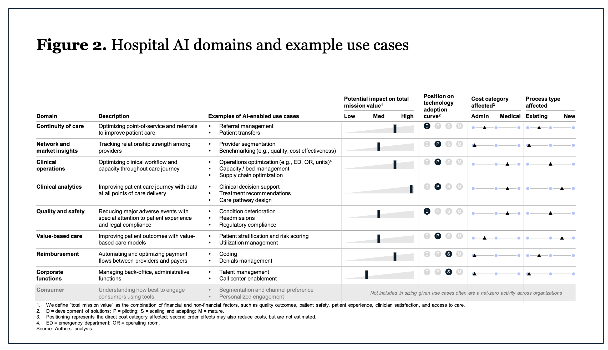

<style>
     p {
        text-align: left;
        font-size: 30px
    }
    ul {
        margin: 0;
        font-size: 30px;
    }
    table {
        font-size: 30px;
    }
    ol {
        margin: 0;
        font-size: 30px;
    }
    blockquote {
        border-left: 10px solid #ccc;
        margin: 1.5em 10px;
        padding: 0.5em 30px;
        quotes: "\201C""\201D""\2018""\2019";
    }

    blockquote:before {
        color: #ccc;
        content: none;
        font-size: 4em;
        line-height: 0.1em;
        margin-right: 0.25em;
        vertical-align: -0.4em;
    }

    blockquote:after{
        content: none;
        font-size: 4em
    }

    img {
    width: 50%;
    height: auto;
  }
</style>

# **Topics in Deep Learning: Healthcare**
```console
Instructor: Erik Drysdale
TA: Jenny Du
```

---

<!--_color: white -->
<!--_backgroundColor: #f4a534 -->
## `Course outline`

---

- The practice of healthcare, medicine, and life sciences (**today**)
- Implementing AI in healthcare #1 (week 1)
- Implementing AI in healthcare #2 (week 1)
- Survival modeling (week 2)
- Protein folding, drug discovery, and medical imaging, and ‘Omics (week 2)
- Commercial applications (week 2)
- "White box" model explainability (week 2)
- "Black box" model explainability (week 3)
- Prediction intervals and quantifying uncertainty (week 3)
- Business thinking and organization structure (week 3)

---

# **Lecture 1: The practice of healthcare, medicine, and life sciences**
```console
Topics in Deep Learning
```

---

##### **Lecture 1 Outline**

- Course outline

- Intros

- Terminology

- Why healthcare

- Brief history of AI in healthcare

- Why *now*

- Challenges and Opportunities in applying AI in healthcare

- Examples of successful applications in healthcare

- Examples of failed applications in healthcare


---

<!--_color: white -->
<!--_backgroundColor: #f4a534 -->
## `Intros`

---

- Instructor: Erik Drysdale (that's me!)
  - Started career in economics
  - Transitioned to healthcare data science
  - Have seen firsthand how hard it is to implement models in healthcare
  - Bringing 9 years of professional experience to this course

<br>
<figure>
  
  <figcaption style="text-align: center; font-size: 20px;">Institutions where I've worked</figcaption>
</figure>

---

- TA: Jenny Du
  - Master of Science in Applied Computing Program at UofT (current)
  - BA in CS and Bioinformatics
  - Research focus: Applications of ML & DS to health and biology

<figure>
  
  <figcaption style="text-align: center; font-size: 20px;">Jenny with trusty coffee</figcaption>
</figure>

---

- Yourselves!
  - Name and background
  - What are you doing currently (work/school)
  - In your last interaction with the healthcare system, do you think AI/ML was involved?
- This course will be very interactive
  - Any concerns?


---

<!--_color: white -->
<!--_backgroundColor: #f4a534 -->
## `Terminology`

---

##### **Terms**

- **Artificial Intelligence (AI)** → any technique that enables computers to mimic human behaviour

- **Machine Learning (ML)** → a form of AI  which involves computational techniques that learn from examples rather than explicitly being programmed.
  - *Example:* programming a computer to detect cancer from a brain scan.

- **Deep learning (DL)** → ML based on neural networks

 ---

![AI_ML_DL][terms]
---

---

##### **Types of ML**

- **Supervised learning** → Use labeled data to train the ML model (task-driven)
- **Unsupervised learning** → Uncover insights about the data and validate with domain experts (data-driven)

![ML][Machine_learning]
---

---

<!--_color: white -->
<!--_backgroundColor: #f4a534 -->
## `Why Healthcare?`

---

##### **Potential applications of AI in healthcare**

Several aspects of the health care involve prediction, including diagnosis, treatment, administration, and operations. Potential application for AI:

- **Improved diagnosis and treatment** → early detection more accurately
- **Personalized medicine** → tailored treatment to individual patients, based on specific medical profiles
- **Increase efficiciency** → automate routine tasks, free up health care professionals to focus on more complex tasks

<!-- Question: Can anything think of an application of personalized medicine IRL? -->

---

##### **Some specific domain applications$^{1}$**

1. **Clinical operations** → enhance the efficiency and effectiveness of clinical processes within healthcare organizations (this includes things like workflow, freeing up staff time and improving resource utilization)
    - *Examples:* Optimization in areas like emergency departments and operating rooms, capacity management, and supply chain.

2. **Clinical analytics** → analysis of clinical data to support decision-making and improve patient care.
    - *Examples:* Providing clinical decision support (CDSS), treatment recommendations and care pathway designs

<!-- Question: How could making a "prediction" help "optimize" an ED? -->

---

##### **Some specific domain applications$^{1}$**

3. **Quality & Safety** → ensure the highest quality of care and patient safety.
    - *Examples:* Prediction of adverse events, deterioration of patients condition and readmissions

4. **Corporate Functions** → improving efficiency and steamlining administrative processes within healthcare.
    - *Examples:* automating various administrative tasks

<!-- Question: Besides preventing death or injury, why would predicting patient detioriation be helpful? -->

---
##### **Current healthcare costs$^{1,2}$**

- Healthcare costs globally are on the rise & clinical expertice is $$$.
- In the United States adoption of AI could save their healthcare system ~**$200 to $360 billion** (cost 2023: $4.7 trillion, 18% GDP).
  - Administration, medical knowledge, clinical operations, diagnostics
  - Three "big players": hospitals, payers, physicians/nurses

![HC][Health care]

---

<figure>
  
  <figcaption style="text-align: center; font-size: 20px; ">Source: The Potential Impact of Artificial Intelligence on Healthcare Spending.</figcaption>
</figure>


---

##### **General Recipe**

1. *Identify a challenge* where the application of AI can decrease process costs or enhance the efficiency and accuracy of tasks performed by clinicians.

2. *Develop an AI* choosing appropriate algorithms or models, and training it on relevant data.

3. *Employ the developed AI* to automate or enhance the specified task or process.


---

<!--_color: white -->
<!--_backgroundColor: green -->
## `Breakout #1`
#### Why would implementing AI/ML in healthcare be harder than in other fields?


---
<!--_color: white -->
<!--_backgroundColor: #f4a534 -->
## `Brief history of AI in healthcare`

---

##### **1970s**

- One of the earliest examples: **MYCIN system** developed at Stanford.$^{3}$
- **Goal:** Assist physicians in the diagnosis and therapy selection for patients with bacterial infections based on symptoms and test results.

- **Performance of MYCIN**
  - *Algorithm Success:* Proposed a good therapy in 69% of cases.
  - *Comparison:* Comparable or better than the best infectious disease experts at the time.

<!-- Question: Was the MYCIN system ever used in clinical practice? (p.s. check out the videos of Dr Shortliffe demo'ing this system)-->

---

##### **1980s**

- **INTERNIST-1** developed at University of Pennsylvania.$^{4}$
- **Goal:** Automated diagnosis for general internal medicine.
- Utilized a probabilistic model to diagnose a patient's health based on thousands of symptom variables.

![INT][INT]

<!-- Question: Was the INTERNIST system ever used in clinical practice? -->


---

##### **1990s**

- **Neural networks** gained popularity in clinical medicine **research**.$^{5}$
  - These networks were simpler than contemporary deep neural networks.
  - Utilized only a few features to make predictions.
  - Predictions were based on data collected through chart review.

- **Paving the Way for Modern Healthcare**
  - Despite their simplicity, and lack of adoption, these early applications paved the way for the hope that AI would one day be integrated into modern healthcare.

---
<!--_color: white -->
<!--_backgroundColor: #f4a534 -->
## `Why now`

---

##### **Evolution of AI in Medicine**

- Traditional AI in medicine was not data-driven → mainly focused on leveraging domain knowledge.
- Adoption of *Electronic Medical Records* (EMRs) in the early 2010's increased dramatically, fueled by digital health funding.$^{6}$
- Diversity of digital health →  lab tests, vital signs, proteomics, imaging, social media etc...
  
![EMR][EMR]
---

---

##### **Significance of *Big Data***

- The abundance of data presents a significant opportunity for ML applications in healthcare.
- Enables more comprehensive and data-driven approaches in diagnosis, treatment, and research.
- Some examples of high-performance AI in medicine (Aidoc, iCAD, IDx etc.)$^{7}$

---

![HP][HP]
---

---

##### **Adoption of AI in healthcare**

- **Hype and Potential:**
  - Significant hype and recognized potential for AI in healthcare, despite fairly little adoption.

- **Lagging Behind Other Industries:**
  - AI adoption in healthcare lags behind its adoption in other industries (e.g., finance, information, technical services).$^{8}$
  - Various factors contribute to the slower pace, including:
    - Regulatory barriers
    - Challenges in data collection
    - Algorithmic limitations
    - Misalignment of incentives

---

<!--_color: white -->
<!--_backgroundColor: #f4a534 -->
## `Challenges and Opportunities in applying AI in healthcare`

---

##### **Some Considerations When Applying AI to Healthcare**

 **Available data is often limited**

- Challenges with missing data, limited longitudinal data, heterogeneous samples, and small sample sizes, especially for rare diseases.

 **Opportunity**

- Innovation in handling sparse data, addressing challenges in data imputation and statistical methods.

---

##### **Some Considerations When Applying AI to Healthcare**

 **Poor data quality**

- AI algorithm performance depends on the quality of available data.
- Challenges lie in heterogeneous sampling, diverse data types, and varying time scales.
- Sparse data with unmeasured and unreported values, lack of follow-up.

**Opportunity**

- Development of algorithms capable of making robust and generalizable predictions even when data is missing.

---

##### **Some Considerations When Applying AI to Healthcare**

**Scarse Labelled data**

- Limited labeled data in healthcare due to challenges in obtaining consensus among clinicians, and clinican time is expensive!
  
**Opportunity**

- Leveraging unsupervised or semi-supervised learning for discovery, including identifying disease subtypes and predicting disease progression.

---

##### **Some Considerations When Applying AI to Healthcare**

**Human centric decisions**

- In healthcare, there is often decision-making in critical scenarios, including life and death situations.
- Ethical responsibility of AI developers and healthcare professionals to prioritize patient well-being.

**Opportunity**

- Develop fair and accountable algorithms for risk stratification and prioritizing resources based on predictions.

---

##### **Some Considerations When Applying AI to Healthcare**

**Regulatory and Privacy Barriers:**

- Regulatory barriers make it challenging to collect and pool healthcare data.
- Sensitivity of healthcare data poses difficulties in de-identifying information.

**Opportunity**

- Innovations in privacy-preserving technologies to navigate regulatory challenges, fostering data de-identification and secure data sharing.

---

<!--_color: white -->
<!--_backgroundColor: green -->
## `Breakout #2`
#### What are other challenges you think might limit the adoption of AI/ML tools in healthcare? What would it take to solve them?

---
  
<!--_color: white -->
<!--_backgroundColor: #f4a534 -->
## `Examples successful applications in healthcare`

---

##### **Using ML to model heart rate response to exercise $^{9}$**
<!-- .side-by-side -->

![HR]![SW]
---

---

##### **Using ML to guide decisions for cancer therapy $^{10}$**

![OC]
---

---

##### **And many more!**

- Embryo selection for IVF
- Genome interpretation for sick newborns
- Paramedic diagnosis of heart attack, stroke
- Assist readings of imaging scans
- Classification of cancer, identify mutations
- etc.
  
> Examples adapted from Topol, E. J. (2019) $^{11}$

---
<!--_color: white -->
<!--_backgroundColor: #f4a534 -->
## `Examples of failed applications in healthcare`

---

#### **Watson**

- **Watson Health** was developed by IBM (International Business Machines Corporation). $^{12}$
- It aimed to provide insights to oncologists about cancer treatment, assist pharmaceutical companies in drug development, and match patients with clinical trials, showcasing the potential of AI in healthcare.

- Despite significant investment and high expectations, Watson Health faced challenges in meeting its goals; company ultimately sold parts to a private equity firm.

---

#### **Epic Sepsis Model**

- **Epic Sepsis Model Issues → Lack of reproducibility:**
  - Peer-reviewed data questioned the effectiveness of Epic's sepsis prediction algorithm.$^{13}$
  - University of Michigan Medical School study with over 27,000 patients found its performance "substantially worse" than reported.

- **Study Concerns:**
  - Lack of external validation for proprietary models and a call for transparency and validation before widespread clinical use.

---

<!--_color: white -->
<!--_backgroundColor: green -->
## `Breakout #3`
#### How would AI be used for "*Embryo selection for IVF*" and what problems (ethical, practical, etc) would this present?


---


##### **References**

(1) Sahni, N., Stein, G., Zemmel, R., & Cutler, D. M. (2023, October). The Potential Impact of Artificial Intelligence on Healthcare Spending (Working Paper No. 30857). National Bureau of Economic Research. Retrieved from (<http://www.nber.org/papers/w30857>)

(2) Evidence Network. (n.d.). Healthcare Funding Policy in Canada. Retrieved from (<https://www.ephpp.ca/healthcare-funding-policy-in-canada/>)

(3) van Melle, W. (1978). MYCIN: A knowledge-based consultation program for infectious disease diagnosis. Journal of the American Medical Informatics Association, 25(3), 276-281

---
(4) Miller, R. A., McNeil, M. A., Challinor, S. M., Masarie, F. E. Jr., & Myers, J. D. (1986). The INTERNIST-1/QUICK MEDICAL REFERENCE Project—Status Report. West Journal of Medicine, 145(6), 816–822.

(5) Penny, W., & Frost, D. (1992). Neural Networks in Clinical Medicine. Journal of Medical Systems, 16(4), 309-321.

(6) The Analysis Group, Inc. (2014). Big Data in Health Care. The National Law Review. Retrieved from <https://www.natlawreview.com/article/big-data-health-care>

(7) Topol, E. (2019). High-performance medicine: the convergence of human and artificial intelligence. Nature Medicine, 25(1), 44–56

---
(8) Goldfarb, A., & Teodoridis, F. (2022, March 9). Why is AI adoption in health care lagging? Research. Retrieved from <https://www.brookings.edu/articles/why-is-ai-adoption-in-health-care-lagging/>

(9) Nazaret, A., Tonekaboni, S., Darnell, G., Ren, S. Y., Sapiro, G., & Miller, A. C. (2023). Modeling personalized heart rate response to exercise and environmental factors with wearables data. npj Digital Medicine, 6, 207.

(10) Bhalla, S., & Laganà, A. (2022). Artificial Intelligence for Precision Oncology. Advances in Experimental Medicine and Biology, 1361, 249-268.

(11) Topol, E. J. (2019). High-performance medicine: the convergence of human and artificial intelligence. Nature Medicine, 25, 44–56.

---

(12) O’Leary, L. (2022, January 31). How IBM’s Watson Went From the Future of Health Care to Sold Off for Parts. Retrieved from (<https://slate.com/technology/2022/01/ibm-watson-health-failure-artificial-intelligence.html>)

(13) Muoio, D. (2021, June 22). Epic's widely used sepsis prediction model falls short among Michigan Medicine patients. Retrieved from (<https://www.fiercehealthcare.com/tech/epic-s-widely-used-sepsis-prediction-model-falls-short-among-michigan-medicine-patients>)

[Health care]: images/Health_care.png
[Machine_learning]: images/Sup_UnSup_ML.jpg
[terms]: images/AI_ML_DL.png
[INT]: images/INTERNIST-1.png
[EMR]: images/EMR.png
[HP]: images/AI_High_Perf.png
[HR]: images/Heartrate.png
[SW]: images/Smartwatch_HR.png
[OC]: images/oncology.jpg
