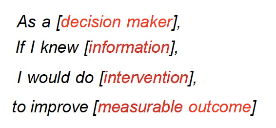

<style>
     p {
        text-align: left;
        font-size: 30px
    }
    ul {
        margin: 0;
        font-size: 30px;
    }
    table {
        font-size: 30px;
    }
    ol {
        margin: 0;
        font-size: 30px;
    }
    blockquote {
        border-left: 10px solid #ccc;
        margin: 1.5em 10px;
        padding: 0.5em 30px;
        quotes: "\201C""\201D""\2018""\2019";
    }

    blockquote:before {
        color: #ccc;
        content: none;
        font-size: 4em;
        line-height: 0.1em;
        margin-right: 0.25em;
        vertical-align: -0.4em;
    }

    blockquote:after{
        content: none;
        font-size: 4em
    }

    img {
    width: 75%;
    height: 70;
  }
</style>

# **Lecture #2: Implementing AI in Healthcare (part 1)**
```console
Data Sciences Institute
Topics in Deep Learning
Instructor: Erik Drysdale
TA: Jenny Du
```

---
##### **Lecture Outline**

  - Choosing the right problem
  - Developing a useful solution
  - Considering ethical implications
  - Rigorous evaluation and reporting
  - Deploying the AI/ML 

---
<!--_color: white -->
<!--_backgroundColor: #f4a534 -->
## `Choosing the right problem`

---
#### **Beware, beware ....**
- "**The reality is that most failures of AI projects are failures in strategy and in execution.**"
  - *Source: [Why AI investments fail to deliver](https://www.infoworld.com/article/3639028/why-ai-investments-fail-to-deliver.html)*
- "**Validation of the performance of an algorithm in terms of its accuracy is not equivalent to demonstrating clinical efficacy. This is ... the ‘AI chasm’—that is, an algorithm with an AUC of 0.99 is not worth very much if it is not proven to improve clinical outcomes.**"
  - *Source: [High Performance Medicine](https://www.nature.com/articles/s41591-018-0300-7)*

---
![Roadmap_1][roadmap_1]

---
#### **Unclear problem formulations**
- The human body can be thought of as a "*black box*" -  the root causes and mechanisms of illnesses are often not known.
- How does a prediction from a ML model actually help us solve a healthcare problem?
- How do we predict a "label" when there is no clear consensus among professionals on diagnosis or when there is significant inter- and intra-operator variability?
- **What problem are we trying to solve, and how does AI/ML help us solve it?**

---
#### **Understanding the problem**
-  Understanding the specific problem being addressed is crucial.  
- Researchers often focus on readily available datasets without questioning the clinical relevance of the problems they address.
- A high-performing model doesn't guarantee clinical utility if the model simply confirms existing knowledge without new insights.

---
#### **Contextualization**
- AI/ML tools in healthcare must align with existing ways of working.
  - Understanding the current workflow is therefore crucial.
- For example, before developing an AI-based sepsis model you need to know:
  - How is Sepsis defined in the hospital? Does this vary between institutions
  - How is Sepsis currently detected? Which staff often spot it first? What point along the patient journey does this happen?
  - What actions are currently taken after a diagnosis?

<!-- Question: Why is it important to know when patients are often diagnosed with Sepsis for developing a ML system? (recall: Sepsis is an overreaction of the immune system to an infection which causes massive inflammation, and possibly organ failure and death)  -->

---
#### **Remember the contextualization Mad Lib**



---
#### **Stakeholder engagement for  problem definition**
- Early stakeholder engagement identifies clinically relevant problems and ensures support throughout development.
  - *Note:* stakeholders can include healthcare providers, administrators, patients, and ethicists.
  
- Prioritizing clinically relevant and stakeholder-supported problems helps helps ensure diverse perspective and leads to impactful AI/ML solutions.
- **Rigorous problem definition** aligns solutions with stakeholder needs.

<!-- Question: Who do you think the stakeholders would be for an AI-based sepsis model? -->

---
#### **Stakeholder engagement: frontline health professionals**
- Recognizing the expertise of frontline healthcare professionals is crucial.
- AI/ML tools should **augment clinical judgment, not replace it.**
- Involving clinicians in the development process is essential.
- Incorporating their feedback and providing necessary training and support enhances AI/ML effectiveness in practice.

---

<!--_color: white -->
<!--_backgroundColor: green -->
## `Breakout #1`
#### Suppose we wanted to reduce the rate of unplanned hospital re-admission (24H), what model would you build to do this, how would the model be acted on, and how would evaluate if it worked after deployment?


---
<!--_color: white -->
<!--_backgroundColor: #f4a534 -->
## `Developing a useful solution`

---
![Roadmap_2][roadmap_2]

---

---
#### **Solution design**
- AI/ML models and tools are developed based on the insights gained during the exploration phase. 
  
- Emphasis is placed on designing solutions that are effective, interpretable, and usable by end-users.

---
#### **Data evaluation**
- Before developing a solution, data must be thoroughly evaluated to ensure suitability for the problem at hand.
- Questions about data collection methods, purposes, and representativeness are crucial.
  - Ensure training data represent the environment where the model will be used.
  - Subtle biases in data can reduce model reliability and must be addressed during development.
  - Identifying and correcting biases upfront is crucial for model correctness.


---
<!--_color: white -->
<!--_backgroundColor: #f4a534 -->
## `Considering ethical implications`

---
![Roadmap_3][roadmap_3]

---

---
#### **Health equity and disparities**
- Health care data used for ML algorithms may be influenced by social inequalities (e.g., race, sex and other factors)
- Ethical questions may arise regarding the use of certain predictors, e.g., smoking status or HIV status
- Collaboration between ethicists, social scientists, regulatory scholars, AI/ML experts, and stakeholders is essential to address bias and ethical concerns.

---
#### **Ethical considerations**
- Ethical considerations must be prioritized to ensure the privacy, safety, and fair treatment of patients and affected parties when deploying AI/ML tools in clinical practice.
- AI/ML algorithms focused on fairness can help mitigate biases and promote equitable healthcare delivery.

---
<!--_color: white -->
<!--_backgroundColor: #f4a534 -->
## `Rigorous evaluation and reporting`

---
![Roadmap_4-5][roadmap_4-5]

---

---
#### **Proper model evaluation**
- Focus on **clinically relevant evaluation metrics** over commonly used ones.
- Use qualitative approaches to uncover concerns missed by quantitative measures.
- Report results and share code and documentation for transparency.

--- 
#### **Recall the Sepsis Model**
- **Epic Sepsis Model Issues → Lack of reproducibility:**
  - Peer-reviewed data questioned the effectiveness of Epic's sepsis prediction algorithm.
  - University of Michigan Medical School study with over 27,000 patients found its performance "substantially worse" than reported.
- **Study Concerns:**
  - Lack of *external validation* for proprietary models and a call for transparency and validation before widespread clinical use.

---
<!--_color: white -->
<!--_backgroundColor: #f4a534 -->
## `Deploying the AI/ML`

---
![Roadmap_6-7][roadmap_6-7]

---

---
#### **Implementation and evaluation**
- ML models should undergo rigorous evaluation in real-world clinical settings to assess their performance, impact, and potential biases. 

- **Continuous monitoring and feedback** mechanisms allow for iterative improvements to the tool over time. 
- Ongoing evaluation helps identify and address any unintended consequences or disparities in healthcare deliver
  
---
<!--_color: white -->
<!--_backgroundColor: #f4a534 -->
## `Summary`

---
#### **Considerations for successful translation of AI/ML  into clinical care** 
- **Clear problem definition** is crucial for effective AI/ML deployment in healthcare.
- **Engaging stakeholders** early and into all stages of development ensures identification of clinically relevant problems.
- **Thorough data evaluation** is necessary to address biases and ensure alignment with existing workflows.
- **Continuous monitoring and feedback** in real-world settings are essential for successful AI/ML deployment.
  
---
Figure adapted from:
> Wiens, J., Saria, S., Sendak, M., Ghassemi, M., Liu, V. X., Doshi-Velez, F., Jung, K., Heller, K., Kale, D., Saeed, M., Ossorio, P. N., Thadaney-Israni, S., & Goldenberg, A. (2022). Do No Harm: A Roadmap for Responsible Machine Learning in Healthcare. Nature Medicine
---

Ideas adapted from:
> Wiens, J., Saria, S., Sendak, M., Ghassemi, M., Liu, V. X., Doshi-Velez, F., Jung, K., Heller, K., Kale, D., Saeed, M., Ossorio, P. N., Thadaney-Israni, S., & Goldenberg, A. (2022). Do No Harm: A Roadmap for Responsible Machine Learning in Healthcare. Nature Medicine
> 
> Drysdale, E., Dolatabadi, E., Chivers, C., Liu, V., Saria, S., Sendak, M., Wiens, J., Brudno, M., Hoyt, A., Mazwi, M., Mamdani, M., Singh, D., Allen, V., McGregor, C., Ross, H., Szeto, A., Anand, A., Verma, A., Wang, B., Paprica, P. A., & Goldenberg, A. (2020). Implementing AI in healthcare. Vector-SickKids Health AI Deployment Symposium, Toronto, Ontario, Canada.
---
> Sendak, M., Elish, M. C., Gao, M., Futoma, J., Ratliff, W., Nichols, M., Bedoya, A., Balu, S., & O'Brien, C. (2020). "The human body is a black box": supporting clinical decision-making with deep learning. FAT* '20: Proceedings of the 2020 Conference on Fairness, Accountability, and Transparency
> 
> Verma, A. A., Murray, J., Greiner, R., Cohen, J. P., Shojania, K. G., Ghassemi, M., Straus, S. E., Pou-Prom, C., & Mamdani, M. (2021). Implementing machine learning in medicine. CMAJ. 

[roadmap_1]: images/roadmap_1.png
[roadmap_2]: images/roadmap_2.png
[roadmap_3]: images/roadmap_3.png
[roadmap_4-5]: images/roadmap_4-5.png
[roadmap_6-7]: images/roadmap_6-7.png

