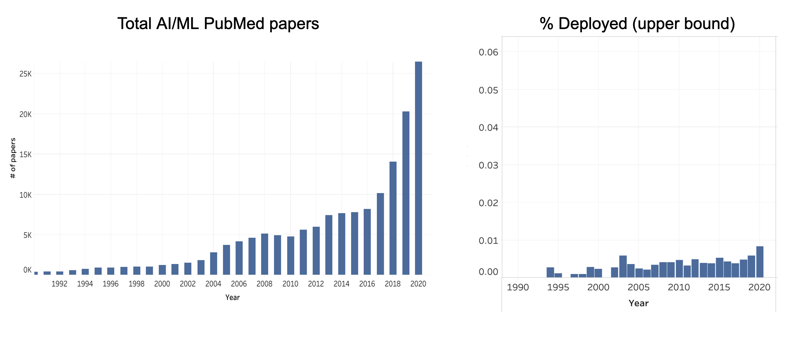
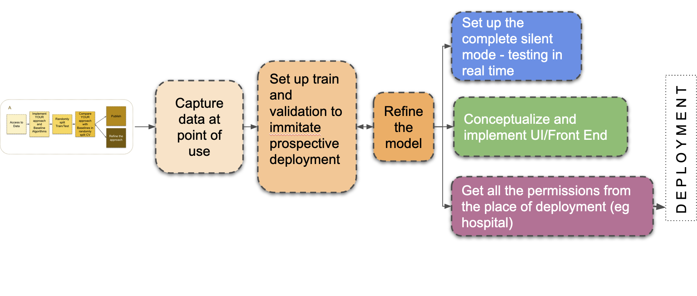
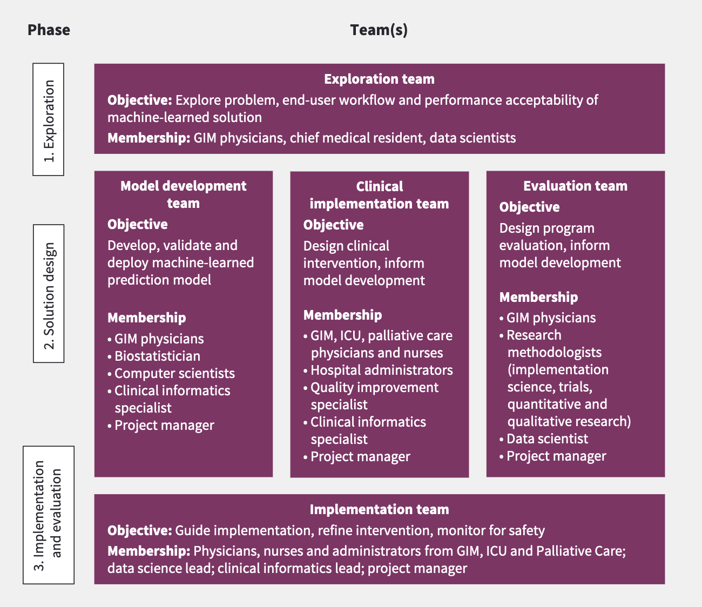
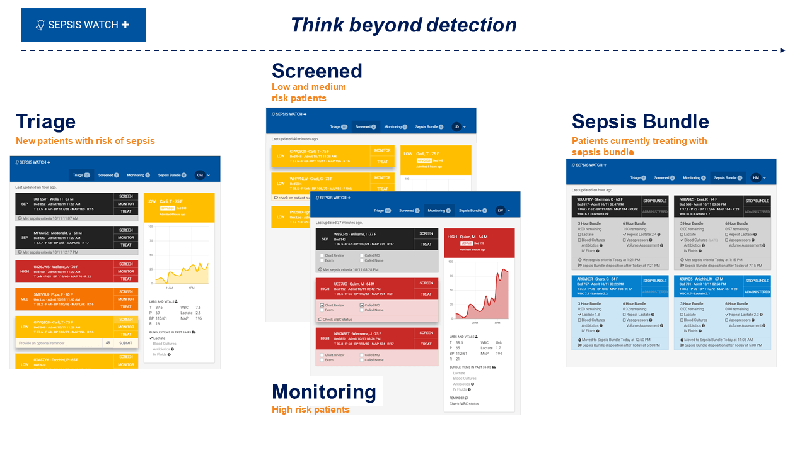
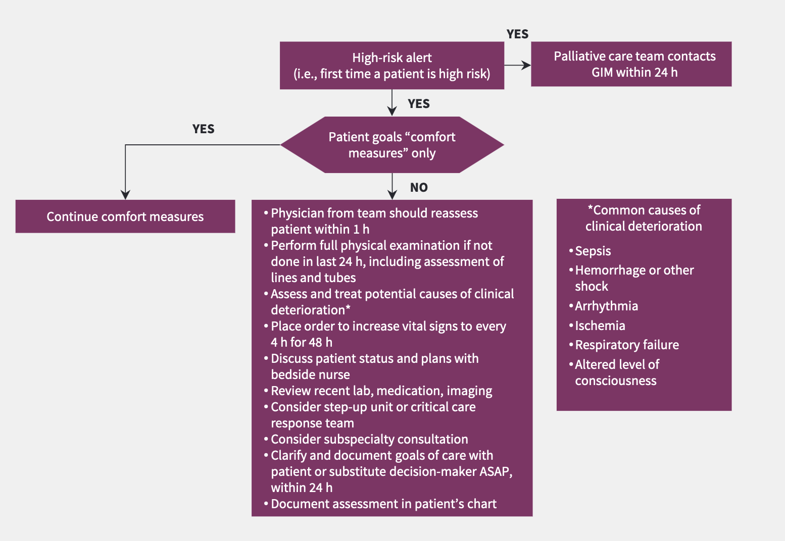
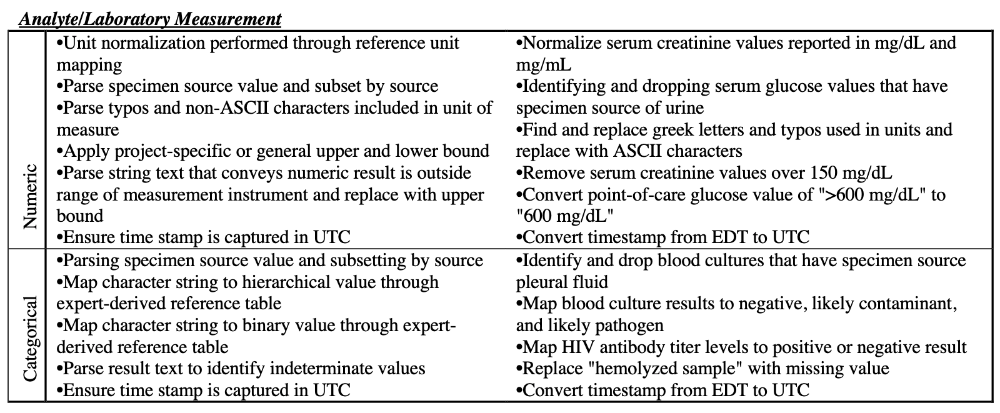
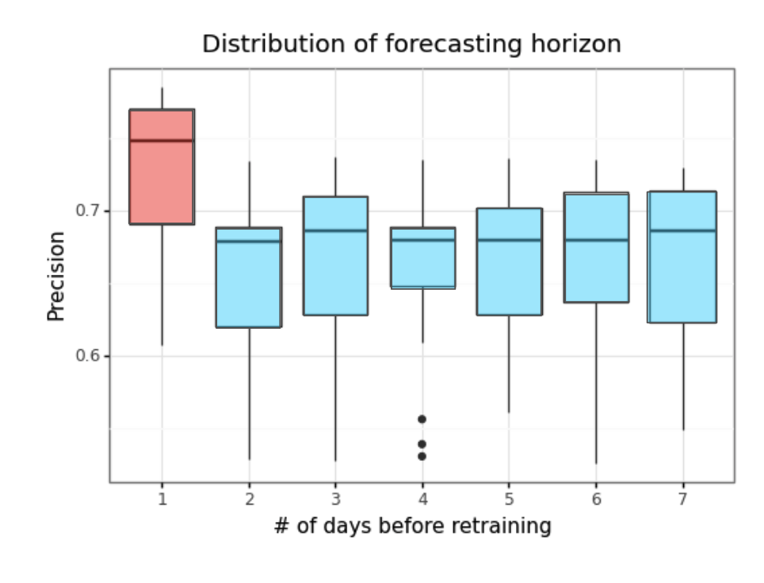
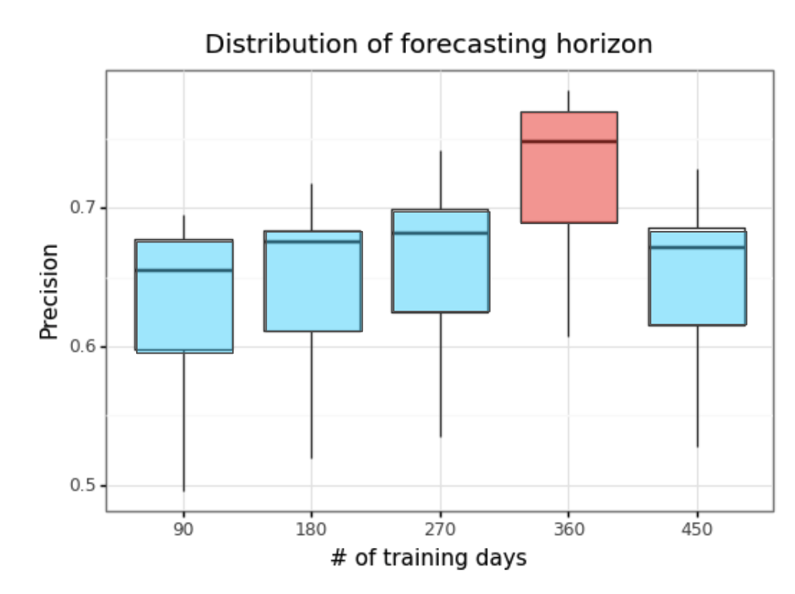
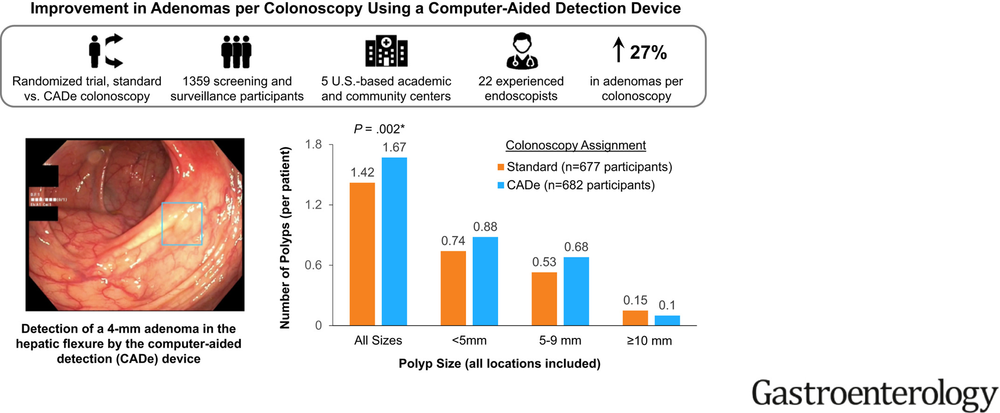
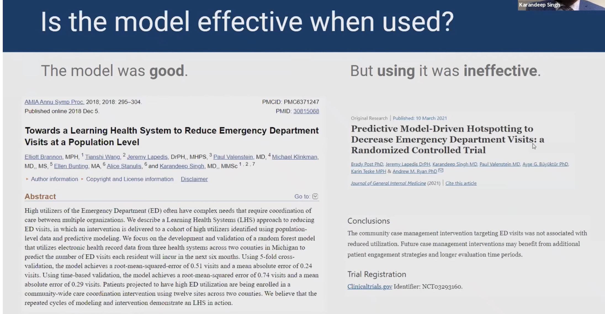

<style>
     p {
        text-align: left;
        font-size: 30px
    }
    ul {
        margin: 0;
        font-size: 30px;
    }
    table {
        font-size: 30px;
    }
    ol {
        margin: 0;
        font-size: 30px;
    }
    blockquote {
        border-left: 10px solid #ccc;
        margin: 1.5em 10px;
        padding: 0.5em 30px;
        quotes: "\201C""\201D""\2018""\2019";
    }

    blockquote:before {
        color: #ccc;
        content: none;
        font-size: 4em;
        line-height: 0.1em;
        margin-right: 0.25em;
        vertical-align: -0.4em;
    }

    blockquote:after{
        content: none;
        font-size: 4em
    }

    img {
    width: 75%;
    height: 70;
  }
</style>

# **Lecture #2: Implementing AI in Healthcare (part 1)**
```console
Data Sciences Institute
Topics in Deep Learning
Instructor: Erik Drysdale
TA: Jenny Du
```

---
##### **Lecture Outline**

  - The key difficulty (recap)
  - The roadmap
  - Choosing the right problem
  - Developing a useful solution
  - Considering ethical implications
  - Rigorous evaluation (silent trial)
  - Real-world examples
  - Deploying AI/ML (MLOps)

---
<!--_color: white -->
<!--_backgroundColor: #f4a534 -->
## `Recap: technology adoption in HC is hard`

---

#### **We've got publications figured out**



[Source](https://www.youtube.com/watch?v=3jDeZ8SNODg): MLHC 2021 (Anna Goldenberg)

---

#### **Talk is cheap**


---
#### **Beware, beware ....**
- "**The reality is that most failures of AI projects are failures in strategy and in execution.**"
  - *Source: [Why AI investments fail to deliver](https://www.infoworld.com/article/3639028/why-ai-investments-fail-to-deliver.html)*
- "**Validation of the performance of an algorithm in terms of its accuracy is not equivalent to demonstrating clinical efficacy. This is ... the ‘AI chasm’—that is, an algorithm with an AUC of 0.99 is not worth very much if it is not proven to improve clinical outcomes.**"
  - *Source: [High Performance Medicine](https://www.nature.com/articles/s41591-018-0300-7)*


---
##### **Electronic Health Record (EHR) Data**
- Challenges and barriers to achieving economies of scale in analyzing EHR data.
- Challenges in scaling EHR data analytics due to non-standardized systems.
- Importance of policy reforms and technology adoption for improved healthcare analysis and outcomes.

---
#### **Where many fear to tread**


---
#### **A lot of upside**


---
#### **History's bumpy road of technological adoption**

<div class="row" style="text-align: center;">
 <div style="display: inline-block; margin-right: 20px;">
  
  <br>
  <span>Justinian I</span>
 </div>
 <div style="display: inline-block; margin-right: 20px;">
  
  <br>
  <span>Emperor Hongxi</span>
 </div>
 <div style="display: inline-block;">
  
  <br>
  <span>Sultan Bayezid II</span>
 </div>
</div> 

<!--Question: What do all of these gentleman have in common? -->

---
<!--_color: white -->
<!--_backgroundColor: #f4a534 -->
## `Roadmap`

---


---
#### **What we think ML scientists do**


---
#### **What ML scientists actually need to do**



<!-- Question: Why is it important to "immitate prospective deployment"? Could you think of an example of this not occuring properly? -->

---
<!--_color: white -->
<!--_backgroundColor: #f4a534 -->
## `Choosing the right problem`

---
![Roadmap_1][roadmap_1]

---
#### **Unclear problem formulations**
- How does a prediction from a ML model actually help us solve a healthcare problem?
- How do we predict a "label" when there is no clear consensus among professionals?
- Who will help us navigate these problems?


---
#### **Putting together the crew**


Source: Verma et. al (2021)

---
#### **Contextualization**
- AI/ML tools in healthcare must align with existing ways of working.
  - Understanding the current workflow is therefore crucial.
- For example, before developing an AI-based sepsis model you need to know:
  - How is Sepsis defined in the hospital? Does this vary between institutions
  - How is Sepsis currently detected? Which staff often spot it first? What point along the patient journey does this happen?
  - What actions are currently taken after a diagnosis?

<!-- Question: Why is it important to know when patients are often diagnosed with Sepsis for developing a ML system? (recall: Sepsis is an overreaction of the immune system to an infection which causes massive inflammation, and possibly organ failure and death)  -->

---
#### **The contextualization Mad Lib**

- As a [<span style="color:red">decision maker</span>],
- If I knew [<span style="color:red">information</span>],
- I would do [<span style="color:red">intervention</span>],
- To improve [<span style="color:red">measurable outcome</span>]

---
#### **If I knew [information]**

- A "middleman" can be used to parse informaiton (SepsisWatch)



---
##### **Alert Fatigue**
- Healthcare professionals receive an overwhelming number of alerts, which often leads to crucial warnings being ignored.
- Current approach to alerts does not consider human factors or user-centered design.
- Solutions include having a human vet which alerts (SepsisWatch), or calibrating a high precision classifier.

<!-- Question: What are some other ways to minimize alert fatigue? -->

---
#### **I would do [intervention]**


Source: Verma et. al (2021)

<!-- Question: If an intervention is designed to prevent an event from occuring which you trained your model on (i.e. trying to prevent the label), what future problems might this cause? -->

---
#### **Stakeholder engagement for  problem definition**
- Early stakeholder engagement identifies clinically relevant problems and ensures support throughout development.
  - *Note:* stakeholders can include healthcare providers, administrators, patients, and ethicists.
  
- Prioritizing clinically relevant and stakeholder-supported problems helps helps ensure diverse perspective and leads to impactful AI/ML solutions.
- **Rigorous problem definition** aligns solutions with stakeholder needs.

<!-- Question: Who do you think the stakeholders would be for an AI-based sepsis model? -->

---
#### **Stakeholder engagement: frontline health professionals**
- Recognizing the expertise of frontline healthcare professionals is crucial.
- AI/ML tools should **augment clinical judgment, not replace it.**
- Involving clinicians in the development process is essential.
- Incorporating their feedback and providing necessary training and support enhances AI/ML effectiveness in practice.

---

<!--_color: white -->
<!--_backgroundColor: green -->
## `Breakout #1`
#### Suppose we wanted to reduce the rate of unplanned hospital re-admission (24H), what model would you build to do this, how would the model be acted on, and how would evaluate if it worked after deployment?


---
<!--_color: white -->
<!--_backgroundColor: #f4a534 -->
## `Developing a useful solution`

---
![Roadmap_2][roadmap_2]

---
#### **Solution design**
- AI/ML models and tools are developed based on the insights gained during the exploration phase. 
- Emphasis is placed on designing solutions that are effective, interpretable, and usable by end-users.


Source: Verma et. al (2021)

---
#### **Ground truth**
- We take "labels" for granted in ML, we should't
  - Example of [sepsis](https://dihi.org/wp-content/uploads/2020/02/Sepsis-Watch-One-Pager.pdf) label shows complexity and opportunity for variability


---
#### **Data evaluation**
- Before developing a solution, data must be thoroughly evaluated to ensure suitability for the problem at hand.
- Questions about data collection methods, purposes, and representativeness are crucial.
  - Ensure training data represent the environment where the model will be used.
  - Subtle biases in data can reduce model reliability and must be addressed during development.
  - Identifying and correcting biases upfront is crucial for model correctness.


---
#### **Data quality control**

- Conformance (fields aligns with expected format)
- Completeness (not missing)
- Plausability (believability, reasonability)


[Source](https://proceedings.mlr.press/v182/sendak22a/sendak22a.pdf): Sendak et. al (2022)

<!-- Question: Could outlier removal improve model performance? How would you empirically test this? -->


---
<!--_color: white -->
<!--_backgroundColor: #f4a534 -->
## `Considering ethical implications`

---
![Roadmap_3][roadmap_3]

---
#### **Health equity and disparities**
- Health care data used for ML algorithms may be influenced by social inequalities (e.g., race, sex and other factors)
- Ethical questions may arise regarding the use of certain predictors, e.g., smoking status or HIV status
- Collaboration between ethicists, social scientists, regulatory scholars, AI/ML experts, and stakeholders is essential to address bias and ethical concerns.
- AI/ML algorithms focused on fairness can help mitigate biases and promote equitable healthcare delivery.

---
<!--_color: white -->
<!--_backgroundColor: #f4a534 -->
## `Rigorous evaluation and reporting`

---
![Roadmap_4-5][roadmap_4-5]


---
#### **Proper model evaluation**
- Focus on **clinically relevant evaluation metrics**.
- Use qualitative approaches to uncover concerns missed by quantitative measures.
- Report results and share code and documentation for transparency.

<!-- Question: What's an example of a machine learning metric that might not be clinically useful? What's an example of a clinically useful metric? -->

--- 
#### **Recall the Sepsis Model**
- **Epic Sepsis Model Issues → Lack of reproducibility:**
  - Peer-reviewed data questioned the effectiveness of Epic's sepsis prediction algorithm.
  - University of Michigan Medical School study with over 27,000 patients found its performance "substantially worse" than reported.
- **Study Concerns:**
  - Lack of *external validation* for proprietary models and a call for transparency and validation before widespread clinical use.

---
<!--_color: white -->
<!--_backgroundColor: #f4a534 -->
## `Prospective evaluation`

---
![Roadmap_6-7][roadmap_6-7]

<!-- Question: Has anyone heard of a silent trial? Why is prospective deployment necessary? -->

---
#### **Silent trial (overview)**

- ML models **need** a real-time prospective evaluation to assess performance, failure points, and biases (w/ no human in-the-loop)

[Source](https://proceedings.mlr.press/v174/tonekaboni22a/tonekaboni22a.pdf) 

<!-- Question: Why don't we want a human in the loop for a silent trial? -->

---
#### **Silent trial (statistics)**

- A prospective trial let's us make one of two (statistical) claims rigorously:
  - This algorithm has at least [X] [accuracy measure]
  - This algorithm has at most [Y] [loss measure]
- How do we do this?
  - "Calibrate" model to have E[X] > X_hypothesis
  - ... or E[Y] < Y_hypothesis

--- 
#### **Silent trial (statistics)**

- In the case of a binary classifier, you need to pick an operating threshold to target a performance measure (e.g. sensitivity)
- But the operating performance=f(threshold) is  a random variable


---
<!--_color: white -->
<!--_backgroundColor: green -->
## `Breakout #2`
#### Suppose we wanted to run a silent trial to demonstrate a model has at least 80% sensitivity, how would we "calibrate" the model so that the trial would likely be successful?

---
#### **Silent trial (calibration)**

- You can increase the likelihood of success by picking a "conservative" operating threshold
  - Bootstrap or order statistic theory (see [Tong et. al (2018)](https://www.science.org/doi/10.1126/sciadv.aao1659))


<div class="row" style="text-align: center;">
 <div style="display: inline-block; margin-right: 20px;">
  
  <br>
  <span>Empirical bootstrap</span>
 </div>
 <div style="display: inline-block; margin-right: 20px;">
  
  <br>
  <span>Rank order approach</span>
 </div>

<!-- Quesiton: Does anyone know what a bootstrap or order statistic is? -->

--- 
#### **Statistical calibration (putting it together)**


<!-- Question: What is meant by "power" -->

---
<!--_color: white -->
<!--_backgroundColor: #f4a534 -->
## `MLOps`

---
##### **Common deployment considerations**

- How often to re-train, and with what data? Consider this an empirical question.

<div class="row" style="text-align: center;">
 <div style="display: inline-block; margin-right: 20px;">
  
  <br>
  <span>Frequency</span>
 </div>
 <div style="display: inline-block; margin-right: 20px;">
  
  <br>
  <span>Training window</span>
 </div>

 <!-- Question: What are some other parameters that might need to be tuned like this empricially from an MLOps perspective? -->

---
##### **Common deployment considerations**

- Example from [DIHI](https://rethinkingclinicaltrials.org/news/grand-rounds-january-26-2024-advancing-the-safe-effective-and-equitable-use-of-ai-in-healthcare-mark-sendak-md-mpp-suresh-balu-md-mba/): Advancing the Safe, Effective and Equitable Use of AI in Healthcare

<br>


<!-- ---
##### **Think about how model fits within organization**


Source: Great Learning (AI Project Life Cycle and Setting up AI Team) -->

---
#### **Implementation and evaluation**

- **Continuous monitoring and feedback** mechanisms allow for iterative improvements to the tool over time. 
- Ongoing evaluation helps identify and address any unintended consequences or disparities in healthcare deliver
  
---
<!--_color: white -->
<!--_backgroundColor: #f4a534 -->
## `Summary`

---
#### **Considerations for successful translation of AI/ML  into healthcare** 
- **Clear problem definition** is crucial for effective AI/ML deployment in healthcare.
- **Engaging stakeholders** early and into all stages of development ensures identification of clinically relevant problems.
- **Thorough data evaluation** is necessary to address biases and ensure alignment with existing workflows.
- **Continuous monitoring and feedback** in real-world settings are essential for successful AI/ML deployment.

---
<!--_color: white -->
<!--_backgroundColor: #f4a534 -->
## `Case Studies`

---
##### **Successes with colonoscopy**



[Source](https://www.sciencedirect.com/science/article/pii/S0016508522005194): Shauket et. al (2022)

---
##### **Google's Diabetic Retinopathy**
- Deployment of a deep learning system for diabetic retinopathy screening in Thai clinics ([source](https://dl.acm.org/doi/abs/10.1145/3313831.3376718)).
- Key findings reveal the challenges of integrating AI into clinical workflows, such as issues with system gradability, internet connectivity, and the necessity of obtaining patient consent.

<figure>
  
  <figcaption style="text-align: center;">Nurse operates the takes images of patient’s retina </figcaption>
</figure>

<!-- Notes: 20% of images rejected by model (too low quality), this automatically triggered a visit to a specialist in Bangkok, nurses started telling patients don't do this b/c you might have to Bangkok if it rejects your scan, they tried uploading two halves of the images, internet was very slow -->


---
##### **UPenn's Sepsis Model**

- Developed and evaluated a machine learning algorithm aimed at predicting severe sepsis and septic shock within a tertiary teaching hospital system.
- Algorithm, based on a random-forest classifier and electronic health record data, showed a sensitivity of 26% and specificity of 98%.

---
- Implementation led to a modest increase in lactate testing and IV fluid administration but no significant change in mortality or ICU transfer rates, though it did reduce the time-to-ICU transfer.

<figure>
  
  <figcaption style="text-align: center;">Clinician perceived impact on patient care (https://doi.org/10.1097/ccm.0000000000003803).</figcaption>
</figure>

<!-- Question: Why would a model that maintains expected statistical accuracy not be able to influence clinical care? -->

---
##### **UMichigan case management (similar story)**




---
Figure adapted from:
> Wiens, J., Saria, S., Sendak, M., Ghassemi, M., Liu, V. X., Doshi-Velez, F., Jung, K., Heller, K., Kale, D., Saeed, M., Ossorio, P. N., Thadaney-Israni, S., & Goldenberg, A. (2022). Do No Harm: A Roadmap for Responsible Machine Learning in Healthcare. Nature Medicine
---

Ideas adapted from:
> Wiens, J., Saria, S., Sendak, M., Ghassemi, M., Liu, V. X., Doshi-Velez, F., Jung, K., Heller, K., Kale, D., Saeed, M., Ossorio, P. N., Thadaney-Israni, S., & Goldenberg, A. (2022). Do No Harm: A Roadmap for Responsible Machine Learning in Healthcare. Nature Medicine
> 
> Drysdale, E., Dolatabadi, E., Chivers, C., Liu, V., Saria, S., Sendak, M., Wiens, J., Brudno, M., Hoyt, A., Mazwi, M., Mamdani, M., Singh, D., Allen, V., McGregor, C., Ross, H., Szeto, A., Anand, A., Verma, A., Wang, B., Paprica, P. A., & Goldenberg, A. (2020). Implementing AI in healthcare. Vector-SickKids Health AI Deployment Symposium, Toronto, Ontario, Canada.
---
> Sendak, M., Elish, M. C., Gao, M., Futoma, J., Ratliff, W., Nichols, M., Bedoya, A., Balu, S., & O'Brien, C. (2020). "The human body is a black box": supporting clinical decision-making with deep learning. FAT* '20: Proceedings of the 2020 Conference on Fairness, Accountability, and Transparency
> 
> Verma, A. A., Murray, J., Greiner, R., Cohen, J. P., Shojania, K. G., Ghassemi, M., Straus, S. E., Pou-Prom, C., & Mamdani, M. (2021). Implementing machine learning in medicine. CMAJ. 

[roadmap_1]: images/roadmap_1.png
[roadmap_2]: images/roadmap_2.png
[roadmap_3]: images/roadmap_3.png
[roadmap_4-5]: images/roadmap_4-5.png
[roadmap_6-7]: images/roadmap_6-7.png

