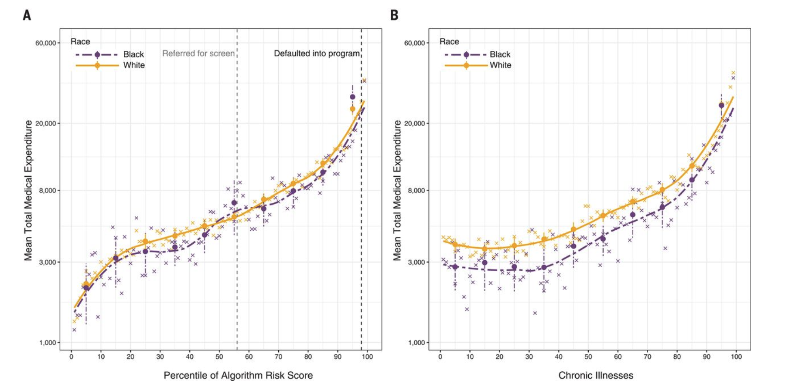

<style>
    p {
        text-align: left;
        font-size: 30px
    }
    ul {
        margin: 0;
        font-size: 30px;
    }
    table {
        font-size: 30px;
    }
    ol {
        margin: 0;
        font-size: 30px;
    }
    figcaption {
        font-size: 15px;
        text-align: center;
    }
</style>

# **Lecture 3: Implementing AI in Healthcare (part 2)**
```console
Data Sciences Institute
Topics in Deep Learning
Instructor: Erik Drysdale
TA: Jenny Du
```

---


- "We should stop training radiologists now. It's just completely obvious that within five years, deep learning is going to do better than radiologists."
    - [Geoff Hinton (2016)](https://www.youtube.com/watch?v=2HMPRXstSvQ), the “godfather of AI”

<p align="center"></p>
<p align="center"></p>

<!-- Question: What happened? Was Geoff Hinton wrong in assuming radiologists would be superfluous? Why do we now have a shortage? -->

---
##### **Lecture Outline**

  - Bias (ethical)
  - Bias (statistical)
  - Types of bias
  - Addressing bias
  - Risk
  - Generalization
  - Best practices
  
---

##### **Introduction**
- The integration of AI in healthcare has great potential for improving patient care, but it is not without challenges.
- This presentation will delve into key pitfalls: bias, risk, and generalization, associated with AI in healthcare.
  
---
<!--_color: white -->
<!--_backgroundColor: #f4a534 -->
## `Bias (ethical)`

---
- Bias in AI refers to the systematic and unfair discrimination or favoritism in the outcomes produced by artificial intelligence systems, algorithms, or models.
- In healthcare it may lead to unequal access to healthcare, inaccurate diagnoses, or disparities in treatment recommendations based on various factors.

---
##### **Bias is inherent in medical practice**


[Source](https://youtu.be/ZTiLwk3VO3s): Artifical Intelligence and Nursing - NPAO 2021

<!-- Question: What should we do here? Should we include language as a variable in our model? Does anyone thing we should use language as a clinical criteria for receiving a DI order? -->

---
##### **And is invisible to the human eye**


Source: [Gichoya et. al (2022)](https://www.thelancet.com/journals/landig/article/PIIS2589-7500%2822%2900063-2/fulltext)

<!-- Question: What do people think is going on here? How is this possible? -->

---
##### **Which means it will be inherent in model inference**


Source: [Zhang et. al (2023)](https://mit-serc.pubpub.org/pub/algorithmic-chest/release/2)

---
##### **Which means it will be inherent in model inference**


Token completion generated by SciBERT (see [Zhang et. al (2020)](https://dl.acm.org/doi/pdf/10.1145/3368555.3384448))


---
<!--_color: white -->
<!--_backgroundColor: #f4a534 -->
## `Bias (statistical)`

<!-- Question: What is the definition of "bias" from a statisticians perspective? -->

---
##### **Bigger is not always better**

- If you wanted to know a proportion (e.g. % who will vote for a president, true positive rate, etc), do you want 400 truly random samples, or 2.3 million samples where there's a 0.5% bias against reporting for one group?
    - Answer: n=400 (source [Meng (2018)](https://statistics.fas.harvard.edu/files/statistics-2/files/statistical_paradises_and_paradoxes.pdf))
- Representativeness is key!

<!-- Question: What do we mean here by better? What fundamental issue are we talking about here that applies to both statistics and ML? -->


---
##### **Test set structure**

- It's very important to create a test set that (most) closely resembles prospective deployment


---
##### **Test set structure**


Source: [Nestor et. al (2021)](https://www.medrxiv.org/content/10.1101/2021.05.11.21257052v1.full.pdf)

---
<!--_color: white -->
<!--_backgroundColor: green -->
## `Breakout #1`
#### Why would would we expect prospective test set performance to be worse on average than a random split?

---
<!--_color: white -->
<!--_backgroundColor: #f4a534 -->
## `Types of Bias`

---
##### **Selection Bias**
- Selection bias is associated with the manner in which the data used for training or evaluation is collected.
- It arises when the data collection process favors certain groups or circumstances over others.
- Selection bias can introduce systemic bias into the dataset (i.e. non-representativeness).

---
##### **Labeling Bias**
- Can arise when the labels assigned to training data reflect existing prejudices or stereotypes
- Can also occur during the annotation or labeling of data points.



Source: [Obermeyer et. al (2019)](https://www.science.org/doi/10.1126/science.aax2342)

---
##### **Algorithmic Bias**
- Algorithmic bias relates to inherent biases in the design or structure of the AI algorithms themselves.
- It can result from the way features are selected, weighted, or processed during decision-making ([example](https://arxiv.org/pdf/1602.04938.pdf): Ribeiro et. al (2016))

<br>


<!-- Question: What is going on here? Why is the explainer points to the background of the image? -->


---
##### **Reinforcement Bias**
- Reinforcement bias emerges from the interactions between AI systems and users.
- It results from AI systems learning from user feedback and behavior.
- If users exhibit biased behavior, the AI may reinforce these biases in its responses.
    - See Hidden Risks of Machine Learning Applied to Healthcare ([Adam et. al (2020)](http://proceedings.mlr.press/v126/adam20a/adam20a.pdf))

<a href="images/animated_bias.gif">
    
</a>

<!-- Question: What are some examples in the RW (doesn't have to be healthcare) where this would be the case?  -->

---
<!--_color: white -->
<!--_backgroundColor: green -->
## `Breakout #2`
#### What issues would arise if we trained a melanoma classier on these sorts of images?

<a href="https://www.sciencedirect.com/science/article/pii/S0022202X18322930?via%3Dihub=">
    
</a>


---
<!--_color: white -->
<!--_backgroundColor: #f4a534 -->
## `Addressing Bias`

---
##### **Three places where bias can be mitigated**

- Pre-processing (what data gets seen)
- In-processing (model training procedure)
- Post-processing (how the model inferences are used)

<!-- Question: What are some examples for each of these? -->

---
##### **Diverse and Inclusive Data Collection (pre-processing)**
- Collect diverse and representative data to train AI models.
- Ensure that data includes various demographic, geographic, and socio-economic factors.
- Pay special attention to underrepresented or marginalized groups to avoid skewed or biased training data.

---
##### **Weighting a loss function (in-processing)**

- Assume a label $y$, features $x$, a protected group $g \in \{A,B\}$, an algorithm $f_\theta(\cdot)$ with learnable parameters $\theta$ and a loss function $\ell(\cdot)$

<br>

$$
\sum_{i=1}^n w_i \cdot \ell(y_i, f_\theta(x_i)), \hspace{2mm} i \in \{A,B\}
$$

<br>

- We can weight a loss function towards whichever group(s) we want to "protect"

<!-- Question1: Why would weighting a loss function not necessarily impact the metric we want to address?

Question 2: What are some other ways of tuning model training to align with a sense of fairness?
 -->


---
##### **Definitions of "fairness" (binary classifier)**

- Recall $\hat{y}=I(f_\theta(x) > t)$
- Demographic parity: $P(\hat{y}| g) \approx P(\hat{y}), \forall g$
- Equality of opportunity: $P(\hat{y}|y=1, g) \approx P(\hat{y}|y=1), \forall g$
- Individualized fairness: $P(\hat{y}_i=y | x_i, g_i=A) \approx P(\hat{y}_i=y | x_j, g_j=B)$, $\forall i,j : \text{dist}(x_i, x_j) \approx \text{small}$
- You cannot reconcile these types of fairness: Impossiblity theorem (see [Saravanakumar (2021)](https://arxiv.org/pdf/2007.06024.pdf))
- [Examples](https://www.borealisai.com/research-blogs/tutorial1-bias-and-fairness-ai/) to follow

<!-- ---
##### **Definitions of "fairness" (binary classifier)**

- Disparate impact: $\Big|1 - \frac{P(y=1 | G=A)}{P(y=1 | G=B)}\Big| \leq \epsilon$
- Demographic parity: $| P(y=1 | G=A) - P(y=1 | G=B)| \leq \epsilon$
- Equalized odds: $| P(\hat{y}=1 | y=k, G=A) - P(\hat{y}=1 | y=k, G=B)| \leq \epsilon$
- Individualized faireness: $| P(\hat{y}_i=y | x_i, G_i=A) - P(\hat{y}_i=y | x_j, G_i=B)| \leq \epsilon$, $\text{dist}(x_i, x_i) \approx \text{small}$ -->

---
##### **Demographic parity**


---
##### **Equality of opportunity**


---
##### **Individual fairness**


---
##### **Transparency, explainability, monitoring, & feedback**
- Make AI models more transparent and interpretable to understand the factors influencing their decisions.
- Implement techniques like explainable AI (XAI) to provide insights into model behavior and allow for the identification and rectification of bias.
- Establish a feedback loop for continuous monitoring and improvement of AI systems' fairness.
- Collect feedback from users and impacted communities to identify and address bias issues as they arise, making ongoing refinements to models and data.

---
<!--_color: white -->
<!--_backgroundColor: #f4a534 -->
## `Risk`

---

- Risk in AI refers to the potential negative consequences or uncertainties associated with the development, deployment, and use of artificial intelligence systems. 
    - **Data Breaches**
        - Breaches can expose patient information, leading to privacy violations and legal consequences.
    - **Incorrect Diagnoses**
        - AI systems that assist in diagnostics could potentially make incorrect diagnoses, leading to improper treatment and harm to patients.
    - **Legal Liabilities**
        - Healthcare providers using AI systems face legal risks if the technology leads to patient harm, including malpractice claims.

---
##### **Addressing Risk**
- **Robust Data Security Measures**
    - Ensure compliance with regulations like General Data Protection Regulation (GDPR) and Health Insurance Portability and Accountability Act (HIPAA) to safeguard sensitive health data.
- **Transparent and Explainable AI**
    - Develop AI systems that are understandable and transparent, elucidating how AI decisions are made.
- **Ethical AI Development and Use**
    - Adhere to ethical principles in AI development to ensure fairness, avoid bias, and respect patient autonomy and privacy.
- **Rigorous Testing and Validation**
    - Subject AI systems to extensive testing and validation to confirm their safety and efficacy, and that they perform as intended across diverse patient populations.


---
<!--_color: white -->
<!--_backgroundColor: #f4a534 -->
## `Generalization`

---
- Generalization in AI refers to the ability of an AI system or model to perform well on new, unseen data after having been trained on a specific set of data.
- We'll review why ML models often have a hard time generalizing, especially in healthcare


---
##### **ML models are "extremely sensitive"**

- All deep learning systems can be rendered useless by adverserial attacks

<br>


[Source](https://arxiv.org/pdf/1412.6572.pdf): Goodfellow et. al (2015)

<!-- Question: Why are DNNs especially prone to adverserial attacks? What, if anything, does this have to do with generalization? -->

---
##### **Can be easily tricked (confounded) by artefacts**

- Example of CNN picking up on hospital-specific X-ray practices (source: [Zech et. al (2018)](https://journals.plos.org/plosmedicine/article/file?id=10.1371/journal.pmed.1002683&type=printable))

<br>


<!-- Question: What is the connection between this issue (confounding) and adverserial attacks?  -->


---
##### **Will often experience model drift**

- After a model goes live the performance of the model will often suffer
    - Unconditional label distribution changes
    - Unconditional feature distribution changes
    - Conditional relationship b/w label and features changes


[Source](http://proceedings.mlr.press/v106/nestor19a/nestor19a.pdf): Nestor et. al (2019)

<!-- Question: Which of these three factors are the most important? Which is the easiest to test for?  -->

---
##### **Variation by institution**

- We often observe variable performance by institution


Source: [Zech et. al (2018)](https://journals.plos.org/plosmedicine/article/file?id=10.1371/journal.pmed.1002683&type=printable)

---
<!--_color: white -->
<!--_backgroundColor: #f4a534 -->
## `Best practices around generalization challenges in healthcare`

---
##### **Overfitting vs. Underfitting**
- Good generalization requires balance between overfitting and underfitting.
- Overfitting: Model learns the training data too well & performs poorly on new data. 
- Underfitting: Model is too simple to capture the underlying structure of the data & performs poorly on training and new data.

<!-- Question: How do you know if your model is overfitting vs underfitting? -->

---
##### **Data diversity and structure**
- Healthcare datasets should come from diverse populations with varying demographics, medical histories, and health conditions. 
- Ensure multiple institutions are represented
- Data should be split in a way that is representative of future usage

---
<!--_color: white -->
<!--_backgroundColor: green -->
## `Breakout #3`
###### The following graph shows how the construction of the feature/label space impacts model accuracy. What is driving this result and how would you construct the feature/label space?


---
##### **Changing Healthcare Practices and Knowledge**
- Healthcare is a rapidly evolving field (i.e., new treatments, diagnostic criteria, and research findings). 
- A dedicated data team is often needed to update the data (and possibly training) pipeline for new and emerging data types (recall "conformance")

---
##### **Transfer learning**
- Transfer learning: involves taking a model that has been trained on one task and adapting it to a different but related task. 
    - Can *sometimes* help in situations where there is not enough data for training a model from scratch, leveraging the generalization capabilities learned from the original task.


Source: [Wiens et. al (2014)](https://pubmed.ncbi.nlm.nih.gov/24481703/)

---
##### **Federated learning**
- Federated learning pools information across for training a machine learning model without data ever needing to be centralized
- Can train more powerful models that generalize without breaching data privacy concerns (speeds up process basically)


Source: [Nadkarni et. al (2021)](https://pubmed.ncbi.nlm.nih.gov/34341802/)
