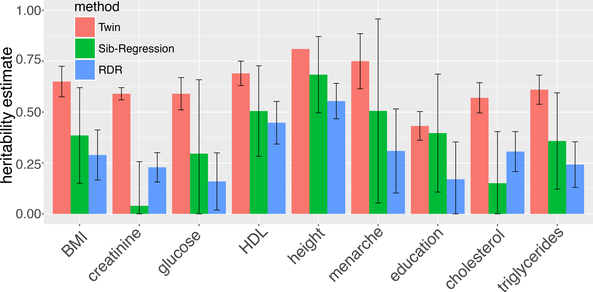
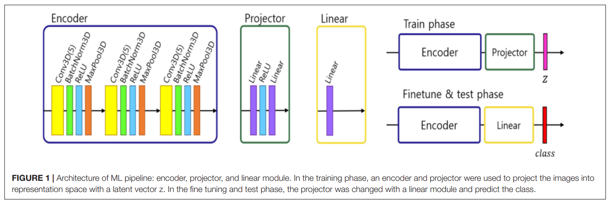

<style>
    p {
        text-align: left;
        font-size: 30px
    }
    ul {
        margin: 0;
        font-size: 30px;
    }
    table {
        font-size: 30px;
    }
    ol {
        margin: 0;
        font-size: 30px;
    }
    blockquote {
        border-left: 10px solid #ccc;
        margin: 1.5em 10px;
        padding: 0.5em 30px;
        quotes: "\201C""\201D""\2018""\2019";
    }

    blockquote:before {
        color: #ccc;
        content: none;
        font-size: 4em;
        line-height: 0.1em;
        margin-right: 0.25em;
        vertical-align: -0.4em;
    }

    blockquote:after{
        content: none;
        font-size: 4em
    }
    img {
        width: 100%;
        height: auto;
        margin-left: auto;
        margin-right: auto;
    }
    figcaption {
        font-size: 15px;
        text-align: center;
    }
</style>
# **DL in Healthcare Research: Proteomics, Genomics, and Medical Imaging**
```console
Data Sciences Institute
Topics in Deep Learning
Instructor: Erik Drysdale
TA: Jenny Du
```

---

##### **Outline**

- General overview
- Proteomics
- Genomics
- Radiomics

---

<!--_color: white -->
<!--_backgroundColor: #f4a534 -->
## `DL in Healthcare Research`

---
#### **Vast amounts of healthcare data**
- Over the past couple of decades, technological advances in data collection have led to an abundance of digital health data.
  - Genome sequencing
  - Wearable sensors
  - High resolution 3D imaging
  - Electronic health records
<br/>
- Analyzing these types of data can prove very challenging, given their sheer size and complexity.

<!-- Question: Imagine you were training a model that contained information from a "chart". How would you incorporate the various text data? -->

---
#### **DL as an analytical tool**
- DL offers several advantages over alternative data analysis tools when dealing with large volumes of data:
  - Ability to model highly complex relationships
  - Ability to handle noisy data
  - Adaptability to diverse data types (e.g., text, images, time series)
  - Scalability
- Given the complexity of human health, and the large amounts of health data now available, AI methods like DL have become increasingly popular in healthcare research $^{1}$

<!-- Question: Why do we say that deep learning is "scalable"? What are classes of algorithms that do not "scale" as easily? -->

---
#### **DL in healthcare research over the years**

---


---
<!--_color: white -->
<!--_backgroundColor: green -->
## `Breakout #1`
#### Why is DL particularly powerful for data modalities like images, text, EKG voltage, etc?


---
<!--_color: white -->
<!--_backgroundColor: #f4a534 -->
## `Proteomics`

---
#### **Proteins 101**


---
#### **Proteins 101**


---
#### **Proteins 101**


<!-- Question: Why do you think proteins (almost always) fold exactly into their native state? How does a protein "know" which way to fold? -->


---
#### **Proteins behaving well (CFTR)**


Source: [Mijnders et. al (2017)](https://www.sciencedirect.com/science/article/pii/S1471489217301285)

<!-- Question: Does anyone know what CF is? -->

---
#### **Proteins behaving badly (CFTR)**


Source: [Uliyakina et. al (2020)](https://www.mdpi.com/1422-0067/21/12/4524)

---
#### **CFTR protein corrected (modulator therapy)**


Source: [Lopez et. al (2022)](https://www.cysticfibrosisjournal.com/action/showPdf?pii=S1569-1993%2823%2900048-6)

<!-- Question: This drug was discovered without AI. How do you think AI could have helped if we were starting this process from scratch? -->

---
#### **Protein structure research**
- Protein structure and function are inherently linked
  - Knowing a protein's structure helps elucidate its interactions with other molecules.
  - For this reason, protein structure research is extremely important for fields like pharmacology, biochemistry, and immunology
<br/>
- **The problem:** discovering new protein structures has historically proven to be a very time-consuming and expensive process

<!-- Question: Does anyone know how we actually get a 3D scan of a protein? -->


---
#### **The Protein Data Bank (PDB)**

- The [Protein Data Bank (PDB)](https://www.rcsb.org/) contains a comprehensive archive of experimentally determined three-dimensional protein structures
<br/>
- Currently, it houses around 186,000 known protein structures
  - This number pales in comparison to the billions of known protein sequences

---

#### **DL in protein structure research**
- Protein folding patterns are governed by a variety of different factors, including evolutionary, physical, and geometric constraints
<br/>
- There exist large databanks from which these factors can be modeled, such as the PDB with its genetic and structural databases
<br/>
- By leveraging these data, various research groups have recently succeeded in developing DL models capable of predicting folding patterns based on amino acid sequences.

---

#### **AlphaFold**
- AlphaFold is a DL system using advanced neural network architectures and training algorithms to predict protein structures with atomic accuracy$^{2}$
<br/>
- This model won the **Critical Assessment of Structure Prediction (CASP)** competition in 2020, a biennial event where international research groups compete to predict protein structures
  - This was the first time that a DL model outperformed all other experimental methods in this competition, with the potential of revolutionising protein structure research with more time- and resource-effective methods

---
#### **Example of AlphaFold's predicted structures**


---
#### **AlphaFold's architecture**


---
<!--_color: white -->
<!--_backgroundColor: green -->
## `Breakout #2`
#### Besides the 3D structure of the protein, what other "labels" would we want to predict with an (amino acid) input sequence?

<!-- Question: Why did AlphaFold folks decide to do Sequence -> Shape? Why not Shape -> Sequence? -->

---
<!--_color: white -->
<!--_backgroundColor: #f4a534 -->
## `Genomics`

---
#### **Genetics and health**

- Most common diseases have a genetic component

<br/>

- Genetic research in healthcare has traditionally focused on identifying rare monogenic mutations that are individually associated with a high risk of disease
  
<br/>

- However, in most cases, polygenic risk factors, involving many common genetic variants of small individual impact, play a greater role in disease risk than rare monogenic mutations$^{3}$

---
#### **Genome-wide association studies (GWAS)**

- GWAS involve leveraging genetic data from large and diverse populations to identify genetic variants whose presence is significantly associated with a particular trait or disease of interest
  
<br/>

- These studies became increasingly popular in the mid-2000s mainly due to the rise of high-throughput genotyping technologies and to the development of large, publicly available genetic databases
  
<br/>

- Associated genetic variants identified via GWAS are typically large in number and most often found in non-coding DNA
  - Downstream analyses are required to properly assess their impact on disease risk

---
#### **Genome-wide association studies (GWAS)**


Source: Palsson et. al (2019)

<!-- Question: Does a "hit" imply a causal relationship? What are some possible confounding factors? -->

---
#### **Missing heritability (Source: [Young (2019)](https://journals.plos.org/plosgenetics/article?id=10.1371/journal.pgen.1008222))**




---


<!-- Quesiton: Why don't we see GWAS results for the bottom left and top right? -->

---
#### **Modeling polygenic risk**

- A popular model of polygenic risk is the weighted polygenic risk score (wPRS)
  - wPRS involves assigning weights to genetic variants based on their effect sizes from GWAS and linearly combining them to generate a risk score based on an individual's genetic makeup

<br/>

- **The problem:** wPRS is prone to bias given its reliance on GWAS effect sizes. It also assumes that the effects of variants are additive while being incapable of modeling non-linear effects or interactions between variants

---

#### **DL in polygenic risk modeling**

- Unlike wPRS, DL models have the capacity to describe complex relationships between GWAS genetic variants and a disease of interest, adapting well to high-dimensional genomic data
  
<br/>

- Because polygenic risk is comprised of multiple genetic variants that are more common than high-risk monogenic mutations, better polygenic risk scoring methods enabled by DL could enable early interventions and improved outcomes for a wider variety of diseases and populations

---
#### **Polygenic risk for Alzheimer's disease (AD)**

- Previous GWAS have revealed that multiple genetic variants contribute to the risk of developing AD
  - Individually, most of these variants have small effects on AD risk, hinting at the need for polygenic risk modeling

<br/>

- In 2023, Zhou et al. developed a fully connected neural network capable of ingesting thousands of genetic variants associated with AD
  - Their polygenic risk score largely outperformed wPRS, achieving AUROC scores of 0.84 and 0.64, respectively$^{4}$

---


<!-- Question 1: Why would Lasso have a much higher effect that univariate weighting?
Question 2: Why would DL have a better effect than the Lasso? -->


---
#### **It's all connected**


Source: Visscher et. al (2017)

---
#### **GWAS == Gattaca?**


Source: Khera et. al (2018)


---
<!--_color: white -->
<!--_backgroundColor: green -->
## `Breakout #3`
#### Besides ethical concerns, why haven't GWAS been used more often in clinical care (e.g. pre-diabetes)?

---
<!--_color: white -->
<!--_backgroundColor: #f4a534 -->
## `Medical imaging/Radiomics`

---

#### **Medical imaging and healthcare**

- Medical imaging provides clinicians with non-invasive or minimally-invasive tools to visually inspect internal anatomy and function
  - X-ray imaging
  - Nuclear imaging (e.g., PET scans)
  - Ultrasound
  - Magnetic resonance imaging (MRI)
  - Optical coherence tomography (OCT)

<br/>

- In many cases, these techniques enable the early detection, diagnosis, and treatment of many diseases that could otherwise be fatal or incur high morbidity

---

#### **Recent advances in medical image acquisition**

- Given the value of medical imaging for disease detection and management, there is continued interest in advancing medical imaging acquisition techniques
  - This includes improvements in digitisation, resolution, portability, acquisition times, and variety

<br/>

- Simultaneously, efforts have been led to establish vast, open-source imaging databanks to accelerate research in various disease contexts

<br/>

---
#### **Medical image analysis**

- In clinic, for many disease contexts, visual inspections performed by a radiologist remain the gold standard for medical image analysis

<br/>

- **The problem:** these conventional reads fail fully to exploit modern medical image acquisition technologies. Subtle signals captured in high resolution images may not be appreciated by the naked eye, but may represent consistent markers of disease

<!-- Question: What are some other "problems" radiomics could help to solve in the current context? -->

---
#### **DL and its success in radiomics**

- Radiomics is a field that applies advanced computational methods to extract quantitative features from medical images to ultimately characterise tissue properties
<br/>
- DL tools, in particular convolutional neural networks (CNNs), have seen increasing popularity in radiomics research given their excellent track record in natural image processing and analysis over the last decade

<!-- Question 1: How did people create "features" from images before deep learning?
Question 2: Why would CNNs likely beat a MLP-only deep neural network? Or any other ML model for that matter -->

---

#### **Case study: neuropsychiatric lupus (NPSLE)**

- Systemic lupus erythematosus (SLE) is a chronic, multisystem autoimmune disease that can affect the nervous system
  - Manifestations of neuropsychiatric lupus (NPSLE) are highly heterogeneous, ranging from mild headaches to psychosis
  
<br/>

- Underlying mechanisms of this rare disease are unknown, and recommended diagnostic protocols involve a lengthy, costly, subjective, and non-specific ruling out process
  - Part of this workup involves a conventional read of a structural T1-weighted MRI scan, which fails to identify brain abnormalities in over 50% of lupus patients with neuropsychiatric symptoms

---
#### **Self-supervised CNN for NPSLE classification**

- In 2022, Inglese et al. developed a self-supervised CNN for NPSLE classification$^{5}$
 
<br/>

- Given the rarity of this disease, the group faced data scarcity challenges, having access to just 163 T1-weighted MRI images
  
<br/>

- Despite these low numbers and the lack of abnormal signals in the MRI scans as probed by the naked eye, their rather simple CNN reached an average classification performance of 83%
  - This was possible due to their use of contrastive learning and augmentation methods

---
#### **Self-supervised contrastive learning**


Source: Khosla et. al (2020)

---
#### **Inglese's self-supervised CNN architecture**



---
#### **Hydronephrosis**

- Prenatal hydronephrosis (PHN) is when the kidney dilates during pregnancy (20% of pregancies)
- Children born with PHN comprise approximately 20-30% of patients seen in pediatric urology clinics
- All children will be monitored up to 36 months unless there is a spontaneous resolution, meaning many invasize ultrasounds
- Up to 30% of PHN infants will require surgery
- **Could AI help predict earlier when patients need surgery using ultrasound images?**

---
#### **Hydronephrosis**


<br>


Source: [Erdman et. al (2021)](https://papers.ssrn.com/sol3/papers.cfm?abstract_id=3967037)

---
#### **Hydronephrosis (silent trial)**


Source: [Kwong et. al (2022)](https://www.frontiersin.org/journals/digital-health/articles/10.3389/fdgth.2022.929508/full)

---
#### **Hydronephrosis (clinical implementation)**


Source: [Kwong et. al (2024)](https://ai.nejm.org/doi/full/10.1056/AIcs2300004)


---
<!--_color: white -->
<!--_backgroundColor: #f4a534 -->
## `Conclusion`

---
#### **Multimodal utopia (v1)?**


[Source](https://erictopol.substack.com/p/multimodal-ai-for-medicine-simplified )


---
#### **Multimodal utopia (v2)?**


[Source](https://erictopol.substack.com/p/generative-ai-and-the-new-medical)

---
<!--_color: white -->
<!--_backgroundColor: green -->
## `Breakout #4`
#### How would we combine different data modality types in a deep learning model? For example, an EKG with genetic information?


---
#### **Popularity and success of DL in healthcare research**

- As depicted by the previous examples, DL has become a popular tool in healthcare-research across a variety of contexts

<br/>

- With recent advances in health-related data collection and the establishment of vast digital data repositories, it was only a matter of time before DL started to outshine alternative data analysis methods, given its complex modeling and scaling capabilities

<br/>

- Next, we will examine how institutions and businesses are working to turn these research tools into commerciable applications


---
##### **References**

(1) Jimma, B. L. (2023). Artificial intelligence in healthcare: A bibliometric analysis. Telematics and Informatics Reports, 9, 100041-. https://doi.org/10.1016/j.teler.2023.100041

(2) Jumper, J., Evans, R., Pritzel, A. et al. Highly accurate protein structure prediction with AlphaFold. Nature 596, 583–589 (2021). https://doi.org/10.1038/s41586-021-03819-2

(3) Khera, A.V., Chaffin, M., Aragam, K.G. et al. Genome-wide polygenic scores for common diseases identify individuals with risk equivalent to monogenic mutations. Nat Genet 50, 1219–1224 (2018). https://doi.org/10.1038/s41588-018-0183-z

(4) Zhou, X., Chen, Y., Ip, F.C.F. et al. Deep learning-based polygenic risk analysis for Alzheimer’s disease prediction. Commun Med 3, 49 (2023). https://doi.org/10.1038/s43856-023-00269-x

---

(5) Inglese, F., Kim, M., Steup-Beekman, G. M., Huizinga, T. W. J., van Buchem, M. A., de Bresser, J., Kim, D.-S., & Ronen, I. (2022). MRI-Based Classification of Neuropsychiatric Systemic Lupus Erythematosus Patients With Self-Supervised Contrastive Learning. Frontiers in Neuroscience, 16, 695888–695888. https://doi.org/10.3389/fnins.2022.695888