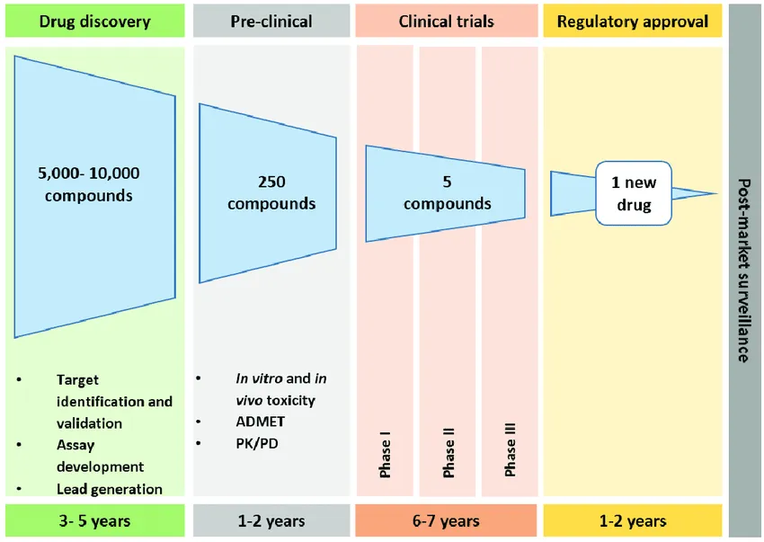
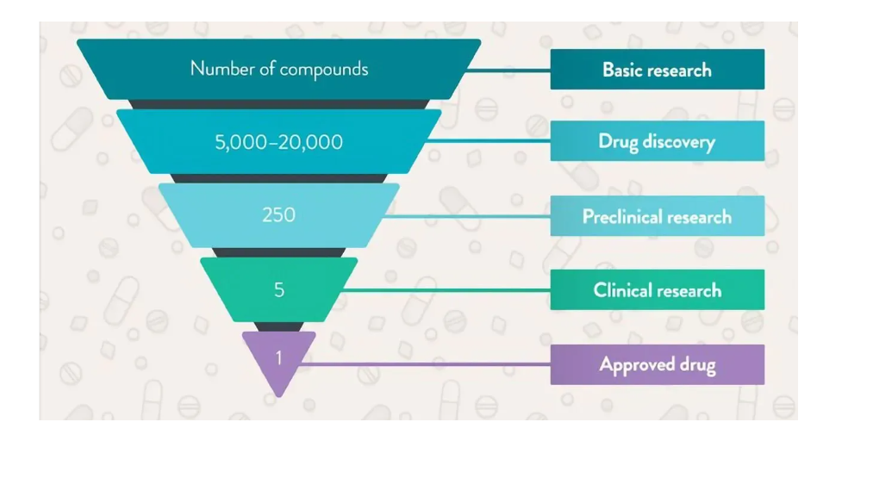
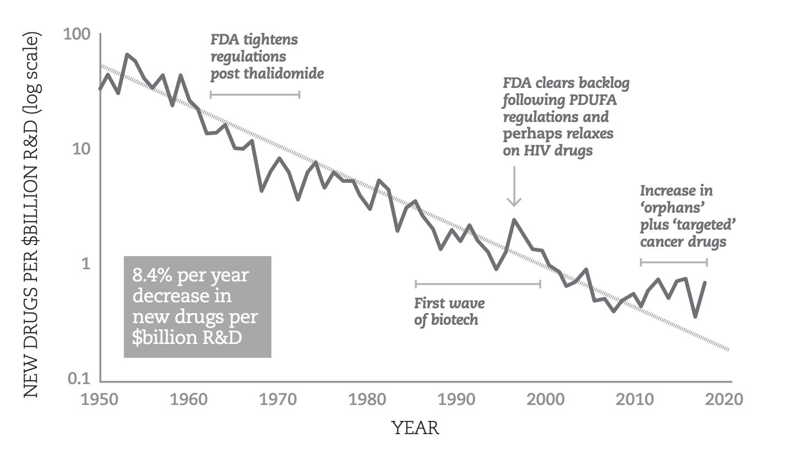
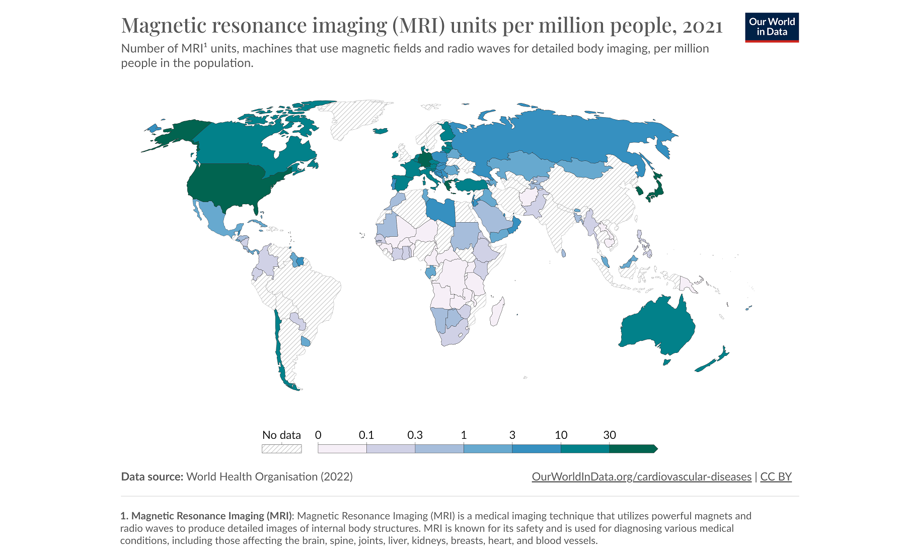
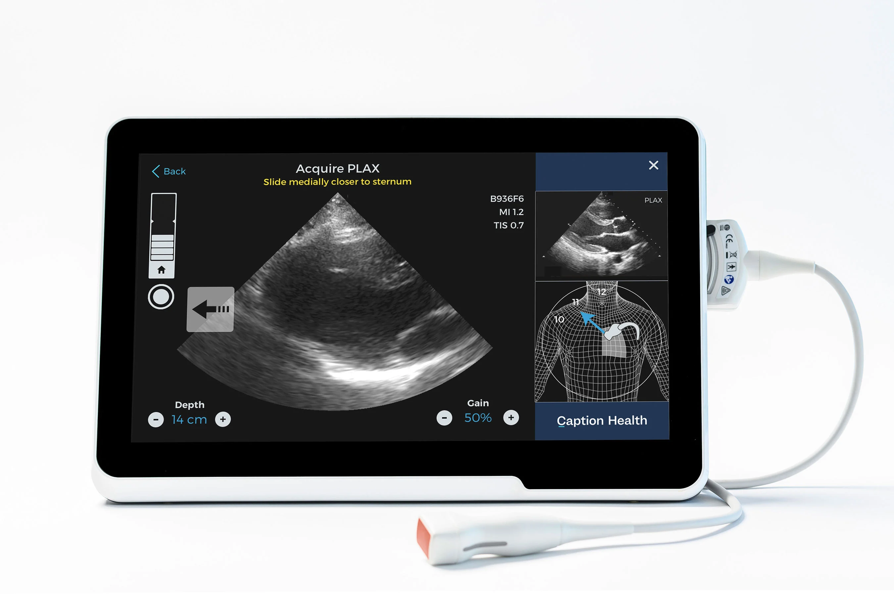
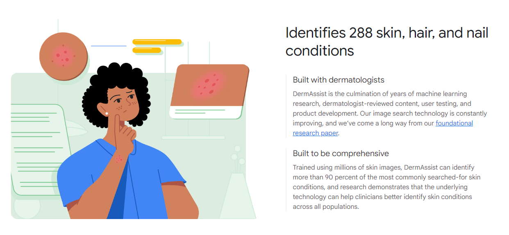

<style>
    p {
        text-align: left;
        font-size: 30px
    }
    ul {
        margin: 0;
        font-size: 30px;
    }
    table {
        font-size: 30px;
    }
    ol {
        margin: 0;
        font-size: 30px;
    }
    blockquote {
        border-left: 10px solid #ccc;
        margin: 1.5em 10px;
        padding: 0.5em 30px;
        quotes: "\201C""\201D""\2018""\2019";
    }

    blockquote:before {
        color: #ccc;
        content: none;
        font-size: 4em;
        line-height: 0.1em;
        margin-right: 0.25em;
        vertical-align: -0.4em;
    }

    blockquote:after{
        content: none;
        font-size: 4em
    }
    img {
        width: 100%;
        height: auto;
        margin-left: auto;
        margin-right: auto;
    }
    figcaption {
        font-size: 15px;
        text-align: center;
    }
</style>
# **DL in Commercial Healthcare Applications**
```console
Data Sciences Institute
Topics in Deep Learning
Instructor: Erik Drysdale
TA: Jenny Du
```

---
##### **Outline**

- Generating value with DL
- Assessing and creating value with DL applications
- DL in biotechnology
- DL in medical devices
- DL in telemedicine

---
<!--_color: white -->
<!--_backgroundColor: #f4a534 -->
## `Assessing Value with DL`

---
#### **DL can do cool stuff, so what?**

- We've seen how ML models in general and DL models in specific can help provide information using various data modalities in healthcare research

<br/>

- However, outside academia, knowledge generated in the form of predictions, classifications, and artificially generated content is worthless on its own.
  
<br/>

- The **real-world value** of DL applications lies in how they can influence and improve downstream processes

---
#### **DL as a decision support tool**

- In commercial settings, successful DL applications can be broadly regarded as decision support tools
  - **Forecast:** Future patient volumes can help medical departments make better staffing decisions
  - **Classification:** Diagnosing patients can reduce time-to-treatment or assist physicians/nurses to come up with more accurate treatments
  - **Generation:** LLMs (e.g. ChatGPT) can accelerate decision making by distilling key information from vast amounts of text data

---
#### **Assessing value of DL applications**

- Under this framework, there are three key steps in commercial model development that relate to value, all of which require close stakeholder engagement:

  **1. Decision identification (hypothetical value):** which downstream decision do we seek to improve upon and why?

  **2. Improvement identification (potential value):** assuming ideal model performance, can this decision actually be improved?

  **3. Downstream action plan: (actual value)** what needs to be in place before workflows can be changed to yield improvements?

---
<!--_color: white -->
<!--_backgroundColor: green -->
## `Breakout #1`
##### Consider a drug known to incur high morbidity side-effects in 50% of patients. Clinicians have expressed an interest in tools enabling side-effect risk prediction for this drug, given that they want to minimise patient morbidity. Given just this information, **is there enough of a value proposition to motivate building a predictive DL model for commercial purposes?**


---
#### **Risk of failure due to uncertainties**

- The decision of whether or not to prescribe the drug seems like a good target for decision support DL tools
  
- That being said, this value remains hypothetical, since it is unclear whether or not this decision can be improved
  - In other words, it is possible that clinicians would not change their current prescription decisions even when knowing that a patient will develop unwanted side-effects
  - Maybe this is the only available treatment, and its benefits always outweigh its risks.
  
<br/>

- In this case, building a DL model with just this information could have a high risk of failure regardless of predictive performance

---
#### **The importance of downstream action plans**

Suppose now that there does exist an alternative treatment specifically designed for patients at high risk of adverse drug side effects
- There is now potential value in this context, since side-effect risk predictions **can** help improve drug prescription decisions
<br/>
- The amount of potential value that is translated into actual value hinges on the characteristics of downstream action plans

<!-- Question: What pieces of information would you provide the physician/pharmacist?
- Transmitting raw model outputs to decision makers is the simplest action plan, though often suboptimal
- In this case, clinicians would probably appreciate receiving detailed reports only for patients at high risk along with suggested care pathways and any relevant patient information -->

---
#### **Value is ultimately determined by the end user**

- **Take-home message:** DL models with perfect performance can be worthless in commercial settings, since value is ultimately determined by the end user (e.g. consumer, pharmacist, nurse, physician, etc)

<br/>

- For this reason, **the development of commercial DL applications differs greatly from purely scientific applications**, demanding the development of a sensible business model long before the start of any DL work

---
<!--_color: white -->
<!--_backgroundColor: #f4a534 -->
## `Creating Value with DL products`

---
#### **Understanding your product's market**

- To build a commercial ML project, you'll need to think about:
  - Market trends
  - Competitor activities
  - Emerging technologies
  - Marketing
  - Internal infrastructure
  - Regulation
  - Security threats
  - Resource availability
  - And more!

<!-- Question: For those in the commercial space, what are other things you've had to plan for and stay on top of for a model/product -->


---
#### **Factors that impact long-run perceived value**

- To ensure longlasting revenue streams, dynamic factors governing the perceived value of commercial DL applications have to be taken into account post-deployment
  - User experience
  - Reliability and consistency
  - Data privacy and security
  - Brand reputation
  - And more!
- These additional considerations further differentiate academic and commercial applications of DL methods


---
<!--_color: white -->
<!--_backgroundColor: #f4a534 -->
## `Commercial Applications: Biopharma`

---
#### **The high cost of drug discovery**

- Drug discovery is a very time-consuming and expensive process
  - In 2013, the cost of developing a new drug was estimated to be **\$5 billion per successful drug** for large pharmaceutical companies$^{1}$
  - These high costs were associated with many factors, including high failure rates in early stages of development and massive R&D costs

---


<!-- Question: Why does this stuff take so long!?! -->

<!-- $^{2}$ -->

---
#### **Eroom's law**



Source: [Smart (2020)](https://www.researchgate.net/publication/343111668_Exponential_Progress_Thriving_in_an_Era_of_Accelerating_Change)

<!-- Question: Why do people think this was the case? Did inputs gets more expensive? -->

---
#### **How DL could revolutionise drug discovery**

- By leveraging large datasets of biochemical data, DL can analyze intricate disease pathways, enhance the efficiency of identifying potential drug targets and candidates, and ultimately reduce failure rates in the early phases of discovery.

---
#### **2023: first DL-developed drug enters phase 2**

- In June of 2023, Insilico Medicine announced the first DL-developed drug to enter phase 2 clinical trials$^{3}$
  - The drug is meant to treat idiopathic pulmonary fibrosis (IPF) and started being developed in 2019
  
<br/>

- DL models have played a role in:
  1. identifying potential target proteins associated with IPF, and
  2. identifying molecules that could disrupt the activity of a target protein

<br/>

- Alex Zhavoronkov, co-founder of Insilico Medicine, thinks this approach shaved off a couple of years from the usual R&D process
  
---
#### **Ex. business model (Compound screening)**

- **Target decision-maker:** Pharma company R&D arm

- **Target downstream decision:** given a particular disease context, which drug compounds are the most promising?

- **Action plan:** provide pharma companies with a list of candidate compounds to run real lab experiments on

- **Expected value for the end-user:** lower failure rates at early R&D stages, and, ultimately, cheaper and faster drug development

---
<!--_color: white -->
<!--_backgroundColor: green -->
## `Breakout #2`
####  What advantage would a DL startup have over a pharma company with >$10 billion revenue when it comes to developing technologies for drug discovery? 


---
#### **Great interest in DL within biopharma**

- Many drug developers have recently established partnerships with AI giant NVIDIA over the past few years, including Amgen, AstraZeneca, GSK, Genentech, and the aforementioned Insilico Medicine$^{4}$

<br/>

- These partnerships reflect a shift within the biotechnology industry towards AI-based life sciences for cheaper and faster drug discovery

<!-- Question: Suppose we identity "promising" compounds, this usually means in terms of some assay or test based on some target (e.g. how much protein is prevented). What is the problem here? What is the label we're trying to predict with compound screening  -->

---


Source: [PharmaWeb (2023)](https://www.pharmiweb.com/press-release/2023-08-17/40-of-global-ai-companies-focus-on-early-drug-development-while-ai-powered-startups-reshape-the-future-of-drug-discovery)

---
<!--_color: white -->
<!--_backgroundColor: #f4a534 -->
## `Commercial Applications: Medical Devices`

---
#### **Limited global access to medical imaging**

- Healthcare centres in low-and-middle income countries (LMIC) lack access to medical imaging devices as well as the expertise required to operate them$^{5}$
  - Given that these technologies enable early detection and intervention for various diseases, their absence translates into increased morbidity and mortality from preventable causes in these regions.

---


---
<h4> <b>How DL <u>could</u> increase access to quality care</b></h4>

- DL applications can expand access to medical imaging technologies by reducing the level of expertise needed for image acquisition and interpretation
  - **Assisted imaging** enables the use of imaging devices by lesser-skilled users
  - **Automated analyses** alleviates the need for highly specialised expertise when interpreting imaging results

<!-- Question: COULD increase. We've talked about the problem w/ Google's diabetic retinopathy. Why is the "downstream action plan" going to be harder in LMICs? Why would "percieved value" be different? -->

---


[Source](https://www.peterdicampo.com/failed-aid)

---
#### **2023: GE Secures \$44M grant to develop assisted ultrasound technology for LMIC**

The Bill & Melinda Gates Foundation awarded GE \$44M to enable quick and accurate ultrasound scans by healthcare professionals, even those with less experience, aiming to improve maternal and fetal health outcomes$^{6}$

---
#### **Ex. business model (ultrasounds in LMIC)**

- **Target decision-maker:** healthcare practitioners with general, nonspecific expertise in LMIC or rural areas

- **Target downstream decision:** maternal health recommendations (e.g. ectopic pregnancy, multiple gestation, fetal viability)

- **Action plan:** develop user-friendly DL interfaces for assisted imaging and automated image analysis, integrate these into affordable ultrasound technologies, and develop suggested care pathways for various imaging results

- **Expected value for the end-user:** increased screening, early detection and early intervention for common complications of pregnancy, leading to a decreases in preventable mortality

---


<!-- Question: What are some other applications of AI in medical devices? Recall the gastroenterologist -->

---
<!--_color: white -->
<!--_backgroundColor: #f4a534 -->
## `Commercial Applications: Telemedicine`

---
#### **Healthcare system strain**

- Aging populations, healthcare workforce shortages, a higher incidence of chronic diseases, addiction, and respiratory illnesses over the past few years have resulted in an overly strained Canadian healthcare system$^{8}$.
  
  - This has led to decreased quality of care, staff burnout, and public distrust, all of which further exacerbate healthcare system strain in a vicious cycle

---
#### **Telemedicine: a partial solution**

- Telemedicine refers to the remote delivery of healthcare services enabled by telecommunications technologies

<br/>

- By enabling remote consultations, telemedicine can help alleviate healthcare system strain; however, it also presents some drawbacks.
  - The requirement of a healthcare practitioner at the other end of the line means this solution remains hindered by labor shortages
  - Voice and video assessments do not provide sufficient information to properly screen for various conditions, which dramatically reduces the usefulness of many remote appointments

---
#### **DL and telemedicine**

- DL can leverage the increasing abundance of portable and wearable sensors to enable AI-assisted remote symptom screening

<br>


Source: Casino Royal's view of telemedicine for James Bond

---
#### **Google's DermAssist**

- In 2021, Google announced the release of DermAssist, a DL-powered tool designed to assist in screening and diagnosing skin conditions$^{9}$
  - The app asks the user for three pictures of a skin concern, along with some additional questions, then provides the closest matches it can find within its database

<br/>

- Later, in 2023, it was announced that Google Lens would be equipped with a similar functionality, being able to search skin conditions that are visually similar to what you a user may see on their skin$^{10}$

- In both cases, Google stressed their intentions to **assist**, but not replace, the symptom screening process

---



---
#### **Ex. business model (dermatology CDSS)**

- **Target decision-maker:** patients and/or healthcare practitioners involved in remote symptom screening for skin conditions

- **Target downstream decision:** what should the next steps be in addressing this skin concern?

- **Action plan:** provide end-users with a list of known skin conditions that best match their concern

- **Expected value for the end-user:** better-informed decision making around skin conditions that are being screened remotely, enhancing the effectiveness and efficiency of telemedicine appointments

---
#### **Mostly emerging applications**

- Regulatory agencies and tech companies remain cautious when defining the potential of DL tools in remote symptom screening
  - Currently, the goal is to assist, but not replace, routine screens

<br/>

- Nevertheless, with further expected advances in portable and wearable sensors, the future of DL-enhanced remote symptom screening remains promising$^{11, 12}$

---
<!--_color: white -->
<!--_backgroundColor: green -->
## `Breakout #3`

##### Suppose you were developing a deep learning system for providing clinical decision support about whether a rash needs antibiotics. What would range of employee skillsets would you need to develop this product?


---
<!--_color: white -->
<!--_backgroundColor: #f4a534 -->
## `Conclusion`

---
#### **DL applications have a promising future in commercial healthcare**

- DL offers significant potential for enhancing patient outcomes and streamlining healthcare delivery

<br/>

- Value identification, market research,  and development efforts are essential to ensure the relevance and effectiveness of deep learning applications in commercial healthcare settings

<br/>

- Collaboration between technology developers, healthcare providers, and regulatory bodies is crucial for driving innovation and facilitating the adoption of DL solutions in healthcare while prioritising safety


--- 
##### **References**

(1) Herper, M. (2013, August 11). The cost of creating a new drug now $5 billion, pushing big pharma to change. Forbes. [Available online](https://www.forbes.com/sites/matthewherper/2013/08/11/how-the-staggering-cost-of-inventing-new-drugs-is-shaping-the-future-of-medicine/?sh=5b9b29dc13c3)

(2) Lansdowne, L. E. (2023, December 18). Exploring the drug development process. Drug Discovery From Technology Networks. [Available online](https://www.technologynetworks.com/drug-discovery/articles/exploring-the-drug-development-process-331894)

(3) Chace, C. (2023, June 30). The first AI-Developed drug reaches Phase 2 clinical trials. with Alex Zhavoronkov. Forbes. [Available online](https://www.forbes.com/sites/calumchace/2023/06/30/the-first-ai-developed-drug-reaches-phase-2-clinical-trials-with-alex-zhavoronkov/?sh=75eadb848c6c)

(4) Philippidis, A. (2023, November 29). Nvidia looks to GenenTech for its next leap in AI drug discovery. GEN - Genetic Engineering and Biotechnology News. [Available online](https://www.genengnews.com/topics/artificial-intelligence/nvidia-looks-to-genentech-for-its-next-leap-in-ai-drug-discovery/#:~:text=In%20its%20new%20partnership%20with,Nvidia%20AI%20supercomputing%20and%20software)

---

(5) Magnetic resonance imaging (MRI) units per million people. (2022). Our World in Data. [Available online](https://ourworldindata.org/grapher/magnetic-resonance-imaging-mri-units-availability)

(6) GE Healthcare (2023, September 18). GE HealthCare Awarded a $44 Million Grant to Develop Artificial Intelligence-Assisted Ultrasound Technology Aimed at Improving Outcomes in Low-and-Middle-Income Countries. [Available online](https://www.gehealthcare.com/about/newsroom/press-releases/ge-healthcare-awarded-a-44-million-grant-to-develop-artificial-intelligence-assisted-ultrasound-technology-aimed-at-improving-outcomes-in-low-and-middle-income-countries)

(7) Yip, M., Salcudean, S., Goldberg, K., Althoefer, K., Menciassi, A., Opfermann, J. D., Krieger, A., Swaminathan, K., Walsh, C. J., Huang, H. H., & Lee, I.-C. (2023). Artificial intelligence meets medical robotics. Science (American Association for the Advancement of Science), 381(6654), 141–146. https://doi.org/10.1126/science.adj3312

(8) Barghiel, N. (2024, January 25). How to advocate for yourself and navigate a strained health-care system. Global News. [Available online](https://globalnews.ca/news/10248469/how-to-advocate-navigate-canadian-health-care-system/)

---

(9) Glatter, R., MD. (2021, May 21). Google announces new AI app to diagnose skin conditions. Forbes. [Available online](https://www.forbes.com/sites/robertglatter/2021/05/21/google-announces-new-ai-app-to-diagnose-skin-conditions/?sh=6071f50e4a0c)

(10) Balasubramanian, S., MD JD. (2023a, June 17). You can now use Google Lens on your phone to look up skin conditions. Forbes. [Available online](https://www.forbes.com/sites/saibala/2023/06/16/you-can-now-use-google-lens-on-your-phone-to-look-up-skin-conditions/?sh=79a8961a2922)

(11) Cramer, G. (2023, June 26). Forward Thinking for the Integration of AI into Clinical Trials. ACRP. [Available online](https://acrpnet.org/2023/06/forward-thinking-for-the-integration-of-ai-into-clinical-trials/)

(12) Marshall, MD, M. (2024, January 17). New AI-powered device DermaSensor could help detect skin cancer. CBS News. [Available online](https://www.cbsnews.com/boston/news/dermasensor-fda-skin-cancer-artificial-intelligence/)
