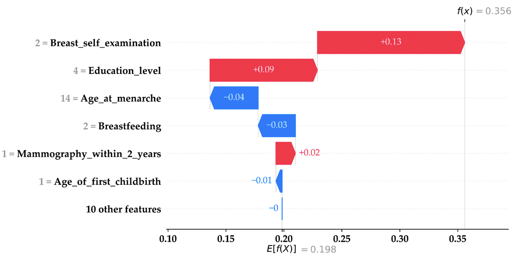

<style>
    p {
        text-align: left;
        font-size: 30px
    }
    ul {
        margin: 0;
        font-size: 30px;
    }
    table {
        font-size: 30px;
    }
    ol {
        margin: 0;
        font-size: 30px;
    }
    blockquote {
        border-left: 10px solid #ccc;
        margin: 1.5em 10px;
        padding: 0.5em 30px;
        quotes: "\201C""\201D""\2018""\2019";
    }

    blockquote:before {
        color: #ccc;
        content: none;
        font-size: 4em;
        line-height: 0.1em;
        margin-right: 0.25em;
        vertical-align: -0.4em;
    }

    blockquote:after{
        content: none;
        font-size: 4em
    }
    img {
        width: 100%;
        height: auto;
        margin-left: auto;
        margin-right: auto;
    }
    figcaption {
        font-size: 15px;
        text-align: center;
    }
</style>
# **Black Box Model Explainability**
```console
Data Sciences Institute
Topics in Deep Learning
```

---
##### **Outline**

- Black box models
- White box models
- Local methods
    - ICE, SHAP, & LIME
- Global methods
    - Global surrogate models
    - HRT
- Archiecture specific methods (DL)
    - Grad cam
    - Attention

---
<!--_color: white -->
<!--_backgroundColor: #f4a534 -->
## `Black Box Models`

---
#### **What is a black box?**

- In general parlance, a "black box" refers to some function whose internal workings are unknown or opaque
- Like a machine learning model, we assume a black box maps an input to an output: $f(x)=y$, where $f: \mathbb{R}^p \to \mathbb{R}^k$

<br>


---
#### **What is a black box in ML?**

- In machine learning, we use "black box" to refer to:
    - Algorithm classes "whose internal workings are unknown or opaque"
    - Methods that work for any arbitrary function (i.e. as long as you can perform inference or possibly take a gradient from $f_\theta(x)$)
- Questions:
    - What are some ML algorithms you would consider "black boxes"?
    - What are some methods that work for arbitrary functions?

---
#### **Why use a black box model?**

- Flexibly model arbirtary functions

<br>


---
#### **Why use a black box model?**

- Learned features >> hand-crafted features (usually)


See: [Word2vec](https://en.wikipedia.org/wiki/Word2vec)


---
#### **Complexity vs interpretability**

- Many ML models (e.g. DL models) are capable of modeling highly complex, non-linear relationships 
- There is usually (but not always) a trade-off between model compexlity and performane


Source: [Morocho-Cayamcela et. al (2019)](https://ieeexplore.ieee.org/document/8844682)

<!-- Quesiton: In what instances would we NOT expect there to be a trade-off? -->


---
#### **Challenges of black box models**

- **Lack of transparency**: how do models generate their predictions?
<br/>
- **Poor interpretability**: given a certain input, why was a particular prediction made?
<br/>
- **Trust issues**: stakeholders may find it challenging to trust a well-performing model that they cannot understand
<br/>
- **Accountability issues**: if a black box model's behaviour results in serious issues such as death, who should be held accountable?


---
#### **Importance of explainability**

- Explainability is crucial for models deployed in high-stakes environments such as healtchare
<br/>
- The more we understand a model, the more we can:
    - Build trust among stake-holders
    - Foster ethical AI practices
    - Ensure regulatory compliance
    - Facilitate and contextualise model debugging and improvement

---
#### **Lesson objective**

- Explore different methods for elucidating understanding how complex, non-linear models work

---
<!--_color: white -->
<!--_backgroundColor: #f4a534 -->
## `White box models`

---
##### **White box models**

- Several important classes of machine learning models are "naturally interpretable" to humans and do not require black box explainers
    - Note: A natural sanity check for a black box explainer is to compare its interpratations to a linear model
- We'll discuss two classes of explainable models
    - Linear models
    - Decision trees

<!-- Question: What are some other "explainable models"? -->

---
##### **Linear models**

- We'll consider any model class that can be written as (1) to be a linear model

<br>

$$ g(E[y | x]) = f_1(x_1) + f_2(x_2) + \dots + f_p(x_p) + \text{interactions} \hspace{1cm} (1)$$

<br>

- Where $g(E[y|x])$ is the inverse link function (e.g. log-odds) 
- $f_k$ is some function of a single covariate (e.g. identity, square, etc)
- Where "interactions" are a combination of two features (e.g. $x_1 \cdot x_4$)

<!-- Question: What are some other link functions? -->

---
##### **Linear models**


Source: [Molnar (2023)](https://christophm.github.io/interpretable-ml-book/ice.html) 

---
<!--_color: white -->
<!--_backgroundColor: green -->
## `Breakout #1`
##### What is the difference between $f(x_1, \dots, x_p)$ and $f_1(x_1)+\dots+f_p(x_p)$? Which one does a 1-year NNet describe?

---
##### **Decision trees**

- Are a class of supervised ML which recursively partions the feature space so that the terminal leaves minimizes entropy (classification) or variance (regression)
    - The CART algorithm which "learns the tree" with data is inherantly greedy which is why there are various rules for early stopping


---
<!--_color: white -->
<!--_backgroundColor: #f4a534 -->
## `Local Methods`

---


---
#### **Understanding individual predictions**

- **Local explainability methods** (aka "instance level explainations") offer insights into individual predictions made by black box models
    - They focus on explaining why a particular prediction was made for a specific instance or region of the input space

---
#### **Methodological approaches**
In this lesson, we will go over two different approaches for local explainability:
<br/>

**1. Individual Conditional Expectation (ICE)**: How does an individual instance's prediction change when a single variable changes at a time?

**2. Variable attribution (SHAP)**: how can differences in the prediction level be attributed among the input variables?

**3. Surrogate models of behaviour (LIME)**: can we model black box behaviour locally using an easy to interpret white box model?
<br/>

---
<!--_color: white -->
<!--_backgroundColor: #f4a534 -->
## `Variable Attribution: ICE`

---
#### **Individual Conditional Expectation (ICE)**

- ICE shows how an instance's prediction changes when a feature changes:
- If $x \in \mathbb{R}^p$, $x'_i = (x_{i1}, x_{2}', x_{i3}, \dots, x_{ip})$ and we compare $f_\theta(x'_i)$ for $x_2' \in \mathbb{R}$ to see how the prediction changes for instance $i$ when $x_2$ changes


Source: [Molnar (2023)](https://christophm.github.io/interpretable-ml-book/ice.html) 


---
#### **Individual Conditional Expectation (ICE)**

- ICE can be turned into a "global" explainer by averaging over the individual curves (this is known as a "partial dependency plot")
- ICE works for all black box models that we can run inference on (no gradients needed)
- It is a form of "mechanistic" interpretability
    - It does not model realistic correlations between the variables

<!-- Quesiton: Is it fair to "mechanistically" interogate a ML model across the feature space? Are there any combinations where this would be absured? -->

---
<!--_color: white -->
<!--_backgroundColor: #f4a534 -->
## `Variable Attribution: SHAP`

---
#### **SHapley Additive exPlanations (SHAP)**

- SHAP is a method for explaining the variation in the output of machine learning model's predictions

<br/>

- This is based on the concept of Shapley values from cooperative game theory: given a set of players (features), how do we distribute the payout (prediction) resulting from a collaborative game (prediction task) 

---
#### **Calculating variable contribution**

- For a given feature $j$ and instance $i$, that SHAP value ($\phi_{ij}$) is:

<br>

$$\phi_{ij} = \phi_j(f, x_i) = \sum_{z' \subseteq x'_i} \frac{|z'|(M-|z'|-1)}{M!} [f_x(z') - f_x(z' \backslash j )]$$

<br>

- This represents a subset of the $2^p$ calculations needed to do an *exact* calculation
- Contributions are anchored to:

$$f(x_i) = E[f(x)] + \sum_{j=1}^p \phi_j(f, x_i)$$

Source: [Lundberg & Lee (2017)](https://arxiv.org/pdf/1705.07874.pdf)


---
#### **Calculating variable contribution**

- In practice, we never calculate the $2^p$ combinations
- Instead we use sampling methods
- While there are algorithm-specific SHAP approaches, the default is KernelSHAP
    - Fit a linear model to the samples inference where $\hat{y}$ is the predicted value, the variables ($Z$) are binary indicators (feature present or not) and the estimated coefficients will be the SHAP values.
    - i.e. regression of $\hat{y} = Z\Phi$
- But how do we run: $f_x(z')$ if $z \in \mathbb{R}^q$ where $q<p$?

---
#### **SHAP waterfall plot: mammography prediction**



Source: [Sun et. al (2023)](https://www.mdpi.com/2227-9032/11/14/2000)

---
#### **SHAP bee swam plot: Cancer survival**


Source: [Alabi et. al (2023)](https://www.nature.com/articles/s41598-023-35795-0)

--- 
#### **Interpreting SHAP values**

- **Sign**: positive SHAP values indicate that a feature value increases the prediction, while negative values indicate a decrease

- **Magnitude**: the magnitude of the SHAP value represents the importance or impact of that feature value on the prediction

- **Additive property**: the sum of SHAP values across all features equals the difference between instance and average predictions

- **Visual interpretation**: SHAP values can be visualized using various plots, such as the waterfall plot, which displays how individual feature values push the prediction of an instance away from the average value

---
#### **Limitations of SHAP**

- **Computationally expensive**: considering all coallitions can be computationally intensive, especially in complex contexts
- **Assumption of independence**: considering all possible coallitions equally may does not reflect feature interdependence, which indicate that certain coallitions are more likely than others in real life
- **Potential misinterpretation**: Users may sometimes misinterpret SHAP values, assuming causality or feature importance and producing false conclusions 

---
<!--_color: white -->
<!--_backgroundColor: green -->
## `Breakout #2`
##### How would you create a "variable importance" based on the SHAP values? How would you explain this metric to a data science expert and non-expert?


---
<!--_color: white -->
<!--_backgroundColor: #f4a534 -->
## `Surrogate models: LIME`

---
#### **Local Interpretable Model-agnostic Explanations (LIME)**

- LIME is a technique for explaining individual predictions of black box machine learning models at a local level

<br/>

- It approximates the behavior of the black box model by training interpretable surrogate models on perturbed instances around the prediction of interest

<br/>

- LIME provides insights into why a specific prediction was made by highlighting the contribution of different features for that instance

<br/>

---
#### **Mechanistic overview**

 Given an original instance of interest, LIME does the following:

 1. Sample multiple new instances around the original neighbourhood
 2. Weight each new instance according to their proximity to the original
 3. Train a simple, interpretable model (such as linear regression) on the neighbourhood data
 4. Explain the original instance's prediction by interpreting the surrogate model

---


---
#### **Limitations of LIME**

- **No single correct way of defining a neighbourhood**: the reweighing function used for new sampled instances based on their distance from the original is variable and can have important impacts in downstream results

- **Generation of unlikely samples**: sampling a neighbourhood by using a normal distribution around the instance of interest may generate samples that wouldn't exist in real data, leading to surrogate models that do not adequately represent the real underlying data distribution

- **Model dependence**: interpretability results heavily depend on the choice of both the black box model and the surrogate model

---
<!--_color: white -->
<!--_backgroundColor: #f4a534 -->
## `Global Methods`

---


---
##### **Understanding overall model behaviour**

- **Global explainability methods** offer insights into average model behaviour and general data characteristics

---
##### **Why does it matter?**

- Global explainability enhances our general understanding of a model's decision-making process across an entire dataset, enhancing methodological transparency and increasing trust amongst stakeholders
<br/>

- It also facilitates model debugging and improvement by identifying unexpected behaviours and potential areas of improvement, such as feature selection

---
##### **Methodological approaches**
In this lesson we will go over two different global explainability approaches:

- **Global surrogates**

- **Holdout Randomization Test (HRT)**

---
<!--_color: white -->
<!--_backgroundColor: #f4a534 -->
## `Global Surrogates`

---
##### **Global surrogate models**

- A global surrogate is a simple, interpretable model (e.g., linear regression or decision tree) trained to approximate the predictions of a black box model
    - We are using simple machine learning to model the behaviour of more complex DL algorithms

---
##### **Basic principle**
A global surrogate model can be obtained and interpreted as follows:
1. Define a dataset $X$
2. Obtain prediction outputs of $X$ using the black box model
3. Select and train an interpretable model using $X$ as input and the black box predictions as output
4. Measure how closely the predictions of both models align
5. Interpret the surrogate model (e.g., which features have the most important coefficients in linear regression)
<br/>

---


---
##### **Limitations**

- **Misinterpretation**: the insights gained from global surrogate models are related to model behaviour, **NOT** to the characteristics of the data itself
- **Susceptibility to choice of training data for surrogate model**: the surrogate model can be trained in any data of similar distribution to that used by the black box model in training. It can happen that surrogate models can model black box behaviour better for some data subsets than others
- **How good is good enough?**: there are no clear rules to determine how similar the surrogate model predictions have to be to its black box counterpart to be considered an acceptable approximation of behaviour

---
<!--_color: white -->
<!--_backgroundColor: #f4a534 -->
## `Holdout Randomization Test`

---
##### **Holdout Randomization Test (HRT)**

- Given a trained model and a held out test set, HRT repeatedly evaluates model performance on the test set following individual feature perturbations
    - Measuring the impact of these perturbations on model predictions serves as a proxy of overall feature importance
<br/>

- These measures provide insights into feature interactions and overall model behaviour

---
##### **HRT algorithm**

Given a trained model and a test set HRT can be implemented as follows:

1. Compute baseline performance on the test set
2. For each feature in the test set:
    - Shuffle the feature of interest
    - Evaluate test set performance following this shuffle
    - Repeat this process multiple times to generate a distribution of performance given the shuffled feature
    - Compute a test statistic to determine whether or not the disturbance of this feature led to worse test set performance

---
##### **Interpreting HRT results**

- At a high level, HRT conducts a conditional independece test for each feature $X_j$, with the null hypothesis stating that an outcome $y$ is independent of feature $X_j$ given all other features
<br/>

- Intuitively, if $X_j$ is predictive of $y$, perturbing this feature in isolation will break down its relationship to $y$ and lead to drops in performance

---


---
##### **Limitations of HRT**

- **Sensitivity to test set size**: effectiveness of HRT may vary depending on the size of the holdout set, with smaller holdout sets potentially leading to less reliable assessments of feature importance

- **Limited interpretability**: while HRT provides insights into feature importance stability, it may not offer detailed explanations for why certain features are deemed important or how they contribute to model prediction

- **Assumption of echangeability**: HRT assumes that feature values are exchangeable, which may not hold true in all datasets, potentially leading to biased assessments of feature importance
    - The act of shuffling features in isolation may introduce unrealistic data upon which feature importance is calculated


---
<!--_color: white -->
<!--_backgroundColor: green -->
## `Breakout #1`
##### Suppose there is a melanoma classifier that uses a CNN. As a potential future patient, how would you want this classifier to explain its "prediction" about whether you had melanoma or not from your picture?


---
<!--_color: white -->
<!--_backgroundColor: green -->
## `Breakout #X`
##### Come up with examples when you would use a local explainability method but not a global one, a global one but not a local one, and when you would use both?


---
##### **References**

(1) Molnar, C. (2022). Interpretable Machine Learning:
A Guide for Making Black Box Models Explainable (2nd ed.). [Available online](christophm.github.io/interpretable-ml-book/)

(2) A Data Odyssey. (2023, March 20). SHAP with Python (Code and Explanations) [Video]. YouTube. https://www.youtube.com/watch?v=L8_sVRhBDLU

(3) Tansey, W., Veitch, V., Zhang, H., Rabadan, R., & Blei, D. M. (2018, November 1). The Holdout randomization test for feature selection in black box models. arXiv.org. [Available online](https://arxiv.org/abs/1811.00645)

(4) Spector, A., & Janson, L. (2020, November 30). Powerful knockoffs via minimizing reconstructability. arXiv.org. [Available online](https://arxiv.org/abs/2011.14625)

