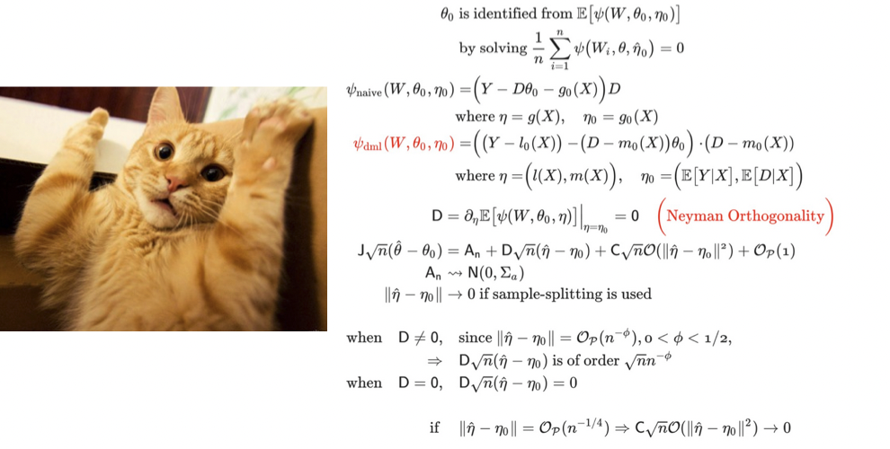

<style>
    p {
        text-align: left;
        font-size: 30px
    }
    ul {
        margin: 0;
        font-size: 30px;
    }
    table {
        font-size: 30px;
    }
    ol {
        margin: 0;
        font-size: 30px;
    }
    blockquote {
        border-left: 10px solid #ccc;
        margin: 1.5em 10px;
        padding: 0.5em 30px;
        quotes: "\201C""\201D""\2018""\2019";
    }

    blockquote:before {
        color: #ccc;
        content: none;
        font-size: 4em;
        line-height: 0.1em;
        margin-right: 0.25em;
        vertical-align: -0.4em;
    }

    blockquote:after{
        content: none;
        font-size: 4em
    }
    img {
        width: 100%;
        height: auto;
        margin-left: auto;
        margin-right: auto;
    }
    figcaption {
        font-size: 15px;
        text-align: center;
    }
</style>
# **Black Box Model Explainability**
```console
Data Sciences Institute
Topics in Deep Learning
```

---
##### **Outline**

- Black box models
- White box models
- Local methods
    - ICE, SHAP, & LIME
- Global methods
    - Global surrogates, Selective Inference, Permutation, Knockoffs, HRT, DML
- Architecture specific methods
    - Tree-based, GradCAM, Attention
- Uncertainty quantification (conformal prediction)

---
<!--_color: white -->
<!--_backgroundColor: #f4a534 -->
## `Black Box Models`

---
#### **What is a black box?**

- In general parlance, a "black box" refers to some function whose internal workings are unknown or opaque
- Like a machine learning model, we assume a black box maps an input to an output: $f(x)=y$, where $f: \mathbb{R}^p \to \mathbb{R}^k$

<br>


---
#### **What is a black box in ML?**

- In machine learning, we use "black box" to refer to:
    - Algorithm classes "whose internal workings are unknown or opaque"
    - Methods that work for any arbitrary function (i.e. as long as you can perform inference or possibly take a gradient from $f_\theta(x)$)
- Questions:
    - What are some ML algorithms you would consider "black boxes"?
    - What are some methods that work for arbitrary functions?

---
#### **Why use a black box model?**

- Flexibly model arbirtary functions

<br>


---
#### **Why use a black box model?**

- Learned features >> hand-crafted features (usually)


See: [Word2vec](https://en.wikipedia.org/wiki/Word2vec)


---
#### **Complexity vs interpretability**

- Many ML models (e.g. DL models) are capable of modeling highly complex, non-linear relationships 
- There is usually (but not always) a trade-off between model compexlity and performane


Source: [Morocho-Cayamcela et. al (2019)](https://ieeexplore.ieee.org/document/8844682)

<!-- Quesiton: In what instances would we NOT expect there to be a trade-off? -->


---
#### **Challenges of black box models**

- **Lack of transparency**: how do models generate their predictions?
<br/>
- **Poor interpretability**: given a certain input, why was a particular prediction made?
<br/>
- **Trust issues**: stakeholders may find it challenging to trust a well-performing model that they cannot understand
<br/>
- **Accountability issues**: if a black box model's behaviour results in serious issues such as death, who should be held accountable?


---
#### **Importance of explainability**

- Explainability is crucial for models deployed in high-stakes environments such as healtchare
<br/>
- The more we understand a model, the more we can:
    - Build trust among stake-holders
    - Foster ethical AI practices
    - Ensure regulatory compliance
    - Facilitate and contextualise model debugging and improvement

---
#### **Lesson objective**

- Explore different methods for elucidating understanding how complex, non-linear models work

---
<!--_color: white -->
<!--_backgroundColor: #f4a534 -->
## `White box models`

---
##### **White box models**

- Several important classes of machine learning models are "naturally interpretable" to humans and do not require black box explainers
    - Note: A natural sanity check for a black box explainer is to compare its interpratations to a linear model
- We'll discuss two classes of explainable models
    - Linear models*
    - Decision trees*

<br>

**Even these methods can become uninterpretable from a human's perspective if there are too many covariates or too much depth*

<!-- Question: What are some other "explainable models"? -->

---
##### **Linear models**

- We'll consider any model class that can be written as (1) to be a linear model

<br>

$$ g(E[y | x]) = f_1(x_1) + f_2(x_2) + \dots + f_p(x_p) + \text{interactions} \hspace{1cm} (1)$$

<br>

- Where $g(E[y|x])$ is the inverse link function (e.g. log-odds) 
- $f_k$ is some function of a single covariate (e.g. identity, square, etc)
- Where "interactions" are a combination of two features (e.g. $x_1 \cdot x_4$)

<!-- Question: What are some other link functions? -->

---
##### **Linear models**


Source: [Molnar (2023)](https://christophm.github.io/interpretable-ml-book/ice.html) 

---
<!--_color: white -->
<!--_backgroundColor: green -->
## `Breakout #1`
##### What is the difference between $f(x_1, \dots, x_p)$ and $f_1(x_1)+\dots+f_p(x_p)$? Which one does a 1-layer NNet describe?

---
##### **Decision trees**

- Are a class of supervised ML which recursively partions the feature space so that the terminal leaves minimizes entropy (classification) or variance (regression)
    - The CART algorithm which "learns the tree" with data is inherantly greedy which is why there are various rules for early stopping


---
<!--_color: white -->
<!--_backgroundColor: #f4a534 -->
## `Local Methods`

---


---
#### **Understanding individual predictions**

- **Local explainability methods** (aka "instance level explainations") offer insights into individual predictions made by black box models
    - They focus on explaining why a particular prediction was made for a specific instance or region of the input space

---
#### **Methodological approaches**
In this lesson, we will go over three different approaches for local explainability:
<br/>

**1. Individual Conditional Expectation (ICE)**: How does an individual instance's prediction change when a single variable changes at a time?

**2. Variable attribution (SHAP)**: how can differences in the prediction level be attributed among the input variables?

**3. Surrogate models of behaviour (LIME)**: can we model black box behaviour locally using an easy to interpret white box model?
<br/>

---
<!--_color: white -->
<!--_backgroundColor: #f4a534 -->
## `Variable Attribution: ICE`

---
#### **Individual Conditional Expectation (ICE)**

- ICE shows how an instance's prediction changes when a feature changes:
- If $x \in \mathbb{R}^p$, $x'_i = (x_{i1}, x_{2}', x_{i3}, \dots, x_{ip})$ and we compare $f_\theta(x'_i)$ for $x_2' \in \mathbb{R}$ to see how the prediction changes for instance $i$ when $x_2$ changes


Source: [Molnar (2023)](https://christophm.github.io/interpretable-ml-book/ice.html) 


---
#### **Individual Conditional Expectation (ICE)**

- ICE can be turned into a "global" explainer by averaging over the individual curves (this is known as a partial dependency plot (PDP))
- ICE works for all black box models that we can run inference on (no gradients needed)
- It is a form of "mechanistic interpretability" (example below: [sklearn](https://scikit-learn.org/stable/modules/partial_dependence.html))


<!-- Quesiton: Is it fair to "mechanistically" interogate a ML model across the feature space? Are there any combinations where this would be absured? -->

---
<!--_color: white -->
<!--_backgroundColor: #f4a534 -->
## `Variable Attribution: SHAP`

---
#### **SHapley Additive exPlanations (SHAP)**

- SHAP is a method for explaining the variation in the output of machine learning model's predictions

<br/>

- This is based on the concept of Shapley values from cooperative game theory: given a set of players (features), how do we distribute the payout (prediction) resulting from a collaborative game (prediction task) 

---
#### **Calculating variable contribution**

- For a given feature $j$ and instance $i$, that SHAP value ($\phi_{ij}$) is:

<br>

$$\phi_{ij} = \phi_j(f, x_i) = \sum_{z' \subseteq x'_i} \frac{|z'|(M-|z'|-1)}{M!} [f_x(z') - f_x(z' \backslash j )]$$

<br>

- This represents a subset of the $2^p$ calculations needed to do an *exact* calculation
- Contributions are anchored to:

$$f(x_i) = E[f(x)] + \sum_{j=1}^p \phi_j(f, x_i)$$

Source: [Lundberg & Lee (2017)](https://arxiv.org/pdf/1705.07874.pdf)


---
#### **Calculating variable contribution**

- In practice, we never calculate the $2^p$ combinations
- Instead we use sampling methods
- While there are algorithm-specific SHAP approaches, the default is KernelSHAP
    - Fit a linear model to the samples inference where $\hat{y}$ is the predicted value, the variables ($Z$) are binary indicators (feature present or not) and the estimated coefficients will be the SHAP values.
    - i.e. regression of $\hat{y} = Z\Phi$
- But how do we run: $f_x(z')$ if $z \in \mathbb{R}^q$ where $q<p$?

---
#### **SHAP waterfall plot: mammography prediction**


Source: [Sun et. al (2023)](https://www.mdpi.com/2227-9032/11/14/2000)

---
#### **SHAP bee swam plot: Cancer survival**


Source: [Alabi et. al (2023)](https://www.nature.com/articles/s41598-023-35795-0)

--- 
#### **Interpreting SHAP values**

- **Sign**: positive SHAP values indicate that a feature value increases the prediction, while negative values indicate a decrease

- **Magnitude**: the magnitude of the SHAP value represents the importance or impact of that feature value on the prediction

- **Additive property**: the sum of SHAP values across all features equals the difference between instance and average predictions

- **Visual interpretation**: SHAP values can be visualized using various plots, such as the waterfall plot, which displays how individual feature values push the prediction of an instance away from the average value

---
#### **Limitations of SHAP**

- **Computationally expensive**: considering all coalitions can be computationally intensive, especially in complex contexts
- **Assumption of independence**: considering all possible coalitions equally may does not reflect feature interdependence, which indicate that certain coalitions are more likely than others in real life
- **Potential misinterpretation**: Users may sometimes misinterpret SHAP values, assuming causality, leading to false conclusions 

---
#### **Question**

- Why would the SHAP value $\phi_{ij}$ be different that the difference between the ICE and the PDP?


Plot: ICE curves (black lines), PDP curve (yellow line)

Source: [Molnar (2023)](https://christophm.github.io/interpretable-ml-book/ice.html) 


---
<!--_color: white -->
<!--_backgroundColor: green -->
## `Breakout #2`
##### How would you create a "variable importance" based on the SHAP values? How would you explain this metric to a data science expert and non-expert?


---
<!--_color: white -->
<!--_backgroundColor: #f4a534 -->
## `Surrogate models: LIME`

---
#### **Local Interpretable Model-agnostic Explanations (LIME)**

- LIME is a technique for explaining individual predictions of black box machine learning models at a local level

<br/>

- It approximates the behavior of the black box model by training interpretable surrogate models on perturbed instances around the prediction of interest

<br/>

- LIME provides insights into why a specific prediction was made by highlighting the contribution of different features for that instance

<br/>

---
#### **LIME's philosophy**

- The LIME model is based on three "Desired Characteristics for Explainers":
    - Interpretable
    - Locally faithful
    - Model-agnostic
- An "interpretable" model class $g(x')$ is used to approximate $f(x)$ (where $x'$ is an interpretable feature space of $x$), where $\ell(\cdot)$ is the error between them and $\pi_x$ defines what is "local"

<br>

$$
\xi(x) = \ell(f, g, \pi_x) + \Omega(g)
$$


---
#### **Mechanistic overview**

 Given an original instance of interest, LIME does the following:

 1. Sample multiple new instances around the original neighbourhood
 2. Weight each new instance according to their proximity to the original
 3. Train a simple, interpretable model (such as linear regression) on the neighbourhood data
 4. Explain the original instance's prediction by interpreting the surrogate model

---
#### **Mechanistic overview**

- Loss functions could include:

<br>

$$
\ell(f, g, \pi_x) = \sum_{z \in \Pi_X} \pi_x(z) [f(z) - g(z)]^2
$$

<br>

- Or if we were willing to "classify" our points ($\hat{y}=I[f(z)>t]$):

<br>

$$
\ell(f, g, \pi_x) = - \sum_{z \in \Pi_X} \pi_x(z) [ \hat{y}\log(g(z)) + (1-\hat{y})\log(1-g(z))   ]
$$


---


---
#### **Some similarity to a local linear regression (LOESS)**

- Local linear regression fits a linear model for every new instance
    - $\arg\min_{\alpha,\beta} \sum_{i=1}^n K_\lambda(x, x_i)[y_i-\alpha-x_i^T\beta]^2$

<br>


<!-- Question: Why is LOESS considered a form of "lazy" learning (hint: KNNs are also considered Lazy learners)  -->

---
#### **Limitations of LIME**

- **No single correct way of defining a neighbourhood**: the reweighing function used for new sampled instances based on their distance from the original is variable and can have important impacts in downstream results

- **Generation of unlikely samples**: sampling a neighbourhood by using a normal distribution around the instance of interest may generate samples that wouldn't exist in real data, leading to surrogate models that do not adequately represent the real underlying data distribution

- **Model dependence**: interpretability results heavily depend on the choice of both the black box model and the surrogate model

<!-- Question: Based on what we've seen so far, which method would you use to "intepret" an ML model on tabular data? -->

---
<!--_color: white -->
<!--_backgroundColor: #f4a534 -->
## `Global Methods`

---


---
##### **Understanding overall model behaviour**

- **Global explainability methods** offer insights into what features drive model performance and prediction

---
##### **Why does it matter?**

- Global explainability enhances our general understanding of a model's decision-making process across an entire dataset, enhancing methodological transparency and increasing trust amongst stakeholders
<br/>

- It also facilitates model debugging and improvement by identifying unexpected behaviours and potential areas of improvement, such as feature selection

---
##### **Methodological approaches**
In this lesson we will go over two different global explainability approaches:

- **Global surrogates**
- **Selective Inference**
- **Knockoffs**
- **Permutation tests**
- **Holdout Randomization Test (HRT)**
- **Double machine learning (DML)**

---
<!--_color: white -->
<!--_backgroundColor: #f4a534 -->
## `Global Surrogates`

---
##### **Global surrogate models**

- A global surrogate is a simple, interpretable model (e.g., linear regression or decision tree) trained to approximate the predictions of a black box model
    - We are using simple machine learning to model the behaviour of more complex DL algorithms

---
##### **Basic principle**
A global surrogate model can be obtained and interpreted as follows:
1. Define a dataset $X$
2. Obtain prediction outputs of $X$ using the black box model
3. Select and train an interpretable model using $X$ as input and the black box predictions as output
4. Measure how closely the predictions of both models align
5. Interpret the surrogate model (e.g., which features have the most important coefficients in linear regression)
<br/>

---


---
##### **Limitations**

- **Misinterpretation**: the insights gained from global surrogate models are related to model behaviour, **NOT** to the characteristics of the data itself
- **What is a good approximation?**: there are no clear rules to determine how similar the surrogate model predictions have to be to its black box counterpart to be considered an acceptable approximation of behaviour

<!-- Question: What are some other limitation here? Why not just train a surrogate model on the original dataset? -->

---
<!--_color: white -->
<!--_backgroundColor: #f4a534 -->
## `Selective inference (white box models)`

---
##### **Selective inference (overview)**

- For high dimensional datasets, there is a reasonable chance that only a small number of variables matter ("sparsity hypothesis")
- We use algorithms like the Lasso, ElasticNet, and stepwise regression to select a subset of covariates


Source: [Wikipedia](https://en.wikipedia.org/wiki/Lasso_(statistics)#/media/File:L1_and_L2_balls.svg)

---
##### **Selective inference (overview)**

- But can we do hypothesis testing on the results of these algorithms?
    - This does not align with the "classical" framework of statistical hypothesis testing


Source: [Candes (2017)](https://candes.su.domains/talks/slides/Wald1.pdf)

<!-- Question: Well, what do we think? -->

---
##### **Selective inference (overview)**

- If we do hypothesis testing **after selection**, then the answer is NO!
    - P-values will not be uniform (or conservative) when the null is true
    - There will be a massively inflated type-I error rate


Source: Taylor and Tibshirani (2015)


---
##### **Selective inference (overview)**

- This problem of HARK'ing (hypothesizing after results are known), is part of the reason why we have the reproducability crisis in academic research


Source: [Ranking Fields by p-Value Suspiciousness](https://www.cremieux.xyz/p/ranking-fields-by-p-value-suspiciousness)


---
##### **Selective inference (overview)**

- Instead, in selective inference we wish to test: 
    - $P( \text{parameters} | \text{data, selection event})$
- We can do this for many classes of algorithms and get "corrected" p-values and confidence intervals
    - e.g. Lasso, ElasticNet, Stepwise Regression


Source: Prostate cancer dataset, from [Recent Advances in Selective Inference](https://www.stat.cmu.edu/~ryantibs/talks/inference-2016.pdf)


---
##### **Selective inference (example)**

- Suppose we have a high-dimensional dataset (e.g. GWAS), and we're modelling a response a linear combination of variables:
    - $g(E[y_i|x_i]) = \beta_0 + \beta_1 x_{i1} + \dots + \beta_p x_{ip}$
    - $i \in \{1, \dots, n\}$, where $p \gg n$
- We use some sort of "sparsity inducing algorithm" (e.g. Lasso)
- We get back a new model: $g(E[y_i|x_i]) = \beta_0 + \beta_2 x_{i1} + \beta_{12} x_{i12} + \beta_{39} x_{i39}$
- We now want to test: $H_0: \beta_{12} = 0$
- We condition on having selected these three specific covariates, and get back associated p-values and CIs
- Now we both have an interpretable model (linear) as well as statistical confidence
- Question: Why not just split the data?

---
##### **Selective inference (Lasso example)**

- By conditioning on the selection event, we condition on the region of the response space that could have generated the selection event (this is known as the polyhedral lemma)


Source: Terada & Shimodaira (2019)

---
##### **Selective inference (Lasso example)**


[Source](https://speakerdeck.com/saltcooky12/detadoribunnajia-shuo-jian-zheng-falsetamefalseselective-inference?slide=3)

---
<!--_color: white -->
<!--_backgroundColor: #f4a534 -->
## `Permutation Tests`

---
##### **Permutation Tests**

- Given a trained model and a held out test set, permutation testing repeatedly evaluates model performance on the test set following individual feature perturbations
    - Measuring the impact of these perturbations on model predictions serves as a proxy of overall feature importance
<br/>

- These measures provide insights into feature interactions and overall model behaviour

---
##### **Permutation algorithm**

Given a trained model and a test set permutation testing can be implemented as follows:

1. Compute baseline performance on the test set
2. For each feature in the test set:
    - Shuffle the feature of interest
    - Evaluate test set performance following this shuffle
    - Repeat this process multiple times to generate a distribution of performance given the shuffled feature
    - Compute a test statistic to determine whether or not the disturbance of this feature led to worse test set performance

---
##### **Interpreting Permutation results**

- At a high level, permutation testing  conducts a conditional independece test for each feature $X_j$, with the null hypothesis stating that an outcome $y$ is independent of feature $X_j$ given all other features
<br/>

- Intuitively, if $X_j$ is predictive of $y$, perturbing this feature in isolation will break down its relationship to $y$ and lead to drops in performance

---


---
##### **Limitations of Permutation testing**

- **Sensitivity to test set size**: effectiveness of Permutation testing may vary depending on the size of the holdout set

- **Limited interpretability**: Does not account for dependencies between columns of the data

- **Assumption of exchangeability**: The act of shuffling features in isolation may introduce unrealistic data upon which feature importance is calculated

<!-- Question: Suppose we were predicting an outcome like "heart disease" and we had features "height" and "weight". Why would both of them likely show a high "feature importance" using the permutation method? -->

---
<!--_color: white -->
<!--_backgroundColor: #f4a534 -->
## `Knockoffs`

---
##### **Knockoffs (overview)**

- Suppose we want to model $y = f_\theta(X)$
- Create a "knockoff" version of $\tilde{X}=X$, then model $y = f_\theta([X, \tilde{X}])$
    - Match correlation structure (except for knockoff pair): $X^T X = \Sigma$, $\tilde{X}^T \tilde{X} = \Sigma$, and $X^T \tilde{X} = \Sigma - \text{diag}(s)$
- Calculate a feature importance score for the original and knockoffs
- Select a subset of features based on empirical distribution of scores which guarantees a certain false discovery rate (FDR) proportion


Source: [Robust inference with the knockoff filter](https://www.math.wustl.edu/~kuffner/WHOA-PSI-3/RinaFoygelBarber-slides.pdf)


---
##### **Knockoffs (overview)**


Source: [Using Knockoffs to Find Important Variables with
Statistical Guarantees](https://klab.tch.harvard.edu/academia/classes/BAI/2021/slides/LucasJanson_Neuro140_presentation.pdf)

---
##### **Knockoffs (example)**


Source: [Yang et. al (2022)](https://www.sciencedirect.com/science/article/pii/S0002929722004025)


---
##### **Knockoffs (summary)**

- Advantages
    - Works with any model able to generate a feature importance score 
    - Provides robust statistical guarantees (false discovery)
- Disadvantages
    - Requires knownledge of $P(X)$
        - Errors in knockoff construction will destroy statistical guarantees
    - Requires special optimization procedure to construct the knockoff
    - Higher computational cost (i.e. need to fit model with $2\cdot p$ features!)
    - Different feature importance metrics will lead to different subsets of features

---
<!--_color: white -->
<!--_backgroundColor: #f4a534 -->
## `Holdout randomization test`


---
##### **Holdout randomization test (HRT)**

- A feature is "uninformative" if, conditional on all other features, it does not impact model performance
    - $y \perp X_j | X_{-j}$
- Suppose we train our model to learn $\theta$: $\arg \min_\theta \hspace{2mm} \ell(y, f_\theta(x))$
- We can get an unbiased estimate of the loss function $\ell(\cdot)$ if we evaluate it on a new set of data (e.g. a "test set")
- The HRT shows how we can determine whether a given feature ($x_j$) has any impact on this representative "test set"
    - And therefore we can get back a p-value for $H_0: y \perp X_j | X_{-j}$

---
##### **HRT algorithm**

- Four step process for **any ML model** and **any loss function**
    - Step 1: Obtain a fitted model, $\hat{f}_\theta$, using training/validation data ($y_R, X_R$)
    - Step 2: Compute the empirical risk on a test set ($y_T, x_T$): $\hat{R}(\hat{f}_\theta)=\ell(y_T, \hat{f}_\theta(x_T))$, where $E[\hat{R}(\hat{f}_\theta)] = R(\hat{f}_\theta)$
    - Step 3: Draw $S$ samples of feature $j$, $\tilde{x}_j^s \sim F(x_j|x_{-j})$, and calculate the test set risk: $\hat{R}^{s}_j=\ell(y_T, \hat{f}_\theta(\tilde{x}_T^j))$, swapping only column $j$
    - Step 4: Calculate a one-sided p-value as the proportion of times the "sampled" covariate led to a lower loss (i.e. risk): 
    $p_j = \frac{1}{1+S}\Big(1 + \sum_{s=1}^S I\big[\hat{R}^{s}_j \leq \hat{R}  \big] \Big)$


---
##### **HRT sampling**

- But how do we draw $\tilde{x}_j^s \sim F(x_j|x_{-j})$? 
- Similar to parametric data imputation, we need to have a new model for every column we want to apply the HRT algorithm towards
- For example, if $x_j$ is a binary indicator, we could model it with a logistic regression model: $\log\frac{E[x_j|x_{-j}]}{1-E[x_j|x_{-j}]} = \gamma_0 + \sum_{k\neq j} \gamma_k x_{k}$
    - And then draw samples from a Bernoulli distribution: $\tilde{x}_{ij} = \text{Bern}(\sigma(\hat\gamma_0 + \sum_{k\neq j} \hat\gamma_k x_{ik}))$

<!-- Question: Can someone explain this more? Suppose we fit any binary classifier (doesn't have to be LR, could be RF, XGBoost, etc), how do you draw samples from this after the model has been fit -->

---
##### **HRT example**


---
<!--_color: white -->
<!--_backgroundColor: #f4a534 -->
## `Double machine learning`

---
##### **Double machine learning (DML)**

- If we assume that our data is "partially linear":
    - $y = d^T \eta + f_\theta(x)$
    - $d$ is a either a vector or a low-dimesional matrix
    - $\eta$ is the parameters we are interested in doing statistical testing on
    - $f_\theta(x)$ is some functional form we will approximate with an ML algo
- Example: 
    - $\text{disease} = \text{smoking}\cdot\eta + f_\theta(\text{genetics})$
- Question: 
    - What will happen if we learn $y = \hat{f}_\theta(x)$ first, and then "plug in" these predictions and run a simple regression ($y = d^T \eta + \hat{f}_\theta(x)$)?

<!-- Answer: There is no consistent estimator for eta! -->

---
##### **Double machine learning (DML)**


---
##### **Double machine learning (DML)**

- The problem is that $y - \hat{f}_\theta(x)$ creates biased "residuals" (i.e. still lots of confounding)
- The solution is to learn two sets of models so that that residual bias cancels out at a very fast rate so we get a consistent estimator of $\eta$
    - Step 1: learn $y = \hat{f}_\theta(x)$
    - Step 2: learn $d = \hat{g}_\phi(x)$
    - Step 3: Determine if there's any variation in $y$ attributable to $d$ that isn't explained by $x$!
        - $y - \hat{f}_\theta(x) = (d - \hat{g}_\phi(x)) \cdot \eta$ 

---
##### **DML intuition**

- Why does this work?
    - The errors in the first stage (estimating $f_\theta$ and $g_\phi$) do not systematically bias the second stage
    - Cross-fitting ensures the procedure is asymptotically unbiased

<br>



<!-- Question: The biggest challenge with DML is with the partially linear assumption. What are some use cases where this is plausible and where it's not? -->

---
<!--_color: white -->
<!--_backgroundColor: green -->
## `Breakout #3`
##### Come up with examples when you would use a local explainability method but not a global one, a global one but not a local one, and when you would use both?


---
<!--_color: white -->
<!--_backgroundColor: #f4a534 -->
## `Architecture specific methods`


---
##### **Architecture specific methods**

- Global methods
    - Tree-based
- Local (instance-level) methods
    - GradCAM, Attention

---
<!--_color: white -->
<!--_backgroundColor: #f4a534 -->
## `Tree-based methods`

---
##### **Tree-based feature importances**

- When using gradient-boosted trees (e.g. xgboost) or bagged trees (e.g. random forest), we can generate feature importance scores from statistics of the tree fitting process:
    - Which covariate led to a split?
    - How many samples were there in a split?
    - What was the change in the splitting criteria (e.g. Gini impurity, variance reduction)

---
##### **Tree-based feature importances**


[Source](https://towardsdatascience.com/understanding-decision-trees-for-classification-python-9663d683c952)

---
##### **Tree-based feature importances**

- Advantages
    - Does not require extra computation
    - Easy to explain (aligns with tree structure)
- Disadvantages
    - Based on splitting criteria
    - Score is only ordinal, unclear what difference in scores means
    - No statistical "significance"

---
<!--_color: white -->
<!--_backgroundColor: #f4a534 -->
## `GradCAM`

---
##### **GradCAM**

- For convolutional neural networks (CNNs)...


---
<!--_color: white -->
<!--_backgroundColor: green -->
## `Breakout #4`
##### Suppose there is a melanoma classifier that uses a CNN. As a potential future patient, how would you want this classifier to explain its "prediction" about whether you had melanoma or not from your picture?


---
<!--_color: white -->
<!--_backgroundColor: #f4a534 -->
## `Attention heads`

---
##### **Attention**

- For attention-based neural networks (e.g. language models)


---
<!--_color: white -->
<!--_backgroundColor: #f4a534 -->
## `Uncertainty quantification (conformal prediction)`

---
##### **Conformal prediction**

- In addition to explaining how a model works (either a global or local level), we may also want to quantify how certain the model is
- This is also a form of explainability (i.e. how "uncertain" the model is), and it helps to build trust in our model
- Questions: 
    - Would you expect the softmax probabilities of a DL model for a multiclass problem to be "well calibrated"?
        - $\sum_{i \in Y_k} p_i = \sum_{i \in Y_k} Y_{i,k}$?
    - For a regression model, how do we know if two different predicted values are statistically different?

---
##### **Conformal prediction**

- In classical statistics we generate **confidence intervals** around a parameter of interest:
    - $P(\mu \in C_\alpha(X)) \geq 1-\alpha$
    - If $X \in \mathbb{R}^n$, then $C_\alpha: \mathbb{R}^n \to \mathbb{R}^2$
    - Example: $\mu = E[X]$, $X\sim N(\mu, \sigma^2)$, then $C_\alpha(X) = \{ \frac{1}{n}\sum_{i=1}^n X_i \pm t^{-1}_{n-1}(\alpha/2) \sqrt{\frac{1}{n-1}\sum_{i=1}^n (X_i - \frac{1}{n}\sum_{i=1}^n X_i)^2} \}$
- But in ML, we are mainly interested in prediction, and thus we care more about **prediction intervals**:
    - If $y=\mu(X) + \epsilon$ is the true data generating process
    - Then we want some interval which will contain the actual label with probability $100(1-\alpha)\%$
    - $P(y \in C_\alpha(X)) \geq 1-\alpha$

---
##### **Conformal prediction**

- **Conformal prediction works for any black box model for classification and regression**


Source: [Angelopoulos & Bates (2022)](https://arxiv.org/abs/2107.07511)

---
##### **Conformal prediction**


Source: [Conformal Prediction in 2022](https://www.youtube.com/watch?v=k8GpG9D5c20)


---
##### **(Split) conformal prediction algorithm**

- Step 1: Fit a model, $f_\theta$ on training/validation data, and hold out a test set (points $\{1, \dots, n\}$)
- Step 2: Define a measure of non-conformity $s(y, f_\theta(x))$, where larger values of $s(\cdot)$ indicate less agreement (e.g. mean-absolute-error)
- Step 3: Pick the type-I error rate ($\alpha$) and compute the $\hat{q}=\lceil (n+1)(1-\alpha) \rceil/n$ quantile of $s_1, \dots, s_n$
- Step 4: For any new instance, define the prediction set as: $C(x_\text{new}) = \{y: s(y, f_\theta(x_\text{new})) \leq \hat{q} \}$

---
##### **Conformal prediction (summary)**

- Advantages
    - Works for all ML algorithms, only requires a calibration (test) set
    - Uses only a heuristic measure of uncertainty (e.g. residuals)
- Disadvantages
    - Provides marginal rather than conditional coverage
    - Size of test set determines variation in type-I error rate


Source: [Angelopoulos & Bates (2022)](https://arxiv.org/abs/2107.07511)


---
##### **References**

(1) Molnar, C. (2022). Interpretable Machine Learning:
A Guide for Making Black Box Models Explainable (2nd ed.). [Available online](christophm.github.io/interpretable-ml-book/)

(2) A Data Odyssey. (2023, March 20). SHAP with Python (Code and Explanations) [Video]. YouTube. https://www.youtube.com/watch?v=L8_sVRhBDLU

(3) Tansey, W., Veitch, V., Zhang, H., Rabadan, R., & Blei, D. M. (2018, November 1). The Holdout randomization test for feature selection in black box models. arXiv.org. [Available online](https://arxiv.org/abs/1811.00645)

(4) Spector, A., & Janson, L. (2020, November 30). Powerful knockoffs via minimizing reconstructability. arXiv.org. [Available online](https://arxiv.org/abs/2011.14625)

