<style>
    p {
        text-align: left;
        font-size: 30px
    }
    ul {
        margin: 0;
        font-size: 30px;
    }
    table {
        font-size: 30px;
    }
    ol {
        margin: 0;
        font-size: 30px;
    }
    figcaption {
        font-size: 15px;
        text-align: center;
    }
</style>

# **Business Thinking & Organizational Structure**
```console
Data Sciences Institute
Topics in Deep Learning
Instructor: Erik Drysdale
TA: Jenny Du
```

---
##### **Outline**

- Healthcare initiatives
- Triple Win & Aim framework
- Institutions, Org charts, and Processes
- Disruptive technologies in healthcare
- Examples of successful healthcare AI companies

---
<!--_color: white -->
<!--_backgroundColor: #f4a534 -->
## `Healthcare Initiatives`

---
##### **Healthcare Initiatives**
- Successful healthcare initiatives will take into account:
  - Key stakeholders (Patients & families, Healthcare providers, and other hospital staff)
  - Organization structure
  - Current incentives
- **Transformation** is much harder than **change**, and most healthcare transformations will be underwhelming
  - Adoption of data science initiatives requires a solid understanding of both the *institutional* and *technical* challenges with DS


---
##### **AI Center of Excellence**

- A healthcare orgnaization wishing to adopt a data science at scale will often face a key strategic question:
  - *To what extent should a central AI team coordinate and drive data science transformation?*
- A common approach is to develop an AI Center of Excellence
  - *A dedicated team or department that focuses on the strategic implementation of artificial intelligence technologies across the organization*


Source: [AtScale](https://www.atscale.com/blog/what-is-an-ai-center-of-excellence/)

---
##### **AI Center of Excellence (benefits)**

- Concentration of expertise
  - Recruiting an maintaining AI talent is very difficult!
- Economies of scale
  - By having larger pool of skilled data scientists, you can more smoothly distribute work
- 

---
##### **AI Center of Excellence (benefits)**

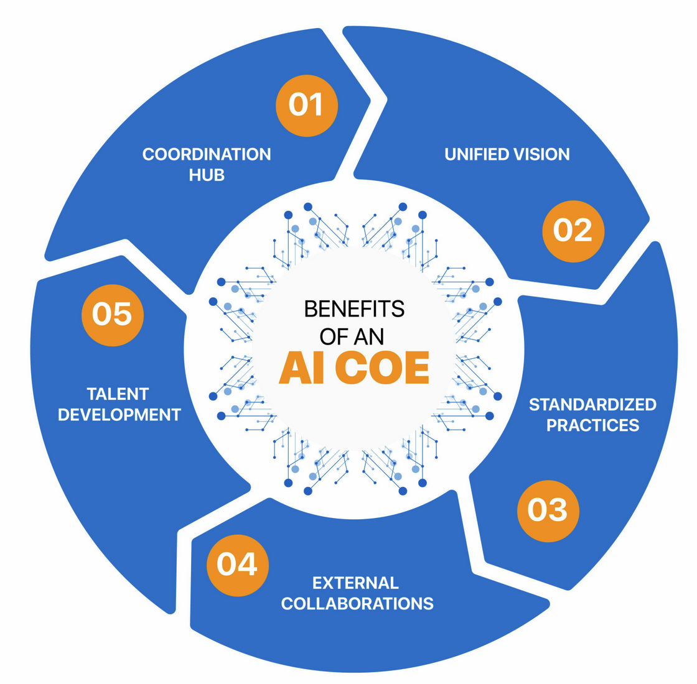

Source: [Zinnov](https://zinnov.com/centers-of-excellence/mastering-ai-centers-of-excellence-key-considerations-for-success-blog/)

<!-- Question: What are some of the downsides with a CoE? -->


---
<!--_color: white -->
<!--_backgroundColor: #f4a534 -->
## `Triple Aim Framework`

---
##### **Triple Aim Framework**
- Developed by Dr. Donald Berwick and colleagues at the Institute for Healthcare Improvement (IHI) in 2007.
- Three interconnected goals focus on enhancing healthcare systems and the overall health and well-being of populations.

---
##### **Triple Aim Framework**

1. **Improving Population Health**: Enhance the health of a defined population.
2. **Enhancing Patient Experience of Care**: Improve the experience of care for individual patients.
3. **Reducing the Per Capita Cost of Healthcare**: Reduce the overall cost of healthcare while maintaining or improving quality.

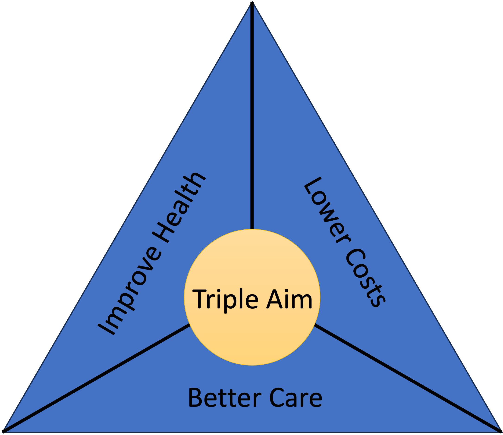

---

<!--_color: white -->
<!--_backgroundColor: #f4a534 -->
## `Triple Win Framework`

---
##### **Triple Win Framework**
- When thinking about new ideas, try expanding "Triple Aim" to "Triple Win".
- You need to consider how your idea creates value for all three stakeholders: patients, clinicians, and funders.

<figure>
  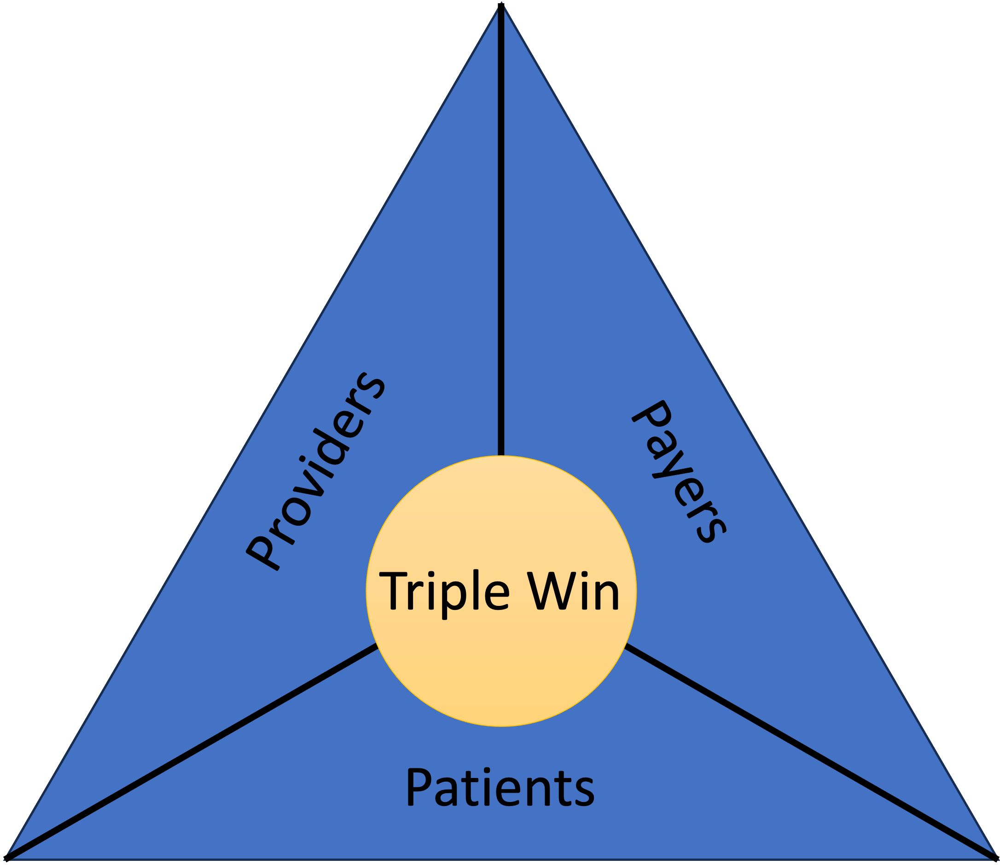
</figure>

---
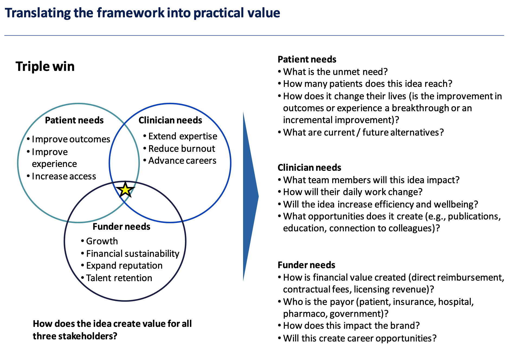

---
##### **Patient**
*Improve Outcomes, Improve Experience, Increase Access*
1. What specific need or problem has not been addressed yet?
2. How many patients can benefit from this idea?
3. Does this idea lead to a change in their lives? Is it large- or small-scale improvements in outcomes or experiences?
4. What are the alternatives that exist now or could exist in the future to address this need or problem?

--- 

##### **Clinician**
*Extend Expertise, Reduce Burnout, Advance Careers*
- Which team members will be affected by this idea?
- How will their daily tasks and responsibilities be altered?
- Will the idea contribute to improved efficiency and the overall well-being of team members?
- What potential opportunities does it bring, such as the possibility of publications, educational benefits, or enhanced connections with colleagues?

---
##### **Funder**
*Growth, Financial Stability, Expand Reputation, Talent Retention*
- How does this idea generate financial value, such as through direct reimbursement, contractual fees, or licensing revenue?
- Who pays for this, is it the patient, insurance providers, hospitals, pharmaceutical companies, or government entities?
- What is the effect of this idea on the brand or reputation of the entity involved?
- Will this idea lead to the creation of new career opportunities?

---
##### **Medicine happens in buildings (usually)**

<div class="row" style="text-align: center;">
 <div style="display: inline-block; margin-right: 20px;">
  
 </div>
 <div style="display: inline-block; margin-right: 20px;">
  
 </div>
 <div style="display: inline-block; margin-right: 20px;">
  
 </div>
</div>


---
##### **Example Org Chart**

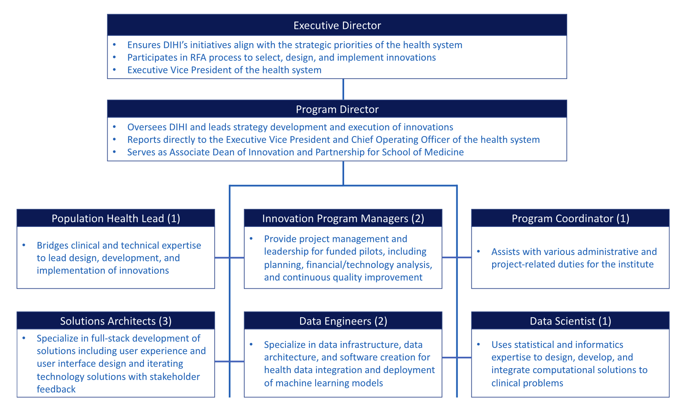

Source: [Sandhu et. al (2023)](https://www.cell.com/patterns/pdfExtended/S2666-3899(23)00047-8)

---
##### **Create a sense of urgency**

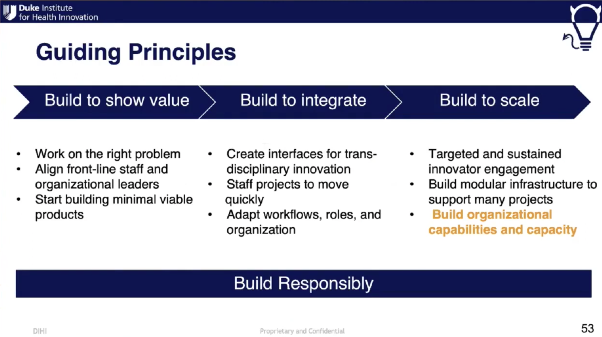

Source: [AI in biomedical data analytics and population health](https://www.youtube.com/watch?v=hBu5ZIvYLjs)

---
##### **Top to bottom**

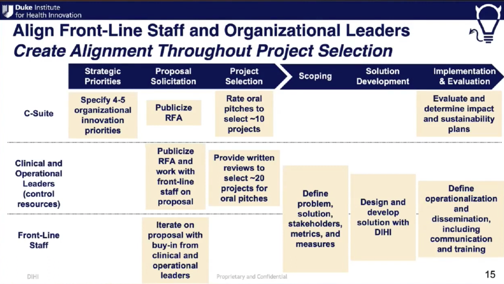

Source: [AI in biomedical data analytics and population health](https://www.youtube.com/watch?v=hBu5ZIvYLjs)


---
##### **At the top**

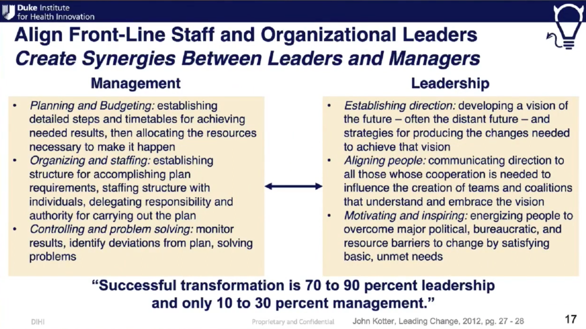

Source: [AI in biomedical data analytics and population health](https://www.youtube.com/watch?v=hBu5ZIvYLjs)


---
##### **Example of making the alignment**

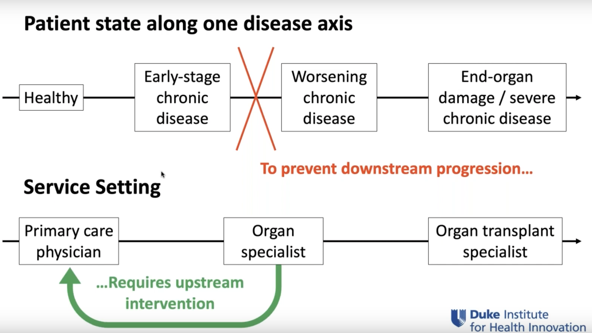


Source: [Increasing AI Tool Adoption by Front-Line Workers](https://www.youtube.com/watch?v=qF18trDyQCg&t=2087s)


---
##### **At the top**


Source: [AI in biomedical data analytics and population health](https://www.youtube.com/watch?v=hBu5ZIvYLjs)


---
##### **Example of making the alignment**


Source: [Increasing AI Tool Adoption by Front-Line Workers](https://www.youtube.com/watch?v=qF18trDyQCg&t=2087s)


---
<!--_color: white -->
<!--_backgroundColor: #f4a534 -->
## `Disruptive technologies in healthcare`

---
##### **Disruptive technologies (overview)**
- A disruptive technology refers to an innovation that significantly alters the way consumers, industries, or businesses operate
  - Classic examples include smartphones, streaming services, ride sharing, short-term rentals, and much more
- Disruptive technologies come about when a sufficient number of complementary technologies allow for an innovation to "break through" (think cell phones and ride sharing)
  - But many also capitalize on **regulatory arbitrage**
  - This will be important to understand many of the (currently early-stage) "disruptions" we are seeing in Canadian healthcare

<!-- Question: What do I mean by regulatory arbitrage?? -->

---
##### **Disruptive technologies (healthcare)**

- Healthcare as an industry is a study of contrasts:
  - Foundational aspects of medical education and clinical practice have shown remarkable resilience to change
  - Whereas, the tools of medicine are constantly changing
- Besides pharma and medical devices, the main disruptive innovations have been: **EHRs, telemedicine, and new service models**

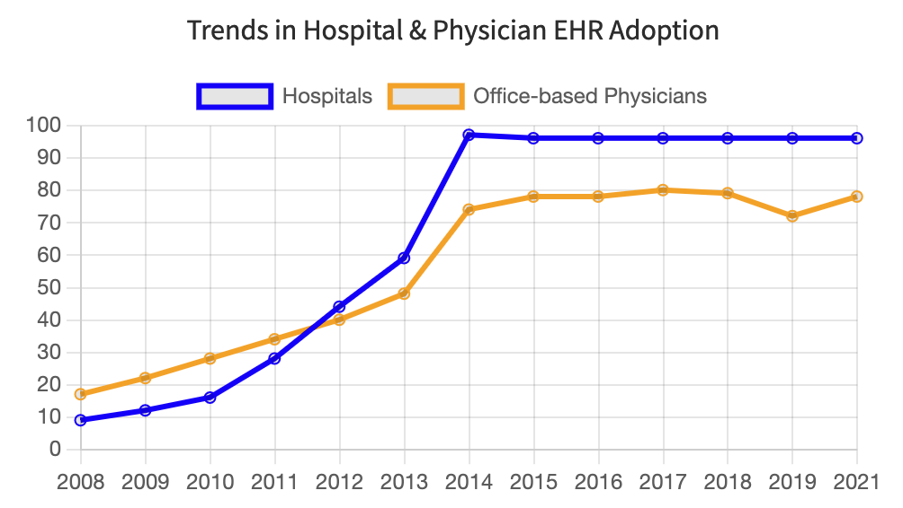

[Source](https://www.healthit.gov/data/quickstats/national-trends-hospital-and-physician-adoption-electronic-health-records)

---
##### **Disruptive technologies (rare-disease orgs & pharma)**

- Breakthrough therapies will often disrupt how entire patient cohorts are treated, and rare-disease focused non-profits have driven this
- The case of Cystic Fibrosis (CF) is illustrative
  - Advances in nutrition, antiobiotics, lung clearance, and finally modulator therapies have revolutionized care and life expectancies
  - These technological breakthroughs have made it a "new" disease

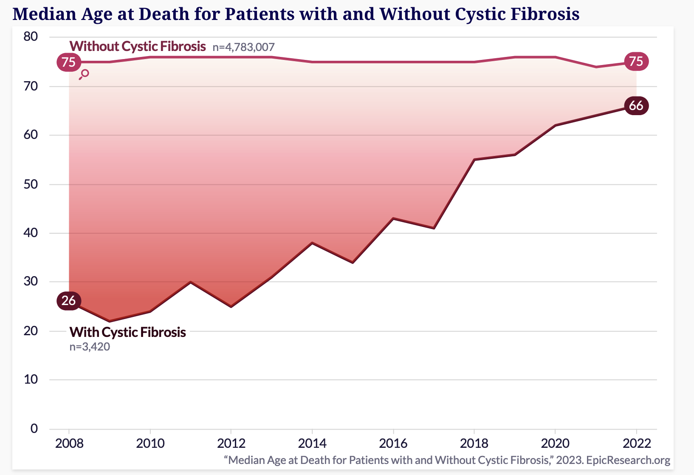

Source: [Epic](https://www.epicresearch.org/articles/cystic-fibrosis-patients-living-much-longer-in-2022-than-in-2008)

---
##### **Disruptive technologies (Medical devices)**

- Countless imaging modalities, surgical instruments, and monitoring devices
- Laparoscopy (key-hole) surgery has enabled countless surgeries to be carried out at lower risk, lower cost, and faster recovery

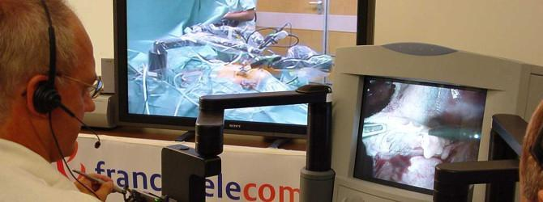

<br>

First telesurgical laparascopic surgery performed in 2001 ([source](https://www.ircad.fr/le-geste-chirurgical-a-traverse-latlantique/))


---
##### **Detour: Canada's healthcare system**

- Canada has a universal healthcare model (like most rich countries)
- But the Canada Health Act (1985) has created a unique legal landscape for healthcare in the country
  - In exchange for $$$ provinces agree to the five principals of the CHA: Universality, Portability, Comprehensiveness, Public Administration, Accessible
  - But healthcare is provincially managed
  - The federal government can fine provinces for being out of step with the CHA, but it is rare/difficult
- In theory, a physician cannot charge for any medical service that is covered by the provincial plan... (70% of HC is paid by government)
  - Question: Has anyone seen exceptions to this?

<!-- 
Each of these concepts though is often challenged or in contraction:
Universality: Generally true, but some areas might just not have any healthcare to access!
Portability: b/c provinces determine what is medically necessary, won't always be true
Comprehensiveness: Needs to cover medically necessary care (but this does not include Rx, Ambulances, Dental, Vision, Prosthetics, etc)
Public Administration: Lot's of private players (private practice, private clinics, big pharma, etc), but only the gov't should pay
Accessible: No user fees (but BC used to charge for a healthcard)
Plus lot's of other fun exceptions (RCMP, Armed Forces, First Nations)
 -->

---
##### **Detour: Canada's healthcare system**


Source: [Commonwealth Fund (2021)](https://www.commonwealthfund.org/publications/fund-reports/2021/aug/mirror-mirror-2021-reflecting-poorly)

---
##### **Disruptive technologies (new service models)**

- There has been an explosion in new service models in Canadian healthcare that are taking advantage (regulatory arbitrary) of our "unique" system
  - Federal vs provincial
  - Medically necessary vs not
  - Publically funded in theory but not in practice

<br>

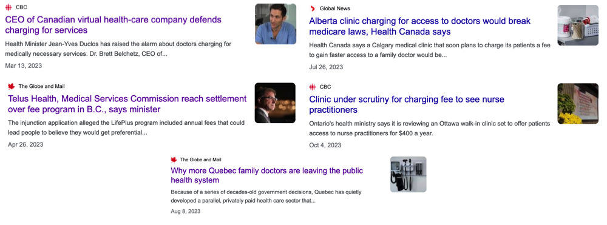

<!-- Note: Quebec's privitization is probably the most advanced, having more than 600 non-participating doctors, against a dozen in all other provinces – nine in British Columbia and three in Alberta. -->


---
##### **Disruptive technologies (new service models: telehealth)**


<br>

> Instead of connecting an Ontario patient with a doctor in Ontario — which would be covered under OHIP — Maple will set up an appointment with a nurse practitioner or a physician outside of the province. Those appointments aren't covered by OHIP. And before a patient speaks with a health worker, they go through a text-based chat, which is also uninsured by OHIP. Maple works the same way in other provinces.

[Source](https://www.ipolitics.ca/queens-park/health-canada-concerned-about-ontario-company-that-charges-for-virtual-doctor-visits)

---
##### **Disruptive technologies (new service models: telehealth)**


<br>

> Dialogue only works with organizations or insurance companies. It doesn’t work with individuals... From a health care regulations point of view, that is the safest way to stay within the confines of the Canada Health Care Act... A patient never uses their credit card to pay for health care service.

[Source](https://www.thestar.com/business/dialogue-co-founder-cherif-habib-on-virtual-care-and-why-he-doesn-t-want-to/article_9b1e37d0-d747-5a72-9eac-a740a798aa14.html)

---
<!--_color: white -->
<!--_backgroundColor: green -->
## `Breakout #X`
##### How do you see the role of data science in Canada's healthcare system emerging with these disruptive trends?


---
<!--_color: white -->
<!--_backgroundColor: #f4a534 -->
## `Successful AI-based HC companies`

---
<figure>
  
  <figcaption style="text-align: center;">https://flatiron.com</figcaption>
</figure>

---
##### **Flatiron health**
- Healthcare technology company specializing in cancer research and patient care. 
- **Data Curation and Analysis**: Analyzes data, including EHRs, for real-world cancer care insights.
- **Software Solutions for Clinics**: Offers cloud-based oncology software to improve clinic operations and patient care.
- **Research Collaboration**: Collaborate with the life sciences sector for cancer research to accelerate therapy development.
- **Insights for Oncology Care**: Provides healthcare insights to enhance care quality, inform policy, and guide strategic planning.

---
<figure>
  
  <figcaption style="text-align: center;">https://www.tempus.com</figcaption>
</figure>

---
##### **Tempus Labs**
-  Tech company focused on precision medicine, using artificial intelligence to analyze clinical and molecular data. 
-  **Genomic Sequencing**: Perform  genomic sequencing for targeted disease treatments.
-  **Data Analytics**: Analyze clinical and molecular data for treatment insights.
-  **Clinical Data Structuring**: Structure unstructured medical data.
-  **Collaboration with Healthcare Research**: Collaborate with healthcare and research entities to advance personalized medicine

---
<figure>
  
  <figcaption style="text-align: center;">https://www.recursion.com</figcaption>
</figure>

---
##### **Recursion Pharmaceuticals**
- Biotech company using AI and automation for drug discovery.
- **Drug Discovery**: Use AI to rapidly identify potential drugs for a wide range of diseases.
- **High-throughput Screening**: Employ automation and robotics to perform experiments at a large scale.
- **Data-driven Insights**: Data-driven insights from biological data and machine learning to speed up pharmaceutical research.
