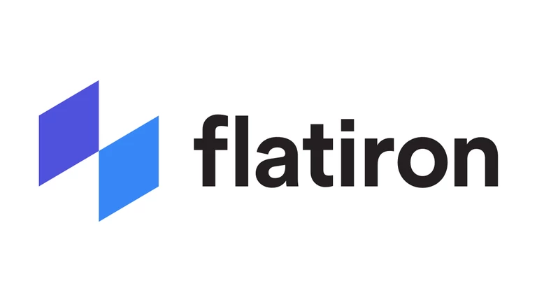

<style>
    p {
        text-align: left;
        font-size: 30px
    }
    ul {
        margin: 0;
        font-size: 30px;
    }
    table {
        font-size: 30px;
    }
    ol {
        margin: 0;
        font-size: 30px;
    }
    figcaption {
        font-size: 15px;
        text-align: center;
    }
</style>

# **Business Thinking & Organizational Structure**
```console
Data Sciences Institute
Topics in Deep Learning
```
---

<!--_color: white -->
<!--_backgroundColor: #f4a534 -->
## `Healthcare Initiatives`

---

##### **Healthcare Initiatives**
- When brainstorming healthcare initiatives, it is important to take into account key stakeholders:
  - Patients
  - Clinicians
  - Healthcare providers
- All have pivotal roles in both the industry's overall success and the well-being of patients.

---

<!--_color: white -->
<!--_backgroundColor: #f4a534 -->
## `Triple Aim Framework`

---

##### **Triple Aim Framework**
- Developed by Dr. Donald Berwick and colleagues at the Institute for Healthcare Improvement (IHI) in 2007.
- Set of three interconnected goals aimed at improving healthcare systems and overall health/well-being of populations.

---

##### **Triple Aim Framework**

1. **Improving Population Health**: Enhance the health of a defined population.
2. **Enhancing Patient Experience of Care**: Improve the experience of care for individual patients.
3. **Reduce Per Capita Cost of Healthcare**: Reduce the overall cost of healthcare while maintaining or improving quality.

<figure>
  
</figure>

---

<!--_color: white -->
<!--_backgroundColor: #f4a534 -->
## `Triple Win Framework`

---

##### **Triple Win Framework**
- When thinking about new ideas, try expanding "Triple Aim" to "Triple Win".
- You need to consider how your idea creates value for all three stakeholders: patients, clinicians, and funders.

<figure>
  
</figure>

---

##### **Patient**
*Improve Outcomes, Improve Experience, Increase Access*
1. What specific need or problem has not been addressed yet?
2. How many patients can benefit from this idea?
3. Does this idea lead to a change in their lives? Is it large- or small-scale improvements in outcomes or experiences?
4. What are the alternatives that exist now or could exist in the future to address this need or problem?

--- 

##### **Clinician**
*Extend Expertise, Reduce Burnout, Advance Careers*
- Which team members will be affected by this idea?
- How will their daily tasks and responsibilities be altered?
- Will the idea contribute to improved efficiency and the overall well-being of team members?
- What potential opportunities does it bring, such as the possibility of publications, educational benefits, or enhanced connections with colleagues?

---

##### **Funder**
*Growth, Financial Stability, Expand Reputation, Talent Retention*
- How does this idea generate financial value, such as through direct reimbursement, contractual fees, or licensing revenue?
- Who pays for this, is it the patient, insurance providers, hospitals, pharmaceutical companies, or government entities?
- What is the effect of this idea on the brand or reputation of the entity involved?
- Will this idea lead to the creation of new career opportunities?

---

<!--_color: white -->
<!--_backgroundColor: #f4a534 -->
## `Business Pitch`

---

##### **Introduction to Business Pitches**
- **Definition**: A business pitch is a brief presentation by an entrepreneur to potential investors, partners, or customers, showcasing their business idea and strategy.
- **Purpose**: Designed to secure funding, partnerships, or sales.
- **Importance**: A compelling pitch can make the difference between securing support or missing out on valuable opportunities.

---
<!--_color: white -->
<!--_backgroundColor: #f4a534 -->
## `Create an Outline of Your Pitch Deck`

--- 

##### **Why do you need an outline?**
- **Clarity & Narrative**: An outline helps you create a clear and compelling narrative about:
  - The market
  - Unmet needs
  - Your strategy to meet them
- **Anticipate Questions**: Planning ahead allows you to foresee and address potential queries from investors and stakeholders.

---

##### **What do you include in your outline?**
1. Executive Summary & Company Overview
2. The Team & Management
3. Problem/Opportunity Identification
4. Solution & Technology
5. Market Opportunity & Size
6. Business Model & Go-to-Market Strategy
7. Competitive Landscape Analysis
8. Intellectual Property (IP) Strategy
9. Funding Requirements & Use of Proceeds (“The Ask”)

---

<!--_color: white -->
<!--_backgroundColor: #f4a534 -->
# `Create Your Pitch Deck`

---

##### **Executive Summary & Company Overview**
  - Provide a succinct overview that encapsulates the mission, technology origin, development stage, and funding objectives.
  - Hook investors with the company’s purpose, trajectory, and the unique problem it solves.
  - Highlight the current development phase (e.g., preclinical, Phase 1 trials) and the investment ask.

---

##### **The Team & Management**
  - Showcase the team’s expertise, previous successes, and the strategic formation of advisory boards.
  - Discuss the completeness of the team, recruitment plans for missing expertise, and key partnerships.
  - Position the team’s capability as a cornerstone for the project’s success.

---

##### **Problem/Opportunity Identification**
  - Clearly articulate the problem being addressed, emphasizing the pain points and the stakeholders affected.
  - Detail the problem’s scale, current solutions’ limitations, and the opportunity for improvement.

---

##### **Solution & Technology**
  - Describe the product’s value proposition and its significance in addressing the identified need.
  - Present data or evidence supporting the technology’s efficacy, mechanism of action, without disclosing proprietary information.
  - Ensure the explanation is investor-friendly, focusing on crucial details rather than overwhelming with technical data.

---

##### **Market Opportunity & Size**
  - Illustrate the commercial potential, focusing on a well-defined market segment.
  - Provide market size estimates, target and secondary market descriptions, and the rationale behind market choice.
  - Emphasize why the timing is right for the product and how the company plans to capture market share.

---

##### **Business Model & Go-to-Market Strategy**
  - Outline the income strategy and how the startup intends to deliver returns to investors.
  - Discuss the development plan, regulatory milestones, and necessary partnerships for market entry.
  - Utilize frameworks like the business model canvas to articulate a coherent strategy.

---

##### **Competitive Landscape Analysis**
  - Identify competitors and substitutes, highlighting your product’s differentiators and advantages.
  - Discuss market readiness for a new solution and why current gaps have not been addressed effectively.

---

##### **Intellectual Property (IP) Strategy**
  - Share details on patent filings, trade secrets, and the company’s overall IP strategy.
  - Include patentability and freedom to operate analyses, ensuring enough detail for evaluation without revealing confidential information.

---

##### **Funding Requirements & Use of Proceeds (“The Ask”)**
  - Clearly state the funding needed, outlining past funding usage and future financial planning to achieve milestones.
  - Discuss potential exit strategies, giving investors a clear understanding of the return on investment.

---

<!--_color: white -->
<!--_backgroundColor: #f4a534 -->
## `Tips For Your Pitch Deck`

---
##### **Understanding Your Audience**
- **Research**: Know your audience's background, interests, and investment focus.
- **Tailoring Your Message**: Customize your pitch to resonate with your audience's specific interests and concerns.

---

##### **Crafting Your Message**
- **Clarity and Conciseness**: Be clear and direct.
- **Storytelling**: Incorporate storytelling to connect emotionally and make your pitch memorable.
- **Visuals**: Use visuals (graphs, images, and infographics) to support your message .
- **Tips**: Keep slides clean and focused, and use bullet points.

---

##### **Delivering Your Pitch**
- **Confidence**: Practice your pitch to deliver it confidently.
- **Preparation**: Anticipate questions and rehearse answers.
- **Handling Questions**: Listen carefully, and answer questions directly and positively.

---

##### **Common Pitfalls to Avoid**
- **Overcomplication**: Keep it simple.
- **Lack of Focus**: Stay on topic and ensure each slide contributes to your overall message.
- **Ignoring Feedback**: Be open to feedback and use it to refine and improve your pitch.

---

<!--_color: white -->
<!--_backgroundColor: #f4a534 -->
## `Case Studies`

---

<figure>
  
  <figcaption style="text-align: center;">https://flatiron.com</figcaption>
</figure>

---

##### **Flatiron health**
- Healthcare technology company specializing in cancer research and patient care. 
- **Data Curation and Analysis**: Analyzes data, including EHRs, for real-world cancer care insights.
- **Software Solutions for Clinics**: Offers cloud-based oncology software to improve clinic operations and patient care.
- **Research Collaboration**: Collaborate with the life sciences sector for cancer research to accelerate therapy development.
- **Insights for Oncology Care**: Provides healthcare insights to enhance care quality, inform policy, and guide strategic planning.

---

<figure>
  
  <figcaption style="text-align: center;">https://www.tempus.com</figcaption>
</figure>

---
##### **Tempus Labs**
-  Tech company focused on precision medicine, using artificial intelligence to analyze clinical and molecular data. 
-  **Genomic Sequencing**: Perform  genomic sequencing for targeted disease treatments.
-  **Data Analytics**: Analyze clinical and molecular data for treatment insights.
-  **Clinical Data Structuring**: Structure unstructured medical data.
-  **Collaboration with Healthcare Research**: Collaborate with healthcare and research entities to advance personalized medicine

---

<figure>
  
  <figcaption style="text-align: center;">https://www.23andme.com/en-ca/</figcaption>
</figure>

---

##### **23andMe**
- Consumer genetics company providing direct-to-consumer DNA testing.
- **Ancestry Reports**: Provide insights into a person's ethnic background and ancestral origins.
- **Health Risk Assessments**: Highlight genetic predispositions to diseases.
- **Trait Reports**: Explore genetics' influence on physical and personal characteristics.
- **Carrier Status Reports**: Identify genes for inheritable conditions.
- Experiencing challenges from blending consumer tech, biotech, and healthcare within one company.
- Considering separating the company's consumer and therapeutics divisions to address declining stock prices and the risk of Nasdaq delisting 

---

<figure>
  
  <figcaption style="text-align: center;">https://www.recursion.com</figcaption>
</figure>

---

##### **Recursion Pharmaceuticals**
- Biotech company using AI and automation for drug discovery.
- **Drug Discovery**: Use AI to rapidly identify potential drugs for a wide range of diseases.
- **High-throughput Screening**: Employ automation and robotics to perform experiments at a large scale.
- **Data-driven Insights**: Data-driven insights from biological data and machine learning to speed up pharmaceutical research.
