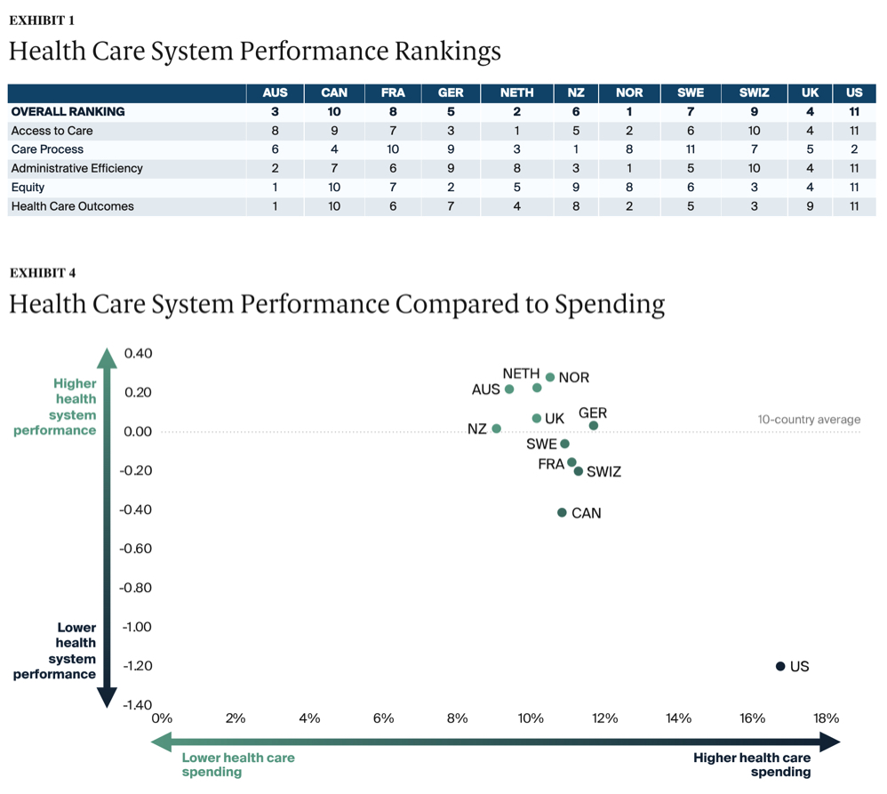
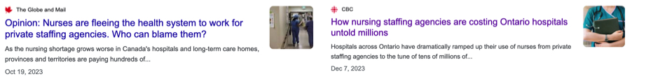

<style>
    p {
        text-align: left;
        font-size: 30px
    }
    ul {
        margin: 0;
        font-size: 30px;
    }
    table {
        font-size: 30px;
    }
    ol {
        margin: 0;
        font-size: 30px;
    }
    figcaption {
        font-size: 15px;
        text-align: center;
    }
</style>

# **Business Thinking & Organizational Structure**
```console
Data Sciences Institute
Topics in Deep Learning
Instructor: Erik Drysdale
TA: Jenny Du
```

---
##### **Outline**

- Healthcare initiatives
- Triple Win & Aim framework
- Example institution (DIHI)
- Disruptive technologies in (Canadian) healthcare

---
<!--_color: white -->
<!--_backgroundColor: #f4a534 -->
## `Healthcare Initiatives`


---
##### **Healthcare Initiatives**
- Successful healthcare initiatives will take into account:
  - Key stakeholders (patients & families, healthcare providers, and other hospital staff)
  - Organization structure
  - Current incentives
- **Transformation** is much harder than **change**, and most healthcare transformations will be underwhelming
  - Adoption of data science initiatives requires a solid understanding of both the *institutional* and *technical* challenges with DS
- We'll discuss one of the most common initiatives which is creating a center of excellence

---
<!--_color: white -->
<!--_backgroundColor: #f4a534 -->
## `AI Center of Excellence (Healthcare Initiatives)`

<!-- Question: Who's heard of a Center of Excellence? -->

---
##### **AI Center of Excellence**

- A healthcare orgnaization wishing to adopt data science at scale will often face a key strategic question:
  - *To what extent should a central AI team coordinate and drive data science transformation?*
- A common approach is to develop an AI Center of Excellence
  - *A dedicated team or department that focuses on the strategic implementation of artificial intelligence technologies across the organization*


Source: [AtScale](https://www.atscale.com/blog/what-is-an-ai-center-of-excellence/)

---
##### **AI Center of Excellence (benefits)**

- Concentration of expertise
  - Recruiting an maintaining AI talent is very difficult!
- Economies of scale
  - By having larger pool of skilled data scientists, you can more smoothly distribute work
- Fostering a community of practice
  - Lessons learned, educational materials, seminars, hackathons, etc
- Strategic vision and priority setting
  - By understanding the core technical challenges of AI and its trends, the AICoE is well placed to provide strategic direction as well as vet external vendor systems

<!-- Questions: Any other thoughts here? -->

---
##### **AI Center of Excellence (benefits)**


Source: [Zinnov](https://zinnov.com/centers-of-excellence/mastering-ai-centers-of-excellence-key-considerations-for-success-blog/)

<!-- Question: What are some of the downsides with a CoE? -->


---
##### **AI Center of Excellence (challenges)**

- Competing resources and priorities
  - Other groups will do some amount of DS; should the AICoE be treated as a new group in addition to IT, HR, finance, etc
- Misaligned interests
  - While an AICoE will have the same interests on many fronts with other departments, it will have to spend time pursuading and coordinating other groups to ensure DS projects align with its vision
- Isolation of expertise
  - Concentrating the "cool" sounding work in one department may cause resentment or a sense of detachment from others (e.g. "we're not smart enough to do AI" or "they think they're the only ones that can do AI")

<!-- Question: Should the AICoE have veto power? Can another department buy an AI product without its blessing? What if data decisions made by IT impact its model development? -->

---
<!--_color: white -->
<!--_backgroundColor: #f4a534 -->
## `Triple Aim Framework`

---
##### **Triple Aim Framework**
- Developed by Dr. Donald Berwick and colleagues at the Institute for Healthcare Improvement (IHI) in 2007.
- Three interconnected goals focus on enhancing healthcare systems and the overall health and well-being of populations.

---
##### **Triple Aim Framework**

1. **Improving Population Health**: Enhance the health of a defined population.
2. **Enhancing Patient Experience of Care**: Improve the experience of care for individual patients.
3. **Reducing the Per Capita Cost of Healthcare**: Reduce the overall cost of healthcare while maintaining or improving quality.


---

<!--_color: white -->
<!--_backgroundColor: #f4a534 -->
## `Triple Win Framework`

---
##### **Triple Win Framework**
- When thinking about new ideas, try expanding "Triple Aim" to "Triple Win".
- You need to consider how your idea creates value for all three stakeholders: patients, providers, and funders.

<figure>
  
</figure>

---


---
<!--_color: white -->
<!--_backgroundColor: #f4a534 -->
## `Example institution: Duke Institute for Health Innovation (DIHI)`

---
##### **Medicine happens in buildings (usually)**

<div class="row" style="text-align: center;">
 <div style="display: inline-block; margin-right: 20px;">
  
 </div>
 <div style="display: inline-block; margin-right: 20px;">
  
 </div>
 <div style="display: inline-block; margin-right: 20px;">
  
 </div>
</div>


---
##### **Example Org Chart**


Source: [Sandhu et. al (2023)](https://www.cell.com/patterns/pdfExtended/S2666-3899(23)00047-8)

<!-- Question: The structure of your organization really matters. When do you want a Matrix system of responsibilities, when do you want a flat system? Who's responsible for delivering ML projects on time, etc -->

---
##### **How to create a sense sense of urgency**


Source: [DIHI: AI in biomedical data analytics and population health](https://www.youtube.com/watch?v=hBu5ZIvYLjs)

---
##### **Aligning top to bottom**


Source: [DIHI: AI in biomedical data analytics and population health](https://www.youtube.com/watch?v=hBu5ZIvYLjs)


---
##### **You need leadership and management**


Source: [DIHI: AI in biomedical data analytics and population health](https://www.youtube.com/watch?v=hBu5ZIvYLjs)

<!-- Question: Does anyone know the famous Peter Drucker quote about management vs leadership ? -->

---
##### **Making organizational alignment**


Source: [DIHI: Increasing AI Tool Adoption by Front-Line Workers](https://www.youtube.com/watch?v=qF18trDyQCg&t=2087s)

---
<!--_color: white -->
<!--_backgroundColor: green -->
## `Breakout #1`
##### Imagine a group of young physicians starting a new clinic wanted to build a practice that would be "data driven". If you were hired to provide strategic advice, what would be your main recommendation(s) be? 


---
<!--_color: white -->
<!--_backgroundColor: #f4a534 -->
## `Disruptive technologies in healthcare`

---
##### **Disruptive technologies (overview)**
- A disruptive technology refers to an innovation that significantly alters the way consumers, industries, or businesses operate
  - Classic examples include smartphones, streaming services, ride sharing, short-term rentals, and much more
- Disruptive technologies come about when a sufficient number of complementary technologies allow for an innovation to "break through" (think cell phones and ride sharing)
  - But many also capitalize on **regulatory arbitrage**
  - This will be important to understand many of the (currently early-stage) "disruptions" we are seeing in Canadian healthcare

<!-- Question: What do I mean by regulatory arbitrage?? -->

---
##### **Disruptive technologies (healthcare)**

- Healthcare as an industry is a study of contrasts:
  - Foundational aspects of medical education and clinical practice have shown remarkable resilience to change
  - Whereas, the tools of medicine are constantly changing
- Besides pharma and medical devices, the main disruptive innovations have been: **EHRs, telemedicine, and new service models**


[Source](https://www.healthit.gov/data/quickstats/national-trends-hospital-and-physician-adoption-electronic-health-records)

---
##### **Disruptive technologies (rare-disease orgs & pharma)**

- Breakthrough therapies can disrupt how entire patient groups are treated, & rare-disease non-profits have helped drive this
- The case of Cystic Fibrosis (CF) is illustrative
  - Advances in nutrition, antiobiotics, lung clearance, and modulator therapies have revolutionized care
  - Technological breakthroughs have made it a "new" disease


Source: [Epic](https://www.epicresearch.org/articles/cystic-fibrosis-patients-living-much-longer-in-2022-than-in-2008)

---
##### **Disruptive technologies (Medical devices)**

- Countless imaging modalities, surgical instruments, and monitoring devices
- Laparoscopy (key-hole) surgery has enabled countless surgeries to be carried out at lower risk, lower cost, and faster recovery

<br>


First telesurgical laparascopic surgery performed in 2001 ([source](https://www.ircad.fr/le-geste-chirurgical-a-traverse-latlantique/))

---
##### **EHRs: Disruptive or interuptive technologies?**

- Electronic health records (EHRs) have changed the way medicine is practiced. But has this disruption been good? 
- A [survey](https://med.stanford.edu/content/dam/sm/ehr/documents/EHR-Poll-Presentation.pdf) of physician views about EHRs found:
  - 40% believe there are more challenges than benefits
  - 71% agree that EHRs greatly contribute to burnout

<br>

> Average time spent on EHR interaction by physicians was nearly 37% of their workday... Family medicine physicians spent approximately half... Nurse clinicians spent... 22%. 

Source: [Pinevich et. al (2021)](https://www.ncbi.nlm.nih.gov/pmc/articles/PMC8387128/)


---
##### **Detour: Canada's healthcare system**

- Canada has a universal healthcare model (like most rich countries)
- But the Canada Health Act (1985) has created a unique legal landscape for healthcare in the country
  - In exchange for $$$ provinces agree to the five principals of the CHA: Universality, Portability, Comprehensiveness, Public Administration, Accessible
  - But healthcare is provincially managed
  - The federal government can fine provinces for being out of step with the CHA, but it is rare/difficult
- In theory, a physician cannot charge for any medical service that is covered by the provincial plan... (70% of HC is paid by government)
  - Question: Has anyone seen exceptions to this?

<!-- 
Each of these concepts though is often challenged or in contraction:
Universality: Generally true, but some areas might just not have any healthcare to access!
Portability: b/c provinces determine what is medically necessary, won't always be true
Comprehensiveness: Needs to cover medically necessary care (but this does not include Rx, Ambulances, Dental, Vision, Prosthetics, etc)
Public Administration: Lot's of private players (private practice, private clinics, big pharma, etc), but only the gov't should pay
Accessible: No user fees (but BC used to charge for a healthcard)
Plus lot's of other fun exceptions (RCMP, Armed Forces, First Nations)
 -->

---
##### **Detour: Canada's healthcare system**



Source: [Commonwealth Fund (2021)](https://www.commonwealthfund.org/publications/fund-reports/2021/aug/mirror-mirror-2021-reflecting-poorly)

---
##### **Disruptive technologies (new service models)**

- There has been an explosion in new service models in Canadian healthcare that are taking advantage (regulatory arbitrary) of our "unique" system
  - Federal vs provincial
  - Medically necessary vs not
  - Publically funded in theory but not in practice

<br>


<!-- Note: Quebec's privitization is probably the most advanced, having more than 600 non-participating doctors, against a dozen in all other provinces – nine in British Columbia and three in Alberta. -->


---
##### **Disruptive technologies (new service models: telehealth)**


<br>

> Instead of connecting an Ontario patient with a doctor in Ontario — which would be covered under OHIP — Maple will set up an appointment with a nurse practitioner or a physician outside of the province. Those appointments aren't covered by OHIP. And before a patient speaks with a health worker, they go through a text-based chat, which is also uninsured by OHIP. Maple works the same way in other provinces.

[Source](https://www.ipolitics.ca/queens-park/health-canada-concerned-about-ontario-company-that-charges-for-virtual-doctor-visits)

---
##### **Disruptive technologies (new service models: telehealth)**


<br>

> Dialogue only works with organizations or insurance companies. It doesn’t work with individuals... From a health care regulations point of view, that is the safest way to stay within the confines of the Canada Health Care Act... A patient never uses their credit card to pay for health care service.

[Source](https://www.thestar.com/business/dialogue-co-founder-cherif-habib-on-virtual-care-and-why-he-doesn-t-want-to/article_9b1e37d0-d747-5a72-9eac-a740a798aa14.html)

---
##### **Disruptive technologies (new service models: nursing)**

- Temporary nurses hired through staffing agencies have been around for decades
  - Historically they filled roles due to sickness, mat leave, etc
- During Covid, health system demand for these nurses skyrocketed, and they have now become a ficture of a system
  - Up to 50% of nurses in an ED might be "temporary"

<br>



<!-- Notes: 
1. Quebec paid almost $1 billion in 2022 for nursing staffing agencies
2. Nurses earn $35-55 an hour, and staffing nurses can earn 2-3 times their unionized counterparts
 -->

---
##### **Disruptive technologies (new service models: nursing)**

- Nurse staffing agencies have now surge pricing, and nurses usually have more control over their schedules
- In the US, we've seen companies begin to develop platforms based on a classic two-sided market 

<br>


> We connect professionals with open shifts at top facilities. Facilities get the help they need and caregivers get the flexibility, freedom, and great rates to live life to the fullest.

---
<!--_color: white -->
<!--_backgroundColor: green -->
## `Breakout #2`
##### How do you see the role of data science in Canada's healthcare system emerging with these disruptive trends?
